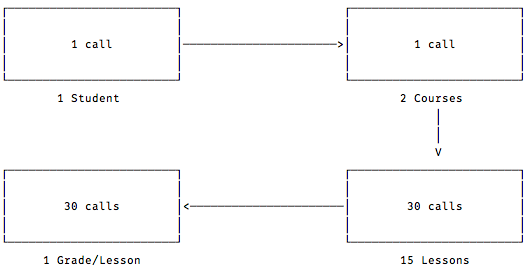
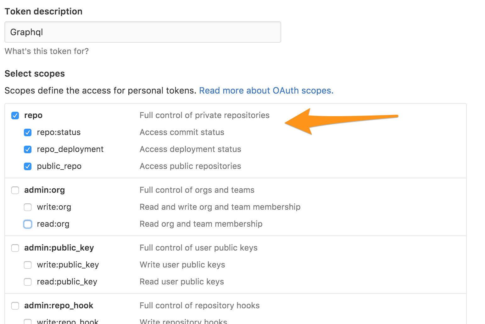
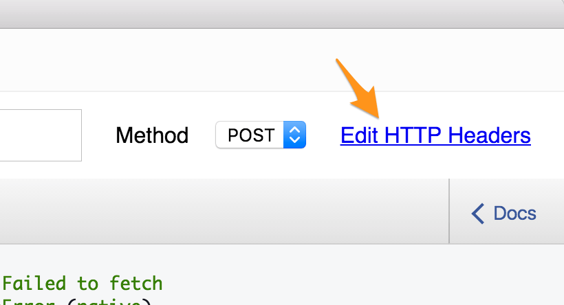
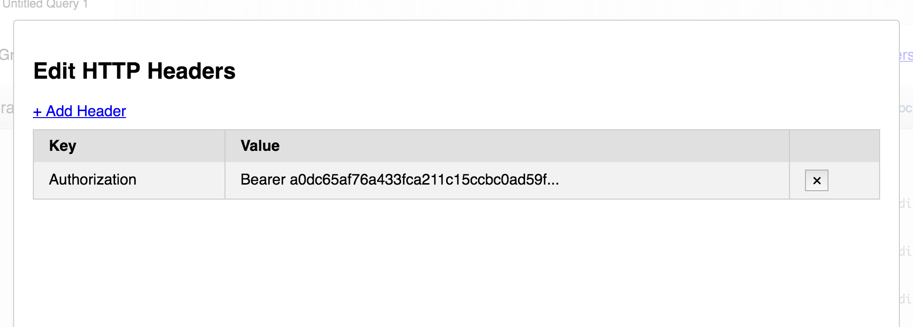
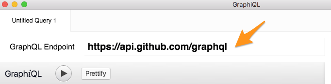
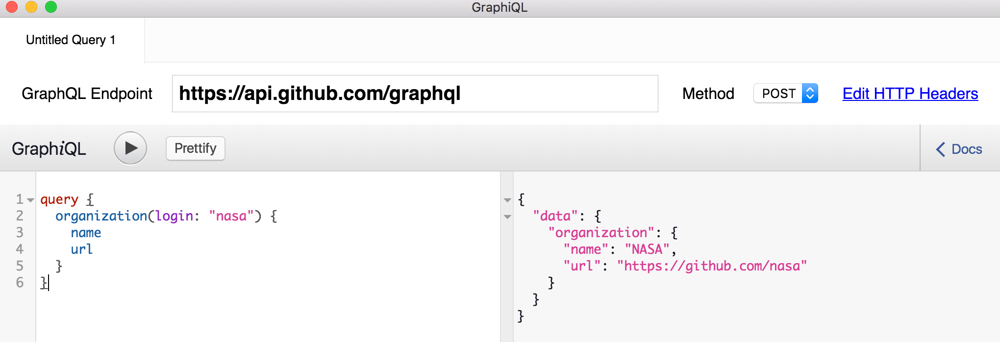
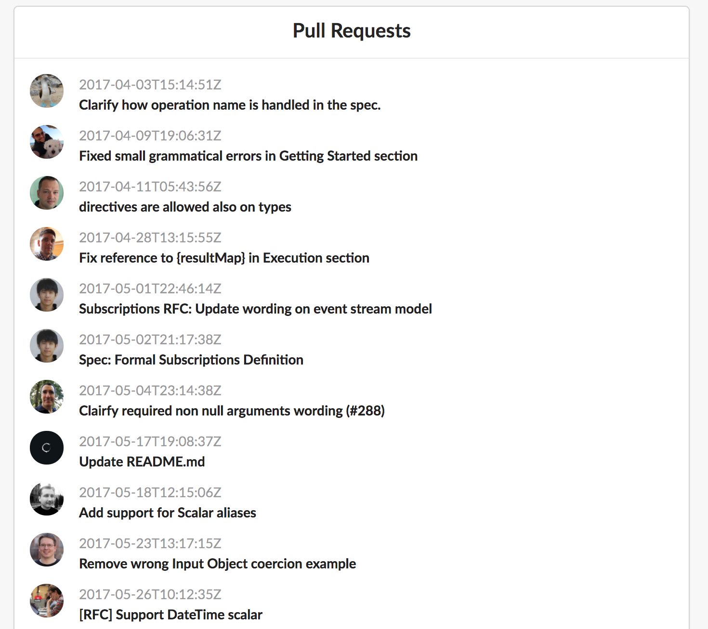

RESTful dengan format JSON sudah menjadi hal yang umum untuk membuat sebuah web service atau API. Nah, ada yang baru nih sebagai evolusi berikutnya dari REST API, namanya GraphQL. Di episode kali ini kita akan membahas sedikit tentang GraphQL dan bagaimana menggunakannya di sisi client dengan React.

Kita akan membuat sebuah aplikasi yang me-list 20 pull request terakhir dari suatu repository GitHub. Kita juga akan menampilkan avatar dan nama dari yang melakukan pull request tersebut.

## Cerita Dibalik GraphQL

Di 2012 tim internal Facebook mulai memikirkan konsep *query language* untuk REST API dan tiga tahun berselang, tepatnya di 2015 Facebook mempublish spesifikasi GraphQL. Dan hingga saat ini perusahaan-perusahaan seperti GitHub, Pinterest dan Shopify telah menggunakan GraphQL ini sebagai dasar dari API mereka.

Beberapa hal yang di-solve oleh GraphQL adalah:

1. **Bagaimana data yang kamu inginkan, bisa kamu dapatkan**. Tidak ada lagi istilah *over fetching* atau kebanyakan mengambil data dan juga *under fetching* atau data yang didapat kurang lengkap dan harus mengambil data lagi dari API.

2. **Nesting**. GraphQL dapat mengambil data dalam bentuk apa saja. *Array, Object, Array of Objects, Array of Objects of Array* dan sebagainya dalam satu kali permintaan saja.

3. **Strongly typed**. Spesifikasi GraphQL yang kita buat harus dengan jelas mendefinisikan tipe data yang kita inginkan sehingga hasil dari sumber data eksternal lebih dapat kita kendalikan.

4. **Hanya ada satu versi**. Tidak jarang API yang disediakan memiliki lebih dari satu versi. Contohnya API GitHub memiliki 4 versi.

5. **Satu endpoint**. Dengan GraphQL kita hanya memiliki satu *endpoint* saja. Untuk menyimpan data, membaca data semuanya ada dalam satu *endpoint*.

*Masalah over/underfetching.*

Untuk lebih jelasnya bisa lihat [slide presentasi saya disini](https://www.slideshare.net/rizafahmi/graphql-story-intro-to-graphql).

## Menggunakan GraphQL

Kita akan menggunakan GraphQL client yang namanya [GraphiQL.app](https://github.com/skevy/graphiql-app). Download dan buka aplikasinya.

## GitHub GraphQL API

Untuk artikel ini kita akan menggunakan API GraphQL yang disediakan GitHub. Untuk menggunakannya, kita harus terdaftar terlebih dahulu dalam program *early access* mereka. Silakan [daftar disini](https://developer.github.com/early-access/).

## Generate GitHub Personal Token

Kita butuh otentikasi untuk mengakses GraphQL GitHub melalui *personal access token*. Ikuti saja [petunjuknya disini](https://help.github.com/articles/creating-an-access-token-for-command-line-use/).

*Generate Personal Token GitHub*

Dan jangan lupa copy access token ke clipboard.

## Konfigurasi GraphiQL.app

*HTTP Header*

Pertama, mari kita menggunakan access token yang sudah kita generate sebelumnya. Tambahkan header dengan *key* Authorization dan *value* Bearer YOUR_PERSONAL_ACCESS_TOKEN.

*Tambahkan Personal token GitHub*

Terakhir, masukkan https://api.github.com/graphql sebagai GraphQL *endpoint*-nya.

*Endpoint GitHub GraphQL*

## Tes Konfigurasi

Mari kita coba konfigurasi GraphQL kita dengan memasukkan query berikut.

    query {
      organization(login: "nasa") {
        name
        url
      }
    }

Dan kita bisa mendapatkan hasilnya seperti berikut:

*Testing GraphQL*

## Hirarki Data

Kita akan membuat sebuah aplikasi yang me-list 20 pull request terakhir dari suatu repository GitHub. Kita juga akan menampilkan avatar dan nama dari yang melakukan pull request tersebut.

Kita akan mendapatkan datanya secara bertahap.

## Mendapatkan GitHub Organization

Kita akan mengambil repository GraphQL dari organisasi Facebook. Jadi querynya seperti berikut:

    query {
      organization(login: "facebook") {
        name
        url
      }
    }

Dan kita akan mendapatkan data seperti berikut.

    {
      "data": {
        "organization": {
          "name": "Facebook",
          "url": "https://github.com/facebook"
        }
      }
    }

Contoh barusan kita mengambil informasi organisasi dari GitHub. Perhatikan, kita hanya mendapatkan data yang kita butuhkan saja, yaitu url dan nama. Sebagai perbandingan jika kita menggunakan versi RESTful API GitHub, kita akan mendapatkan lebih dari [30 field lainnya](https://developer.github.com/v3/orgs/#response-3) yang tidak kita butuhkan.

## Mendapatkan Data Repositori

Kemudian kita akan mendapatkan data repository graphql yang ada di organisasi facebook. Berhubung repositori adalah milik organisasi, kita tinggal tambahkan saja dari query diatas seperti berikut.

    query {
      organization(login: "facebook") {
        name
        url
        repository(name: "graphql") {
          name
        }
      }
    }

Dan hasilnya seperti berikut.

    {
      "data": {
        "organization": {
          "name": "Facebook",
          "url": "https://github.com/facebook",
          "login": "facebook",
          "repository": {
            "name": "graphql"
           }
      }
    }

Gimana, keren kan GraphQL?!

## Mendapatkan Informasi Pull Request

Berikutnya kita akan mendapatkan data pull request yang berada didalam repositori. So kita tambahkan saja querynya menjadi seperti berikut.

    query {
      organization(login: "facebook") {
        name
        url
        repository(name: "graphql") {
          name
          pullRequests(last: 10, states: [OPEN]) {
            edges {
              node {
                id
                title
                createdAt
                author {
                  login
                }
              }
            }
          }
        }
      }
    }

Dan kita butuh juga nama yang melakukan Pull Request tersebut.

## Variable di GraphQL

Sekarang kita akan menambahkan variable sehingga beberapa opsi bisa kita ubah nantinya. Kita akan ubah organisasi, repositori dan jumlah Pull Request menjadi variable.

Dan data yang kita perlukan sudah kita dapatkan semuanya. Sekarang mari kita beranjak ke sisi React untuk mengkonsumsi data tersebut.

## GraphQL dengan React

Kita mulai dengan membuat project react baru.

    $ create-react-app react-graphql

Kemudian install beberapa *package* yang kita perlukan, terutama yang berkaitan dengan GraphQL dan kita akan menggunakan [Apollo](https://www.apollographql.com/), wrapper GraphQL yang memudahkan kita berinteraksi dengan GraphQL.

    $ yarn add graphql apollo-client-preset react-apollo graphql-tag

Tak lupa untuk mempercantik tampilan, kita tambahkan [UI Framework Semantic-UI](https://react.semantic-ui.com/).

    $ yarn add semantic-ui-react semantic-ui-css

## Jalin Koneksi Dengan GraphQL

Mari kita mulai menjalin koneksi dengan GraphQL via ApolloClient yang akan kita tambahkan di fil src/index.js.

    // index.js
    import React from "react";
    import ReactDOM from "react-dom";
    import { ApolloClient } from "apollo-client";
    import { HttpLink } from "apollo-link-http";
    import { InMemoryCache } from "apollo-cache-inmemory";
    import { ApolloProvider } from "react-apollo";

    import "./index.css";
    import App from "./App";
    import registerServiceWorker from "./registerServiceWorker";

    const YOUR_GITHUB_PERSONAL_TOKEN = '';

    const client = new ApolloClient({
      link: new HttpLink({
        uri: `https://api.github.com/graphql`,
        headers: {
          Authorization: `Bearer ${YOUR_GITHUB_PERSONAL_TOKEN}`
        }
      }),
      cache: new InMemoryCache()
    });

    ReactDOM.render(
      <ApolloProvider client={client}>
        <App />
      </ApolloProvider>,
      document.getElementById("root")
    );
    registerServiceWorker();

## Query ke GraphQL

Kita akan melakukan query ke GraphQL dari komponen React dan kemudian untuk memastikan datanya kita dapatkan, kita lakukan console.log dulu.

    // src/App.js
    import React, { Component } from "react";
    import { graphql } from "react-apollo";
    import gql from "graphql-tag";
    import { Container, Feed, Card } from "semantic-ui-react";
    import "semantic-ui-css/semantic.min.css";
    import "./App.css";

    class App extends Component {
      render() {
       console.log(this.props.data);
        return (
          <Container text textAlign="center">
            <Card centered fluid>
              <Card.Content>
                <Card.Header>Pull Requests</Card.Header>
              </Card.Content>
              <Card.Content>
                {/* iterate data here later... */}
              </Card.Content>
            </Card>
          </Container>
        );
      }
    }

    const queries = gql`
      query(
        $login: String!
        $repo: String!
        $pullRequestsCount: Int
        $reviewsCount: Int
        $commentsCount: Int
      ) {
        organization(login: $login) {
          name
          url
          login
          repository(name: $repo) {
            name
            pullRequests(last: $pullRequestsCount) {
              edges {
                node {
                  id
                  title
                  createdAt
                  author {
                    ...userFields
                  }
                  reviews(last: $reviewsCount) {
                    edges {
                      node {
                        comments(last: $commentsCount) {
                          edges {
                            node {
                              author {
                                ...userFields
                              }
                            }
                          }
                        }
                      }
                    }
                  }
                }
              }
            }
          }
        }
      }

      fragment userFields on User {
        name
        avatarUrl
      }
    `;
    export default graphql(queries, {
      options: {
        variables: {
          login: "facebook",
          repo: "graphql",
          pullRequestsCount: 50,
          reviewsCount: 20,
          commentsCount: 20
        }
      }
    })(App);

## Membaca Data dari GraphQL

Setelah memastikan data telah didapat, mari kita render datanya kedalam komponen.

    // src/App.js
    import React, { Component } from "react";
    import { graphql } from "react-apollo";
    import gql from "graphql-tag";
    import { Container, Feed, Card } from "semantic-ui-react";
    import "semantic-ui-css/semantic.min.css";
    import "./App.css";

    class App extends Component {
      render() {
        return (
          <Container text textAlign="center">
            <Card centered fluid>
              <Card.Content>
                <Card.Header>Pull Requests</Card.Header>
              </Card.Content>
              <Card.Content>
                {/* iterate data here... */}
                {this.props.data.organization && (
                  <Feed>
                    {this.props.data.organization.repository.pullRequests.edges.map(
                      pullRequest => (
                        <Feed.Event key={pullRequest.node.id}>
                          <Feed.Label image={pullRequest.node.author.avatarUrl} />
                          <Feed.Content>
                            <Feed.Date content={pullRequest.node.createdAt} />
                            <Feed.Summary>{pullRequest.node.title}</Feed.Summary>
                          </Feed.Content>
                        </Feed.Event>
                      )
                    )}
                  </Feed>
                )}
              </Card.Content>
            </Card>
          </Container>
        );
      }
    }

    const queries = gql`
      query(
        $login: String!
        $repo: String!
        $pullRequestsCount: Int
        $reviewsCount: Int
        $commentsCount: Int
      ) {
        organization(login: $login) {
          name
          url
          login
          repository(name: $repo) {
            name
            pullRequests(last: $pullRequestsCount) {
              edges {
                node {
                  id
                  title
                  createdAt
                  author {
                    ...userFields
                  }
                  reviews(last: $reviewsCount) {
                    edges {
                      node {
                        comments(last: $commentsCount) {
                          edges {
                            node {
                              author {
                                ...userFields
                              }
                            }
                          }
                        }
                      }
                    }
                  }
                }
              }
            }
          }
        }
      }

      fragment userFields on User {
        name
        avatarUrl
      }
    `;
    export default graphql(queries, {
      options: {
        variables: {
          login: "facebook",
          repo: "graphql",
          pullRequestsCount: 50,
          reviewsCount: 20,
          commentsCount: 20
        }
      }
    })(App);

Selesai sudah aplikasi kita. Dan berikut hasilnya.

*Hasil akhir*

Mau lihat versi video-nya? Silakan ke [https://randomscreencast.com/17-graphql-react/](https://randomscreencast.com/17-graphql-react/).

## Referensi

* [https://blog.codeship.com/an-introduction-to-graphql-via-the-github-api/](https://blog.codeship.com/an-introduction-to-graphql-via-the-github-api/)

* [https://www.apollographql.com/](https://www.apollographql.com/)

* [https://react.semantic-ui.com/](https://react.semantic-ui.com/)
