Berikut adalah rekap perjalanan saya ketika diundang menghadiri F8 Developer Conference sebagai salah satu Facebook Developer Circle yang beruntung.

Di H-1 sebagai *leads* dari berbagai kota di belahan dunia, kita semua diminta untuk *gathering* di Facebook HQ untuk mengikuti beberapa acara menarik. Berikut ceritanya.

## Ketemu Simon CTO Praekelt asal Belanda

Duduk sebelahan di bis dari [ Hotel Marriot San Jose ](https://www.marriott.com/hotels/travel/sjcsj-san-jose-marriott/) ke Facebook HQ di Menlo Park. Lokasi cukup jauh, sekitar 1 jam perjalanan jadi bisa diskusi cukup panjang. Bukan diskusi sebenarnya, lebih ke interview karena *mostly* saya yang banyak nanya :)

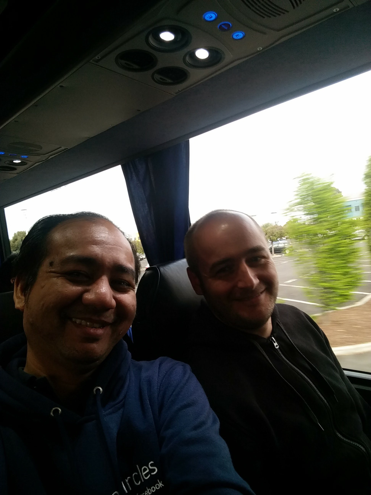*Simon de Haan*

Percakapan dimulai dari pekerjaan kemudian diskusi kita lanjutkan ke bahasa pemrograman [ Python ](https://www.python.org/) yang menjadi favoritnya, bahasa yang sehari-hari ia dan timnya gunakan. Simon menggunakan Python karena elegansi dari syntaks-nya, bahasa yang sudah *mature* dan *well crafted*, menurutnya. Saya baru sadar, mungkin ada unsur nasionalisme juga karena [Guido](https://en.wikipedia.org/wiki/Guido_van_Rossum) sang pembuat Python juga berasal dari negara yang sama, Belanda.

Kemudian pertanyaan saya lanjutkan ke pemilihan *web framework* dan Simon menuturkan bahwa mereka menggunakan [Twisted](https://github.com/twisted/twisted) sebuah *web framework* yang sifatnya *event-driven*. Untungnya saya pernah riset tentang Twisted sebelumnya, jadi lumayan mengerti :) Pertanyaan saya lanjutkan kenapa Twisted kok kurang populer. Menurut Simon karena memang susah, dan tidak *straightforward* penggunaannya. Dokumentasinya pun kurang mendukung. Untuk *event-driven* dan *callback*, NodeJS *did it better*.

Kemudian bahasan kita lanjutkan ke bahasa pemrograman lain. Tidak disangka ternyata dia juga menggunakan [Elixir](https://elixir-lang.org/) khusus untuk beberapa project yang butuh *concurrency*. Alasan dipilihnya Elixir karena WhatsApp menggunakan Erlang dan Erlang VM memungkinkan WhatsApp *scale* hingga mampu menangani 2 juta koneksi secara berbarengan. Awalnya Simon mencoba [Erlang](http://www.erlang.org/), tapi ternyata dia ngga begitu suka sintaks-nya dan ketika Elixir muncul, tanpa pikir panjang Simon langsung mengadaptasinya kedalam project yang sedang ia tangani.

Obrolan kita berlanjut, saya kembali bertanya kok sekarang *functional programming* kembali *hyped*. Padahal paradigma ini kan cukup jadul dan sudah lama ada. Bahkan sudah ada sebelum paradigma OOP muncul. Menurutnya, *tools*, *requirement* dan aplikasi semakin berkembang dan developer terus mencari solusi yang lebih sederhana untuk mengembangkan aplikasi, terutama proses development yang lebih terprediksi dan saat ini tren sedang menuju kepada tools yang memberikan developer rasa aman. Misalnya saja paradigma *functional programming, static typed* sekarang sedang digemari seperti Haskell, TypeScript, Elm dan lain sebagainya. Oh iya, dia juga menggunakan Elm, React dan Redux. Dia juga tertarik ke [ReasonML](https://reasonml.github.io/), meski belum pernah menggunakan.

Percakapan ditutup ketika Simon bercerita bahwa selain menjadi CTO, saat ini dia juga sedang menggagas sebuah startup bersama seorang temannya. Masih di area *healthcare*. Luar biasa ya, pagi jadi CTO malam jadi co-founder.

[Linkedin-nya Simon](https://www.linkedin.com/in/sdehaan/).

## Meet and Greet Developer Circle Around The World

Tidak bisa saya jabarkan satu-per-satu sih. Di sebuah ruangan seluruh *leads* dari Developer Circle seluruh dunia berkumpul. Dan itu saja sudah membuat saya merinding.

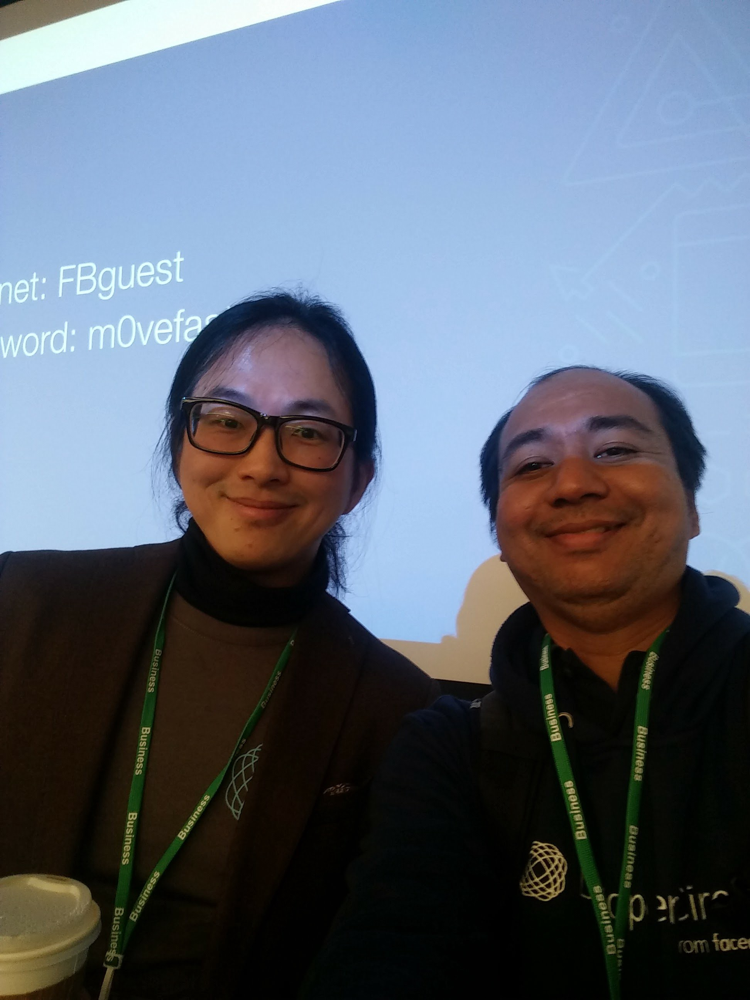*Sean Liu*

Sempat ngobrol dengan sebagian kecil dari mereka, ada [Sean Liu](https://www.facebook.com/profile.php?id=638368594&ref=br_rs) lead DevC Taiwan yang sangat ingin sekali mengenalkan *co-lead*-nya ke saya, entah kenapa :) Sean adalah developer yang fokus kepada teknologi chatbot.

Ada juga [Edwin](https://www.facebook.com/edwinallenz) yang sangat membenci kalau ada orang yang mojok sendirian, pasti dia samperin dan diajak ngumpul ke grup.

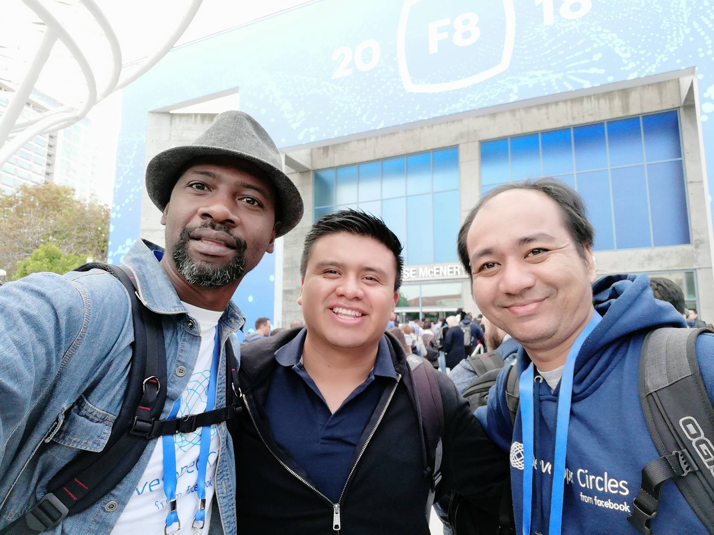*Edwin (paling kiri)*

[Bonnie](https://www.facebook.com/bonnie.milian.5) juga salah satu dari 3 co-lead DevC Gutemala. Menariknya Bonnie punya passion yang cukup besar di akademika dan *lecturing*. Coba dia mau ke Indonesia, pasti akan saya *hire* untuk jadi instruktur ;)

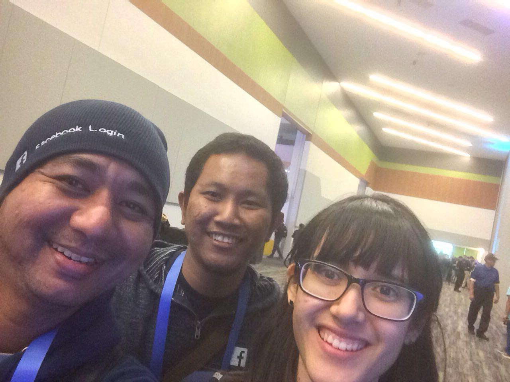*With Bonnie (paling kanan)*

Sempat ngobrol juga dengan DevC lead Bangkok [Pondd](https://www.facebook.com/suwitcha.sugthana) dan share tentang *insight tech scene* di Bangkok seperti apa. Katanya, di Bangkok lagi demam blockchain. Semua teknologi maunya di blockchain-kan :) Dan ternyata dia juga temannya om [ Rendra Toro ](https://www.facebook.com/rendra.toro).

Oh iya, ada satu percakapan menarik lagi yang harus di-*mention*. Saya sempat berbincang sebentar dengan [Emeka Afigbo](https://www.facebook.com/chukwuemeka.afigbo) Manager Developer Programs di Facebook. Waktu kenalan dan begitu tahu saya Riza dari Jakarta dia bilang gini: “I’ve heard a lot of good things about you!”. Terus saya kaget, dan saya tanya balik: “About me or about DevC Jakarta?”. Kalo tentang DevC Jakarta saya ngga kaget, karena co-lead saya keren-keren. Dan dengan yakin dia menjawab: “No, You!”. Saya langsung terharu dan tidak bisa berkata-kata. Entah apa maksudnya *good things about me* itu. Dan saya tidak punya keberanian untuk bertanya lebih lanjut. Dan saya juga tidak berani ngajak foto bareng :)

](./1_-g8BP2EG8NCTLWkTM1wNqA.png)*Video Emeka (paling kanan) di stage F8 2018. Link: [https://developers.facebook.com/videos/f8-2018/partner-panel-how-to-grow-your-business-with-facebook/](https://developers.facebook.com/videos/f8-2018/partner-panel-how-to-grow-your-business-with-facebook/)*

Banyak lagi obrolan singkat nan menarik dengan leads di berbagai kota. Tidak bisa saya jabarkan disini satu-per-satu.

## Bertemu Developer Asal Indonesia Yang Bekerja Di Facebook

Jauh sebelum hari H, kita sudah diinformasikan apabila ingin bertemu dengan *engineer* Facebook, yang dikenal tentunya, silakan *request* biar bisa ketemu.

Saya kenal seorang *engineer* asal Indonesia yang bekerja di Facebook. Namanya [Kevin Gozali](https://www.facebook.com/fkgozali). Orang inilah yang bertanggung jawab memperkenalkan saya dengan React :) Kita pernah ketemu di akhir tahun 2015 dan saya minta diajari React pada saat itu.

Dan ternyata kebetulan pada hari itu dia sedang cuti 😢. Tapi karena tahu ada kontingen Indonesia yang sedang berada di Facebook HQ, dia sempatkan untuk datang dari rumahnya, yang katanya ngga terlalu jauh dari kantor Facebook. Thanks Kevin!

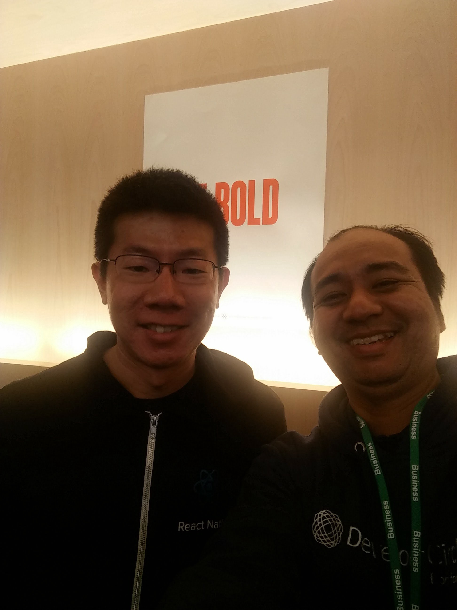*With Kevin*

Pada waktu pertama ketemu, Kevin masuk dalam tim Ads-nya Facebook dan karena kontribusinya ke React dan React Native sekarang ia 8fulltime8 ngurusin React Native bersama 10 orang yang ada di Facebook. Lebih lanjut diskusi teknis tentang React dan React Native nanti dibagian Happy Hour.

## Facebook HQ Tour

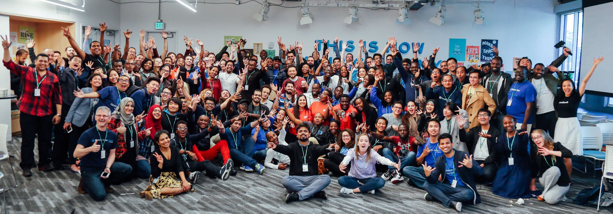

Setelah acara Leadership Sessions DevC selesai, kita pun diajak tour keliling kantor Facebook. Kantornya keren banget pastinya.

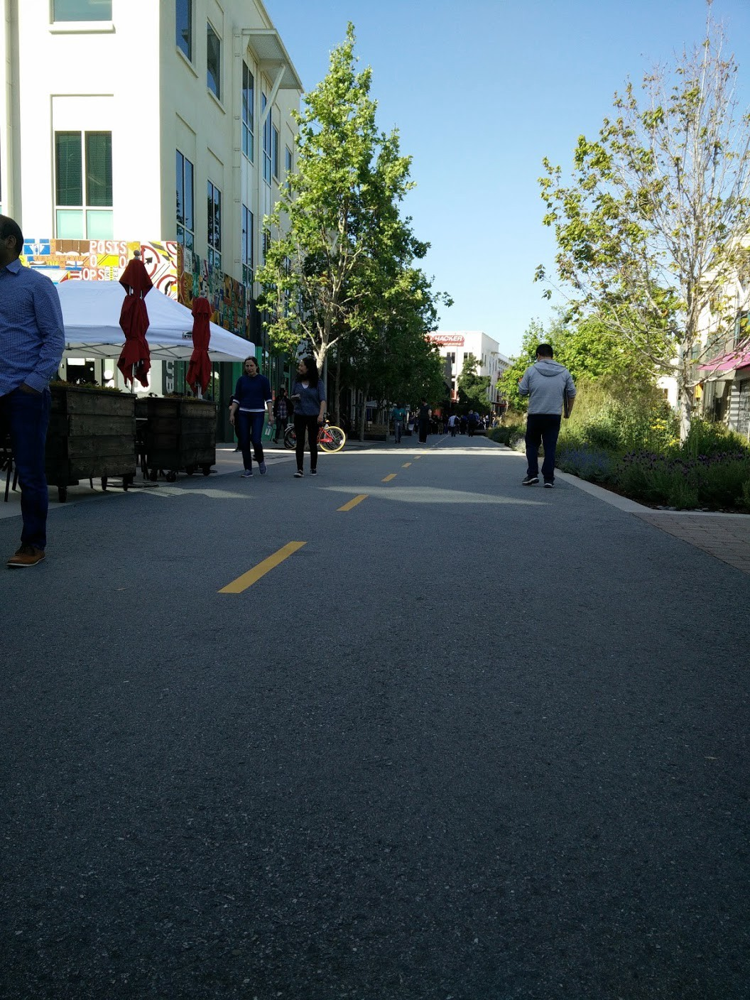*Salah satu sisi kantor facebook*

Fakta unik dari kantor facebook ini adalah dulunya ini adalah kantor Sun Microsystem. Bahkan plang di depan kantornya pun masih terdapat sisa-sisa kejayaan Sun.

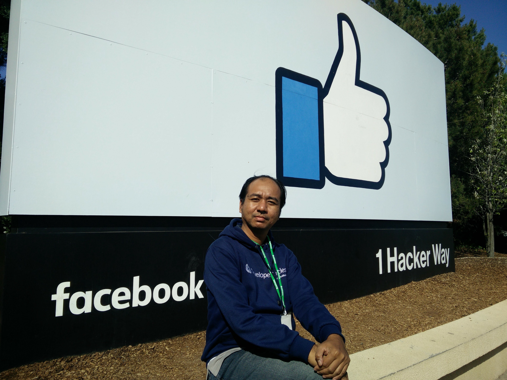*Sisi depan*

Foto diatas tampak depan, sementara dibelakangnya seperti ini.

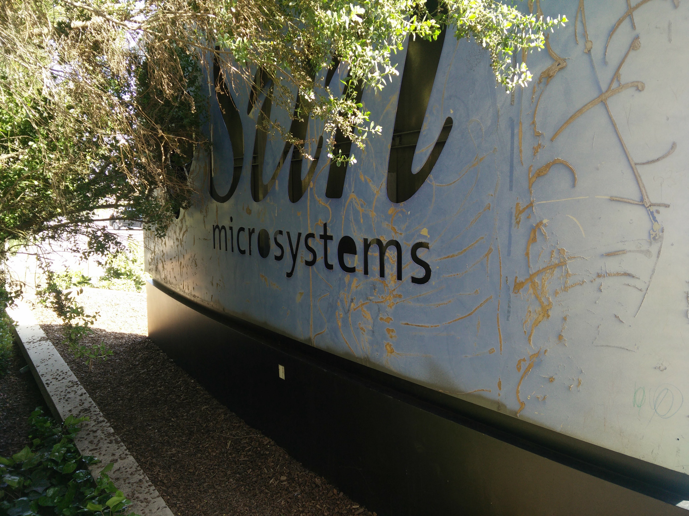*Sisa-sisa kejayaan Sun microsytem*

## Happy Hour: Ketemu Hack Reactor

Setelah acara di kantor Facebook selesai, kita kembali ke Marriot untuk menukar badge buat besok (biar ngga ngantri) dan diundang ke acara Happy Hour.

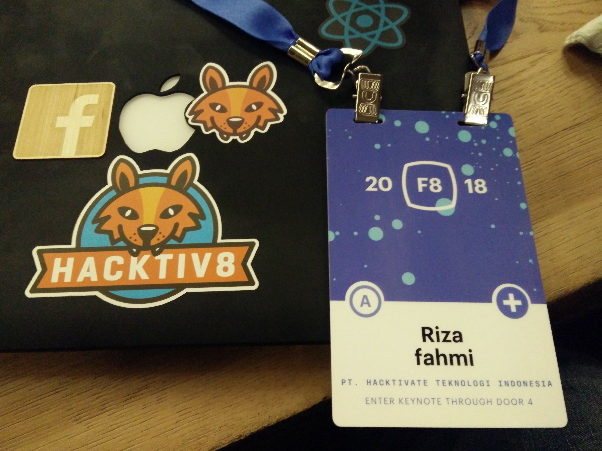*Badge F8*

Saya sempat berencana mau mengunjungi kampus [Hack Reactor](https://www.hackreactor.com/) karena dulu saya pengen banget ikutan bootcamp itu. Malah sekarang jadi bikin [bootcamp sendiri](https://hacktiv8.com) :)

Nah, di even happy hour ini ternyata ada booth [Hack Reactor](https://www.hackreactor.com/)! Saya tanya kira-kira saya bisa ikut *tour* ke kampusnya apa ngga ya? Dia bilang bisa, justru dia adalah orang yang *in charge* di *campus tour.* Namanya Andrew, tim Admission and Partnership. Tapi karena dia sibuk ngurusin even F8, *tour* ditiadakan seminggu. Tapi ngga masalah bisa bertemu dan ngobrol walau sebentar dengan salah satu tim dari Hack Reactor sudah cukup mengobatinya.

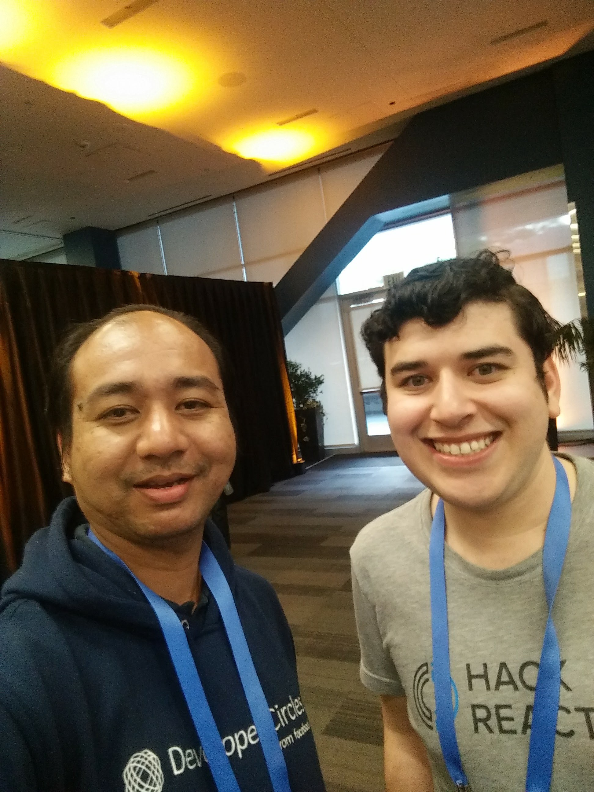*With Andrew Hack Reactor*

Tak lama kemudian, Kevin datang lagi. Memang sudah janjian sih, karena kita mau nanya banyak hal.

Kontingen Indonesia berebutan mau nanya ke Kevin tentang Facebook, React dan React Native! Diskusi berlanjut hingga larut malam.

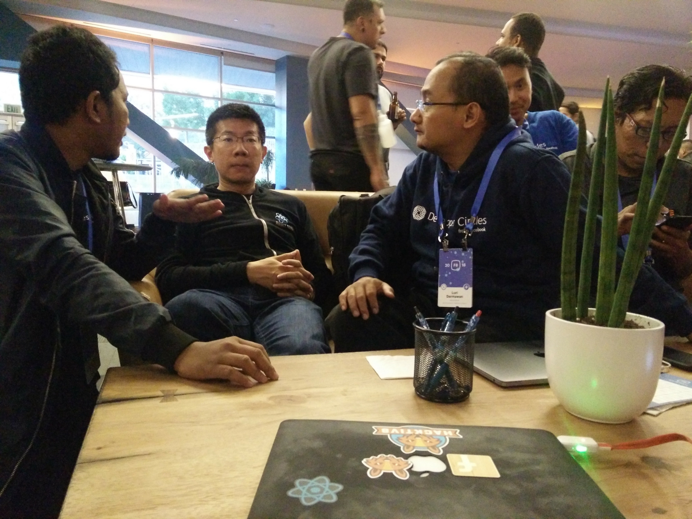*Kevin dibanjiri pertanyaan*

## Diskusi Mendalam Tentang React dan React Native

Diskusi kita dengan Kevin terus berlanjut. Saya telat join diskusinya karena satu dan lain hal. Saya sempat bertanya pendapatnya tentang [Flutter](https://flutter.io/), haha. Dan saya tidak menemukan jawaban yang menarik dari dia :)

Yang menarik dari pembicaraan ini adalah fakta bahwa yang menangani library React Native di Facebook ada 10 orang dan butuh kontribusi banyak dari teman-teman. React Native adalah sebuah library besar dan kedepannya React Native akan dipecah kedalam library-library yang lebih kecil agar lebih mudah di-*maintain* dan lebih kecil kemungkinan untuk *breaking changes*.

Diskusi ditutup tentan React Native Navigation dan sedikit insight tentang masa depan library-library navigation untuk React Native.

Ini [facebook-nya Kevin](https://gingkoapp.com/export/7296af0e6291059d36000159.html). *Go add him and say thank you for his contributions and inspiration*!

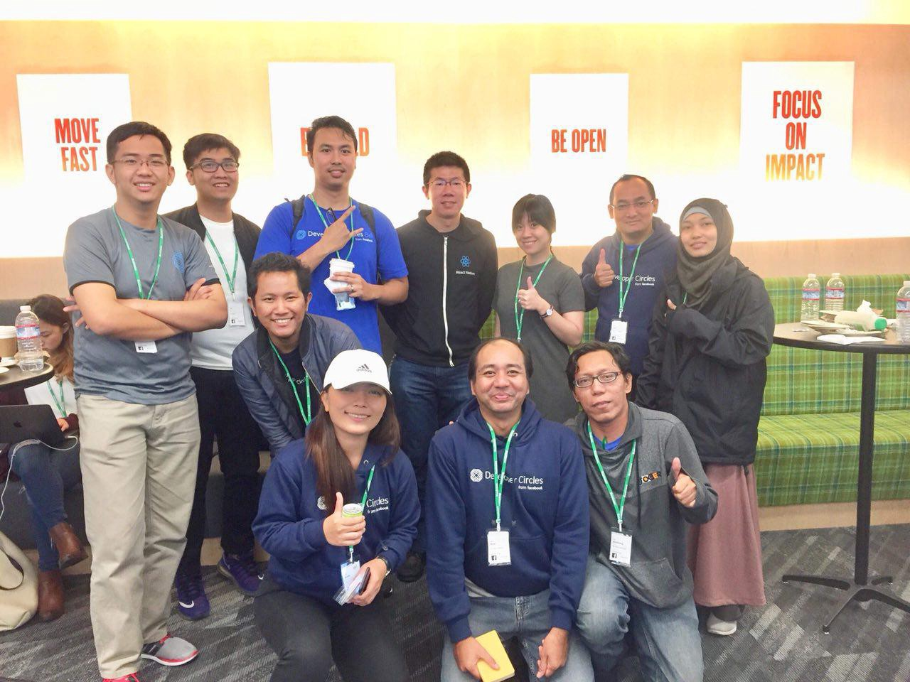*Indonesia DevC Leads with Kevin*

Demikianlah keseruan di H-1 F8. Tunggu cerita keseruan berikutnya ya :) Kalau mau dengar penuturan langsung dari kami yang berangkat, silakan join [grup facebook DevC Jakarta](https://www.facebook.com/groups/DevCJakarta/). Kita akan mengadakan meetup khusus membahas tentang pengalaman kita di F8.
