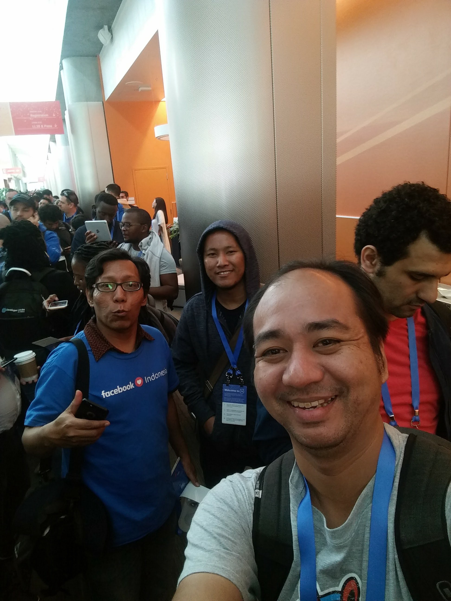
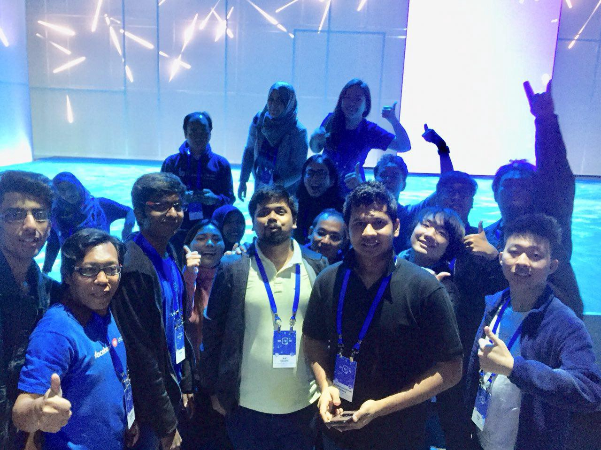
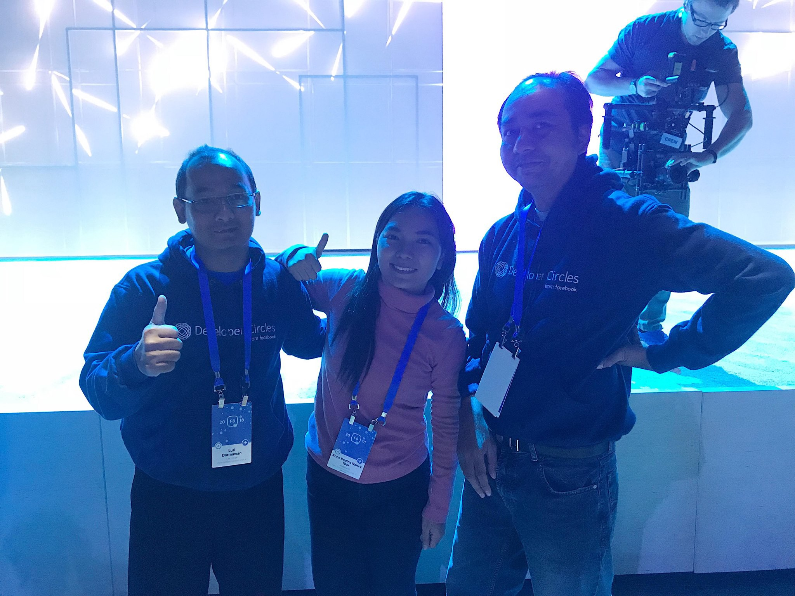
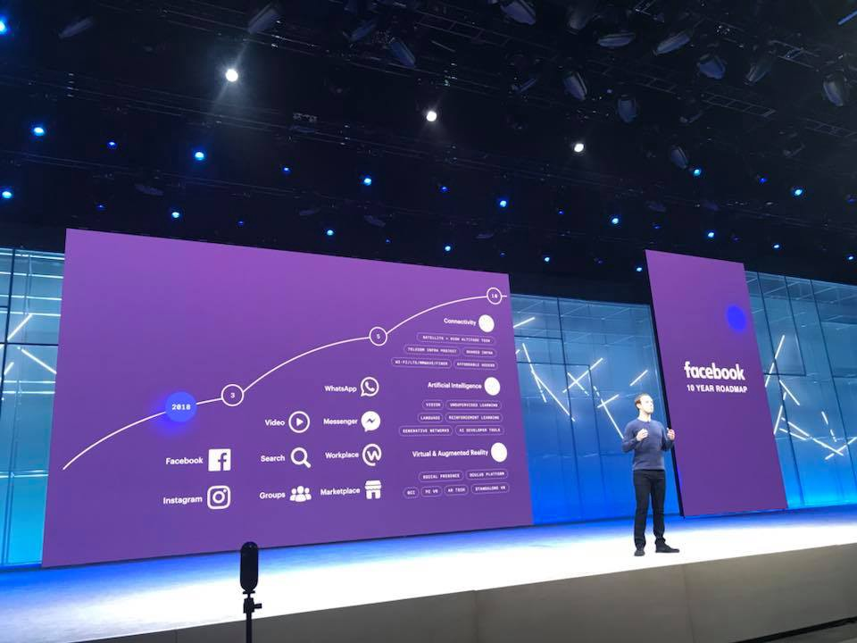
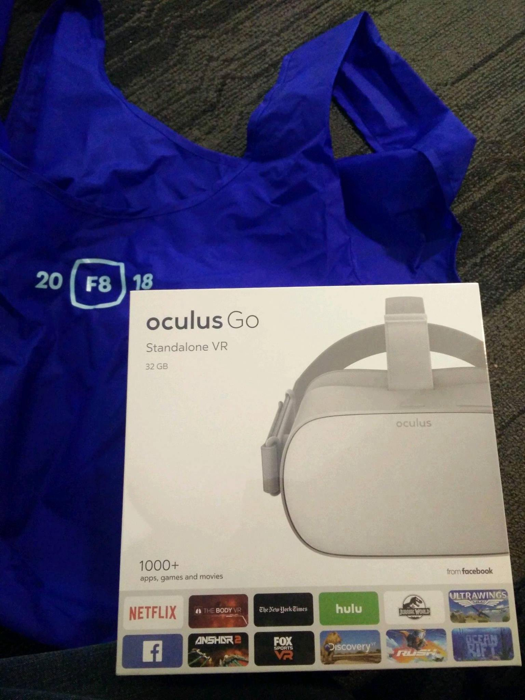
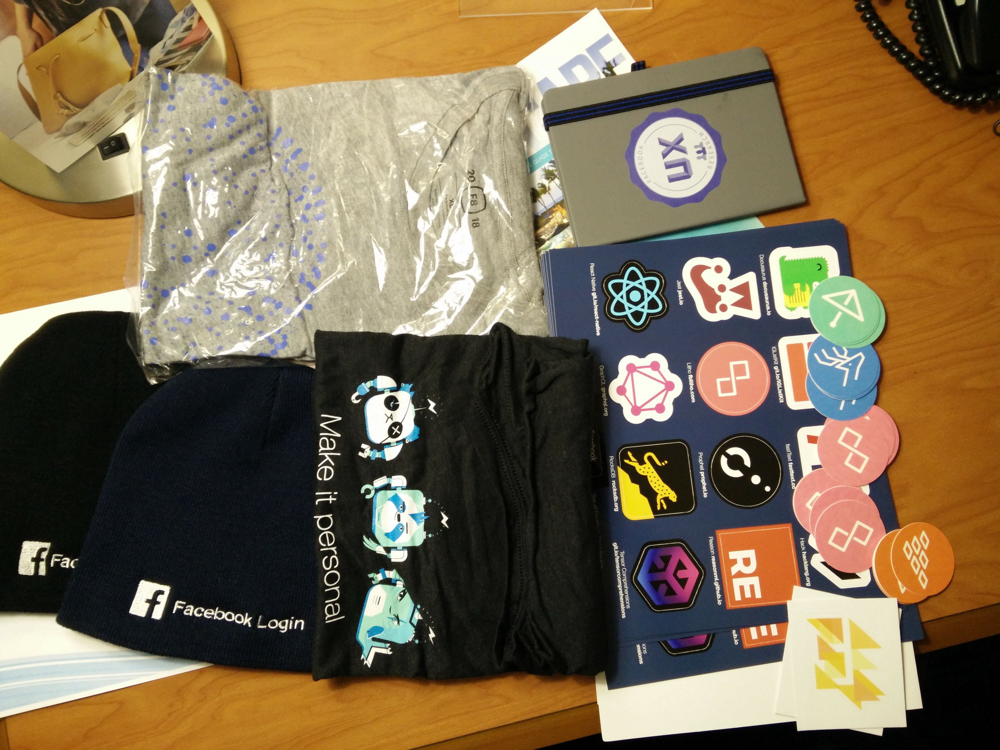
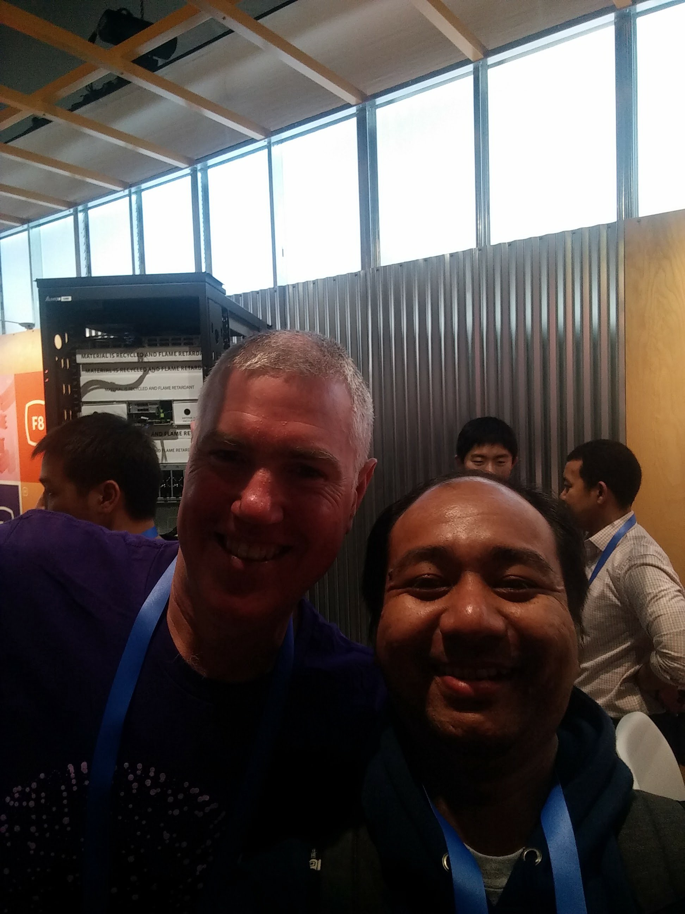
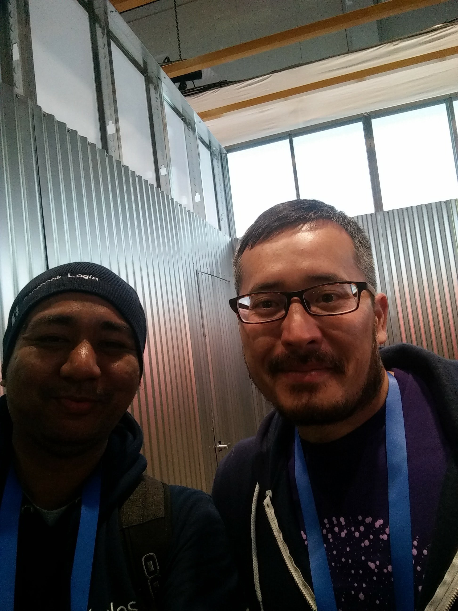
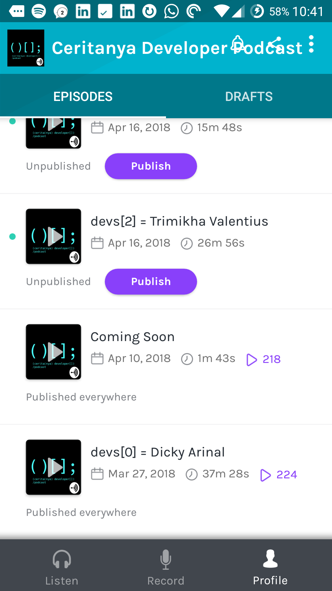

Ini adalah cerita berseri tentang perjalanan saya dan teman-teman Facebook Developer Circle Leads ke Silicon Valley dalam rangka mengikuti Facebook F8 Developer Conference. Ikuti dari bagian 0 supaya mendapatkan jalan ceritanya secara keseluruhan.

Sampailah kita di acara utama [F8 Conference](https://f8.com) day 1! Di hari pertama ini cukup banyak yang bisa di-*highlight*. Meskipun agak salah strategi sehingga di hari pertama ini banyak sekali melewatkan *talk-talk* keren, salah satunya *talk* tentang Jest yang dibawakan oleh [ Aaron Abramov ](https://twitter.com/aarondjents). Entah siapanya [ Dan Abramov ](https://twitter.com/dan_abramov) si Aaron ini.

## Keynote By Mark Zukerberg

Setelah mengantri cukup panjang untuk masuk ke auditorium, akhirnya bisa dapat tempat duduk yang cukup strategis.

*Ngantri with om Bambang dan Firdaus*

DAN bisa foto dan naik panggung sebelum Mark muncul! Walaupun setelah itu dikejar-kejar satpam :)

*DevC Asia Pacific foto-foto di depan stage sebelum Mark tampil.*

*With DevC Jakarta: Om Luri (paling kiri) dan Anne.*

Ok, masuk ke catatan *keynote*. Saya ngga akan me-*review* secara detil ya disini. Silakan baca atau nonton videonya kalo mau lebih detil. Saya hanya akan me-*review* dari sudut pandang saya dan ada beberapa momen yang mungkin terlewat karena saya tertidur karena jet lag :)

Terlepas dari masalah yang dihadapi akhir-akhir ini, Mark terlihat segar dan cukup ceria. Mengusung tagline “**We will keep building**”, Mark membawakannya dengan semangat yang tinggi sehingga saya yang mendengarkan juga bisa ikut merasakan semangatnya. Sangking semangatnya hingga tertidur di tengah-tengah *talk* 😉.

*Mark on the stage.*

Berikut beberapa catatan dari keynote Mark Zuckerberg terkati Facebook:

* App review kembali dibuka.

* Sempat mengangkat isu privasi dan privasi data meski porsinya tidak terlalu banyak.

* Facebook akan fokus memberantas berita *hoax*, *spam*, dan akun palsu. Mungkin untuk konten berbahasa Indonesia bisa pakai [engine yang dibuat alumni HACKTIV8](https://www.youtube.com/watch?v=3qAdcwIyGKM) 😉.

* Beberapa tambahan fitur untuk grup dan komunitas.

* Facebook akan mengeluarkan fitur kencan ala tinder.

* Akan ada *marketplace*, jadi bisa jualan di Facebook. Mark bilang hal ini terinspirasi dari Indonesia yang sudah menggunakan Facebook sebagai tempat jualan.

* Akan ada up vote dan down vote.

Untuk instagram sendiri ada beberapa fitur yang akan ditambahkan:

* Instagram akan memperbarui halaman* explore.*

* Akan ada juga fitur video chat.

* Tambahan *Augmented Reality Camera Effect*. Jadi bisa nambahin efek AR di foto.

Sementara untuk WhatsApp, ada beberapa update juga:

* *Shout out* dan tepuk tangan dari Mark untuk co-founder WhatsApp yang memutuskan keluar.

* Akan hadir fitur *group video calling*.

* *WhatsApp for Business* akan segera *open to public.*

Dan sebagai catatan penutup, Oculus meluncurkan produk barunya yaitu [Oculus Go](https://www.oculus.com/go/) dan harganya $199 dan semua yang ikutan F8 mendapatkannya secara gratis!

*Oculus Go sudah ditangan*

## Hunting Swag

Kegiatan berikutnya adalah hunting swag! 😈 Dapat cukup banyak sampai-sampai koper nyaris tidak muat. Hampir semua booth memanjakan pengunjung dengan berbagai swag keren. *Booth-booth* yang ada semuanya adalah produk Facebook. Mulai dari Oculus, Messenger, Analytics, Video, PyTorch, Ads, Instagram, dan banyak yang lainnya. Hasilnya… Cukup menggembirakan!

*Hunted!*

Dan yang menjadi favorit *booth* buat saya adalah *booth* Open Source! Sangking kerennya, *booth* ini layak mendapat porsi pembahasan tersendiri.

## Open Source Booth

Kenapa *booth* ini menjadi favorit? Karena dikasih segepok stiker buat dibagi-bagi ke komunitas di Jakarta. Alasan kedua karena bisa bertemu dengan *influencer* di dunia open source dan *tech scene* secara umum. Booth ini dijaga oleh [Joel Marcey](https://github.com/JoelMarcey), Developer Advocate Facebook. Saya sempat berinteraksi dengan Joel ketika mencoba kontribusi ke salah satu project open source [Docusaurus](https://github.com/facebook/Docusaurus/issues/467). Dan bisa bertemu dan diskusi langsung adalah hal yang sangat menyenangkan.

*With Joel*

Dan ada satu orang lagi yang menjaga *booth* open source adalah [Eric Nakagawa](https://twitter.com/ericnakagawa)! Dia adalah orang yang bertanggung jawab terhadap semua project open source yang ada di Facebook! Sebenarnya ada kesempatan bertemu kemaren pas acara DevC Leadership tapi saya *missed* karena sedang ngobrol dengan [Emeka Afigbo](https://www.facebook.com/chukwuemeka.afigbo). [Silakan baca artikel sebelumnya](https://rizafahmi.com/2018/05/08/f8-san-jose-trip-day-0/).

*With Eric Nakagawa*

Dengan Eric diskusi cukup banyak. Yang saya baru tahu adalah Eric sempat mencoba menjadi podcaster. Dia sempat menjalankan podcast dengan format yang, well, mirip dengan [Ceritanya Developer](https://ceritanyadeveloper.com), podcast yang sedang jalankan. Dia melakukan interview dengan teman-temannya yang adalah developer juga. Namanya [Potluck Podcast ](https://itunes.apple.com/pl/podcast/potluck-podcast/id1196828738)dan sudah berhenti di episode 6. Sudah tidak bisa di *download* dan didengarkan, sayangnya.

Kemudian giliran saya yang bercerita. Saya sampaikan bahwa saya juga baru saja me-*launch* sebuah [podcast](https://ceritanyadeveloper.com) setelah [podcast lama saya berhenti](https://soundcloud.com/appscoast). Saya juga sempat memperlihatkan statistik dua episode awal: [episode teaser/coming soon](https://anchor.fm/ceritanya-developer/episodes/Coming-Soon-e1aaad) dan [episode pertama](https://anchor.fm/ceritanya-developer/episodes/devs0--Dicky-Arinal-e186lm). Dia cukup kaget dan bilang “Impressive! You’re doing much better than me!!”. Terimakasih banyak pendengar [Ceritanya Developer Podcast](https://ceritanyadeveloper.com). Karena kalian, saya jadi bisa sedikit pamer didepan sosok *prolific* seperti Eric 😈.

*Statistik Ceritanya Developer Podcast*

Kemudian Eric juga memperingatkan saya supaya menjaga momentum dan jangan sampai *burnout*. Dia menyebutkan bahwa dia melakukan podcast **sambil** membuat *tools* untuk podcast. Agak kepo dan ingin melakukan analisa terhadap pendengarnya, Eric memutuskan membuat sendiri *analytic tools* yang bisa melihat *behavior* pendengar secara *realtime*. Hal itulah yang akhirnya membuat dia *burnout* dan memutuskan berhenti nge-*podcast*.

Eric juga sempat *share best practice* untuk podcast. Katanya yang paling optimal adalah *publish* seminggu sekali. Atau paling tidak dua minggu sekali. Karena kalau lebih lama, misalnya sebulan sekali maka pendengar akan bertanya-tanya dan sudah *nagih* episode baru di dua minggu pertama. Tapi *challenge*-nya melakukan podcast seminggu sekali adalah *burnout* dan kehabisan narasumber kalau formatnya interview. Format seminggu sekali mungkin cocok untuk podcast dengan format *self talk* kali ya.

Saya kemudian juga share ke Eric bahwa saya menggunakan format yang sedikit berbeda. Saya menggunakan format *season* seperti TV Series untuk podcast [Ceritanya Developer](https://ceritanyadeveloper.com). Jadi dalam setahun saya *nyetok* delapan interview dan akan saya publish setiap bulan. Dan kalo responnya ok baru saya lanjut ke *season* berikutnya. Dan menurut dia format seperti ini cukup menarik dan cukup bagus. *Let see*…

Setelah selesai curhat seputar podcast, saya mulai bertanya *insight* tentang *development* dan teknologi kepada Eric. Dia menyebutkan artificial intelligence atau AI adalah masa depan. Dan menyarankan kita, developer, untuk segera belajar AI. Untuk memulai belajar AI, Eric menyarankan belajar dari [fast.ai](http://fast.ai) karya Jeremy Howard. Saya sempat tanya, gimana dengan *course* [Andrew NG](https://www.coursera.org/learn/machine-learning/) yang ada di [Coursera](https://www.coursera.org/learn/machine-learning/)? Menurut Eric, punya Andrew NG bagus untuk mempelajari teori yang lebih mendalam sementara course Jeremy Howard lebih *practical*. Di lesson pertama saja kita sudah bisa membuat *image classification* yang membedakan gambar kucing dengan gambar anjing.

Jadi mari segera belajar AI.

## Anne On The Stage

Setelah bertemu Eric dan Joel dan mendapatkan *insight* yang *super useful* saya dan teman-teman sangat merasa puas. Saya bisa tidur nyenyak nih nanti malam 😃. Tapi ada satu lagi momen dimana saya merinding. Bukan (hanya) karena kedinginan, tapi karena menjadi saksi dan menyaksikan teman seperjuangan, [Anne](https://www.facebook.com/annereginancy) berdiri dan *talk* didepan audience F8! Bangga lah pasti sebagai teman dan co-lead. Meski bukan panggung utama, tapi tetap aja!!

*Anne on the stage*

Topik yang diangkat adalah tentang komunitas dan *female developer*. Sampai saat ini belum ada videonya, semoga ada rekamannya jadi teman-teman bisa nonton juga.

Itu dia keseruan di hari pertama. Secara umum saya banyak melakukan *networking* dan ngobrol di hari pertaman ini. Bayangkan orang-orang hebat sekelas Eric Nakagawa jaga stand dan bisa diajak diskusi, kapan lagi coba kesempatan itu muncul?! Gara-gara kebanyakan diskusi jadi porsi nonton *talk* jadi minimun.

Nantikan keseruan di hari kedua. Untuk hari kedua saya fokus melihat beberapa *talk-talk* keren. Kalau mau dengar penuturan langsung dari kami yang berangkat, silakan join [grup facebook DevC Jakarta](https://www.facebook.com/groups/DevCJakarta/). Kita akan mengadakan meetup khusus membahas tentang pengalaman kita di F8.
