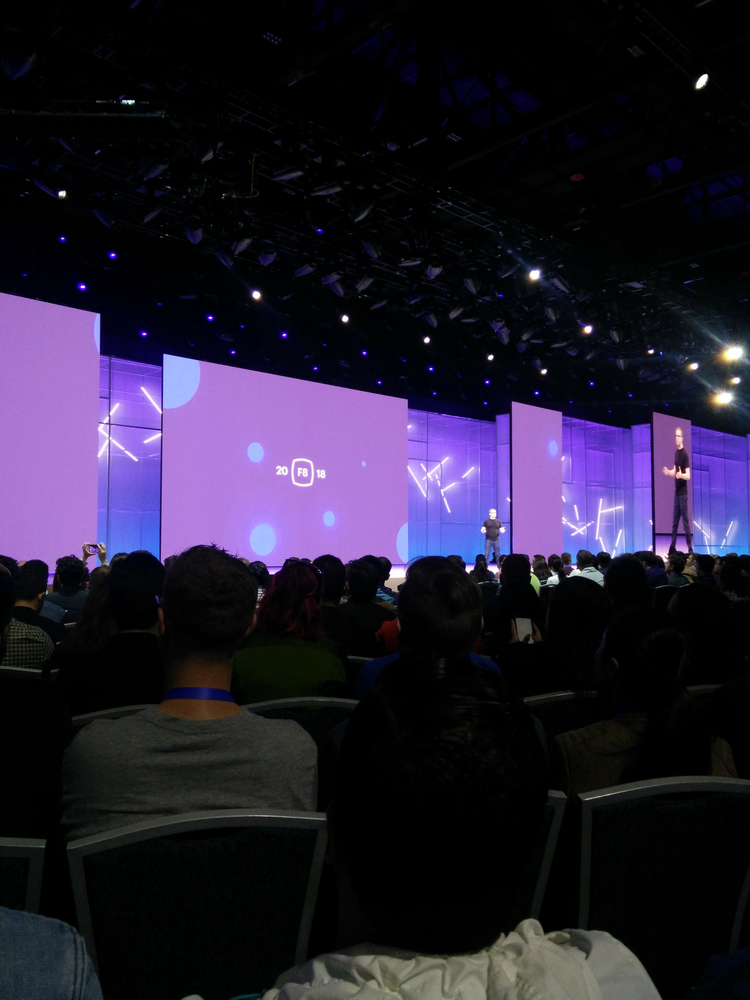
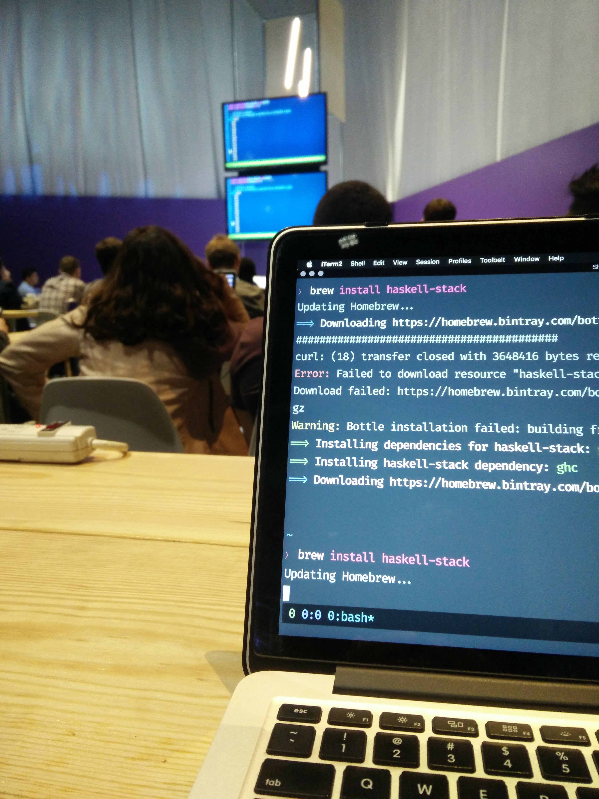
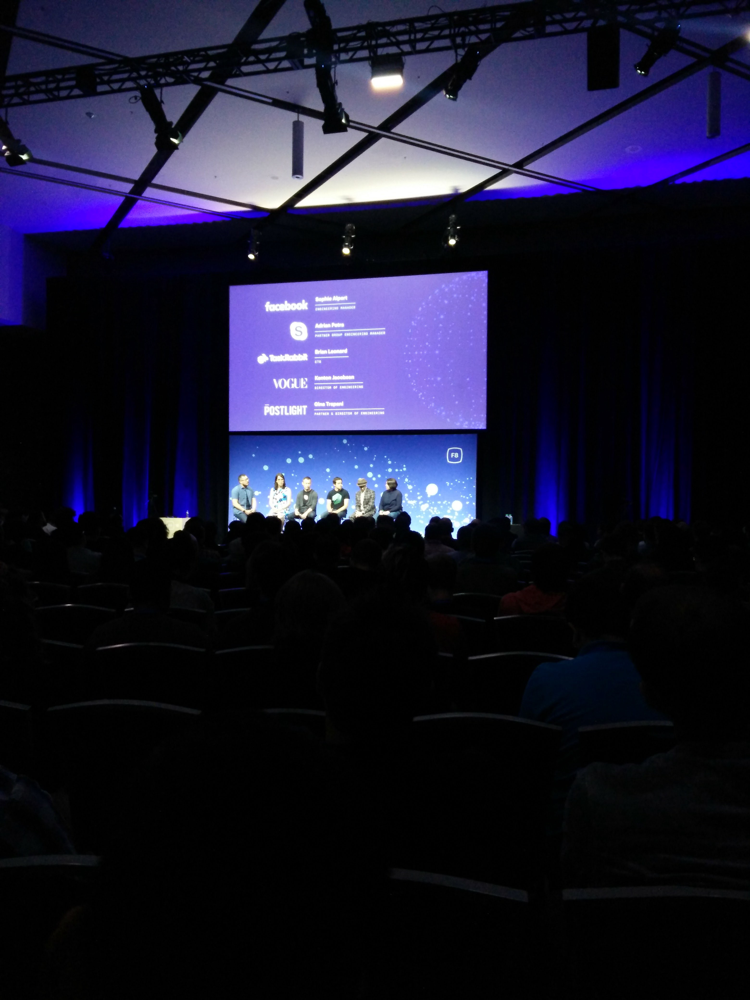
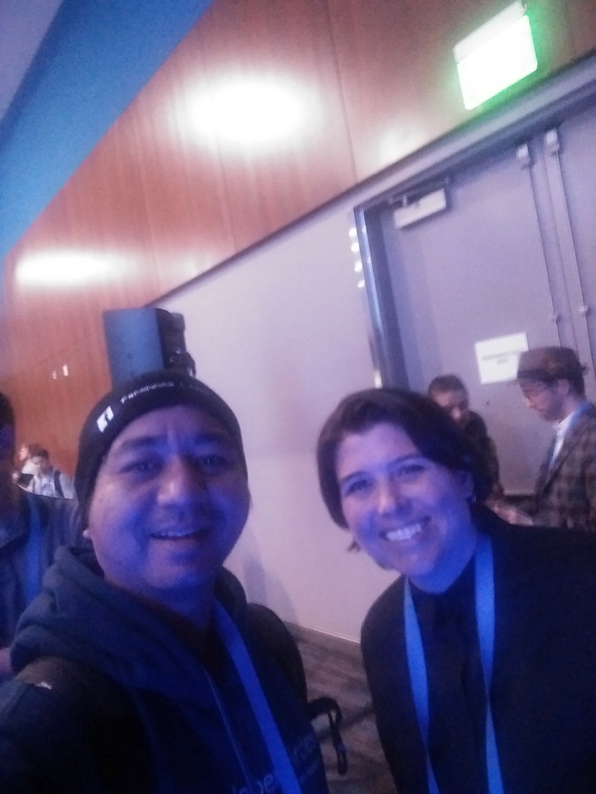
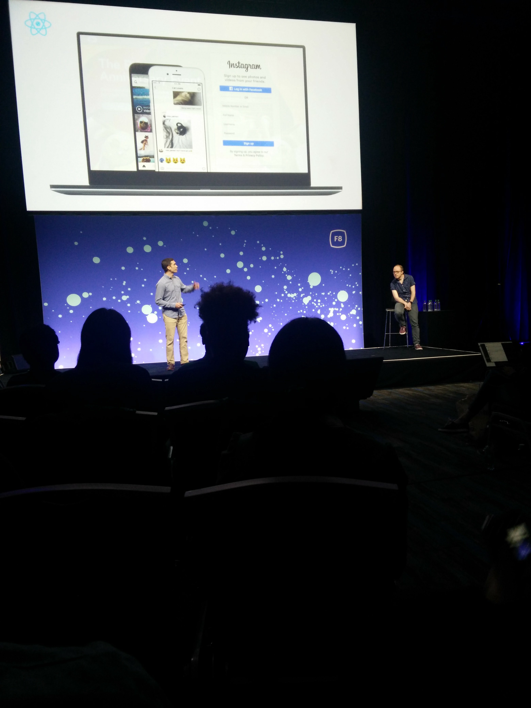
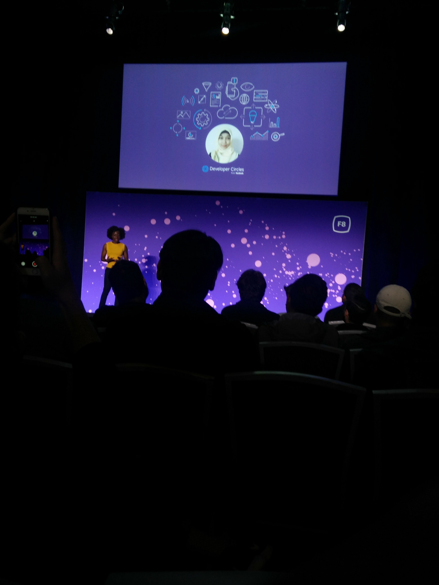
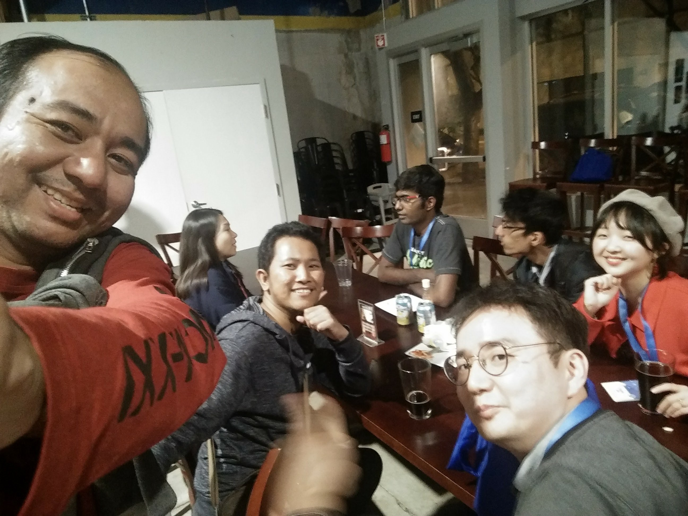
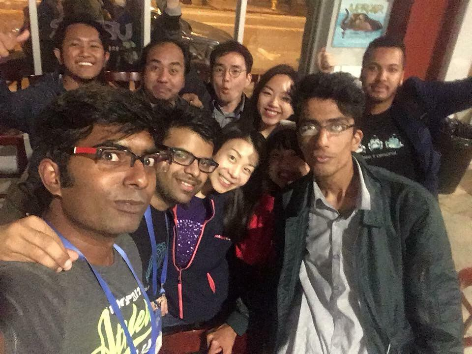
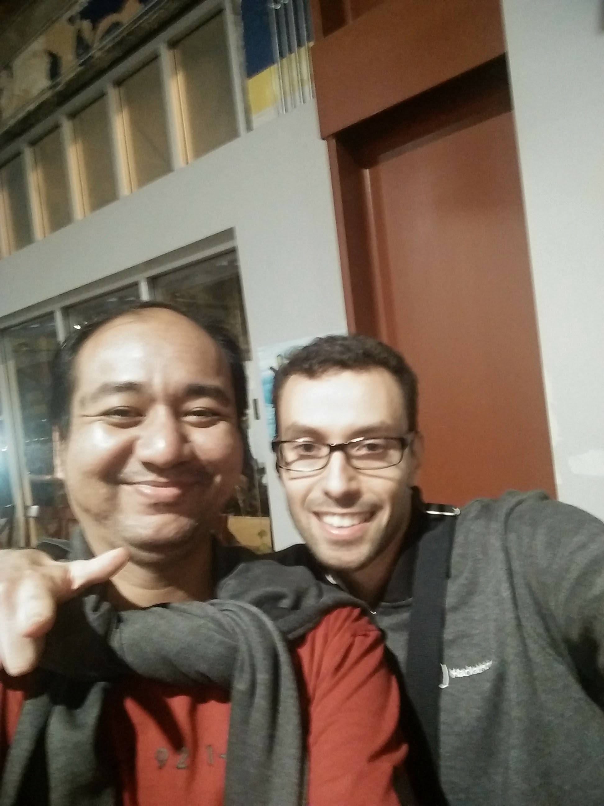

Ini adalah cerita berseri tentang perjalanan saya dan teman-teman Facebook Developer Circle Leads ke Silicon Valley dalam rangka mengikuti Facebook F8 Developer Conference. Ikuti dari [ bagian 0 ](https://rizafahmi.com/2018/05/08/f8-san-jose-trip-day-0/), dan [ bagian 1 ](https://rizafahmi.com/2018/05/14/f8-silicon-valley-trip-day-1/) supaya mendapatkan jalan ceritanya secara keseluruhan.

Tidak mau salah strategi lagi, F8 hari kedua saya fokuskan untuk menyaksikan berbagai *talk* yang menarik. Satu hal menarik yang saya perhatikan dari *conference* ini adalah setiap habis sesi talk, speaker *mojok* disisi kiri atau kanan panggung dan menantikan beberapa *audience* yang mau bertegur sapa dan bertanya. Ini hal baru buat saya, terutama *conference* di Indonesia belum pernah saya melihat hal seperti ini dilakukan. Dan *audience* juga cukup sopan untuk antri dan bergantian menyapa para pembicara.

## Keynote Hari Kedua

Kembali, jet lag menyerang. Banyak momen terlewat karena tidak tahan menahan kantuk. Untungnya ngga sampai *ngorok* seperti orang yang berada dua *row* dari saya 😈. Untuk hari kedua ini keynote dibawakan oleh Chief Technology Officer Facebook, Mike Schroepfer dan beberapa petinggi Facebook lainnya memaparkan tentang teknologi dan inovasi terkini yang dilakukan Facebook.

*Talk by CTO Facebook Mike Schroepfer*

Berbeda dengan hari pertama, kali ini saya duduk agak dibelakang karena sedikit telat pada saat masuk ke arena. Dari talk Mike diatas saya baru tersadar bahwa di Facebook, AI sudah digunakan dimana-mana. *AI is everywhere*! Ya ampun, saya yang sempat memilih mata kuliah AI dulu waktu di Binus menyia-nyiakan ilmu yang sebenarnya sudah saya ketahui dari dulu, dari tahun 2002-2003. Selaras yang dikatakan [Eric Nakagawa](https://rizafahmi.com/2018/05/14/f8-silicon-valley-trip-day-1/) yang saya jabarkan di artikel sebelumnya. Saya harus segera *upgrade* ilmu nih!

Beberapa catatan penting lainnya:

* [PyTorch](https://pytorch.org/), sebuah library Machine Learning rilis versi 1.0.
* [Caffe2](https://caffe2.ai/), sebuah library deep learning juga dirilis.
* [ONNX](https://onnx.ai/), sebuah open platform untuk deep learning model juga dirilis. Hal ini memungkinkan beberapa platform sepert Amazon AWS, Microsoft Azure dan yang lainnya bisa saling berkolaborasi menghasilkan model yang lebih powerful.
* Sebuah web juga dirilis, khusus untuk pengembang AI [https://facebook.ai/developers](https://facebook.ai/developers).

Secara umum visi Facebook sepuluh tahun kedepan adalah AI, Connectivity, VR dan AR. Berikut [link videonya](https://developers.facebook.com/videos/f8-2018/f8-2018-day-2-keynote/).

## Beberapa Talk Menarik

Sehari sebelumnya saya sudah planning untuk menyaksikan talk-talk berikut:

* Duckling: An Overview of the Open Source Probabilistic Parser
* ~~Using Natural Language Processing to Enhance Your Messenger Conversations~~
* ~~Build Your First Messenger Instant Game~~
* How React Native Helps Companies Build Better Mobile Apps
* Building with React Native and React VR: Insights from Instagram and Oculus
* ~~How Camera Effects Helped Us to Grow Our Business~~
* ~~Audio and Speech Understanding System~~
* Investing in Innovators Through Developer Programs

Tapi tidak semua akhirnya bisa saya hadiri karena satu dan lain hal. *Talk* pertama yang saya hadiri adalah tentang library [Duckling](https://github.com/facebook/duckling). Sebuah library Haskell yang bisa mem-*parsing* text menjadi data yang lebih terstruktur seperti tanggal dan lainnya. Sayangnya *pace*-nya agak cepat sehingga saya ketinggalan. Dan juga karena koneksi internet yang cukup mengecewakan sehingga keinginan belajar Haskell berhenti ketika gagal menginstal package [haskell-stack](https://docs.haskellstack.org/en/stable/README/). Haha, alasan aja ini mah 😏.

*Install Haskell Stack gagal*

## React Native Panel Discussion

Kemudian saya menghadiri diskusi panel tentang React Native yang di moderatori oleh [Eric Nakagawa](https://twitter.com/ericnakagawa). Panel terdiri dari [Gina Trapani](https://twitter.com/ginatrapani) Director of Engineering at [Postlight](https://postlight.com/), [Sophie Alpert](https://github.com/sophiebits) Engineering Manager at Facebok, [Brian Leonard](https://twitter.com/bleonard?lang=en) CTO at [TaskRabbit](https://www.taskrabbit.com/), [Adrian Potra](https://www.linkedin.com/in/apotra/) Engineering Manager at [Skype](https://www.skype.com/en/), dan [Kenton Jacobsen](https://twitter.com/kentonjacobsen?lang=en) Director of Engineering at [Vogue](https://www.vogue.com/).

*ReactNative Discussion Panel*

Seperti yang sudah bisa ditebak, Postlight, Facebook, TaskRabbit, Skype dan Vogue semua menggunakan ReactNative di *production*. Berikut beberapa catatan yang saya dapat dari diskusi panel ini:

* Skype mengunakan [ReactNative](https://facebook.github.io/react-native/) dengan [TypeScript](https://www.typescriptlang.org/). Mereka menggunakan [React](https://reactjs.org/) dan ReactNative untuk *solve cross-platform issue*. Mereka juga menggunakan [ReactXP](https://github.com/Microsoft/reactxp). Untuk hiring, mereka lebih fokus kepada orang-orang dengan tipe generalis.

* TaskRabbit pertama kali menggunakan ReactNative di aplikasi Tasker mereka. Yang tadinya tim mobile disemua platform ada enam orang, setelah menggunakan ReactNative, timnya bisa dipangkas menjadi 2 orang saja!

* Vogue menggunakan ReactNative dan [GraphQL](https://graphql.org/). Di Backend Vogue menggunakan [NodeJS](https://nodejs.org/en/).

* Facebook menggunakan ReactNative dimana-mana. Yang paling besar salah satunya di Facebook Marketplace yang diakses 800 juta orang per bulannya.

* PostLight menggunakan React sangat intensif di web dan mereka hanya punya 1 orang iOS engineer. Dan memilih ReactNative merupakan pilihan yang *no brainer* buat PostLight. Terutama karena mereka juga banyak bekerjasama dengan instansi-instansi non-profit dengan budget minimal

Setelah diskusi selesai, saya melihat semua narasumber turun dari panggung dan menunggu di sisi panggung untuk *disamperin* audience. Dan *audience* juga membentuk antrian yang rapi dan bergantian bertanya atau sekedar *say hi*. Karena kemaren sudah berbincang banyak dengan Eric, saya memutuskan untuk *say hi* ke [Gina Trapani](https://ginatrapani.org/). Buat yang belum tahu, Gina ini cukup populer dimasanya. Dia pembuat aplikasi [todo.txt](http://todotxt.org/), ex-founder [lifehacker](https://lifehacker.com/), pengisi acara di [twit.tv](https://twit.tv/episodes?credits_people=23), dan masih banyak lagi.

*With Gina Trapani*

## ReactNative Dan ReactVR di Instagram dan Oculus

Talk selanjutnya yang saya hadiri berjudul “Building with React Native and React VR: Insights from Instagram and Oculus”. Dibawakan duet oleh [Brian Rosenfeld](https://www.instagram.com/brosenfeld/?hl=en) dari [Instagram](https://instagram.com) dan Mike Armstrong dari [Oculus](https://www.oculus.com/), mereka share apa dan bagaiman ReactNative dan ReactVR digunakan di perusahaan masing-masing.

Inti dari sesi ini adalah meskipun Instagram dan Oculus berasal dari dunia yang berbeda, yang satu adalah aplikasi mobile dan web dan lainnya mengembangkan platform virtual reality, tapi mereka menggunakan *framework* yang sama, React (padahal katanya React bukan framework ya, ya sudahlah).

Di sesi ini sebenarnya mereka ‘jualan’ React sih dengan menjelaskan apa itu React, apa itu ReactNative dan ReactVR. Dan buat saya yang sudah menggunakan React, saya tidak perlu di-*convince* lagi sih. Tapi presentasinya cukup menghibur dan mendapatkan *insight* tambahan kenapa React itu keren!

*Sesi ReactNative dan ReactVR*

### Investing in Innovators Through Developer Programs

Dan sesi terakhir yang saya hadiri adalah sesi Developer Programs. Disini Kunbi Adeyemo dari Facebook sharing tentang bagaimana program Developer Circles mengubah hidup banyak orang. Salah satunya, [Nila](https://www.facebook.com/nilawilda) DevC Lead asal Surabaya. Tuh, slide-nya saya foto! Merinding episode kedua 😃.

*Nila on the slide*

Luar biasa ya kontingen Indonesia banyak di-*highlight*. Dan satu hal lagi yang baru saya tahu ternyata salah satu founder aplikasi belajar coding [SoloLearn](https://developers.facebook.com/videos/f8-2018/investing-in-innovators-through-developer-programs/), [Yeva Hyusyan](https://www.linkedin.com/in/yeva-hyusyan-5a16a220/) juga hasil ‘didikan’ Developer Program di Armenia.

Dan selesai sudah sesi-sesi *talk* dan sekaligus F8 ditutup dengan Happy Hour sekaligus pengumuman pemenang Hackathon. Karena saya ngga ikutan, saya dan beberapa *leads* memutuskan pulang ke hotel untuk isitirahat sejenak karena malamnya ada acara khusus untuk *leads*. Seperti acara pembubaran panitia gitu deh.

## Happy Hour For DevC Leads

Nah, *another great moment came at this event*. Setelah makan, minum, saling bertegur sapa, dan foto-foto (sumpah, para leads disini banyak banget yang hobi selfie!) saya mendapatkan momen yang sangat berharga meski sebentar.

*Maaf, saya kurang bisa wefie.*

*With Leads, mother of Leads (Elisha) and Mother of mother of Leads (Alice).*

*Moment of truth*, atas inisiasi bro Firdaus, DevC Lead Surabaya saya dikenalkan oleh orang yang keren parah! Dia sangat terkenal di dunia p̶e̶r̶s̶i̶l̶a̶t̶a̶n̶ ReactNative. Tapi karena orangnya *low profile* dan *super geek*, ngga banyak orang yang tahu. Namanya [Farid Safi](https://twitter.com/FaridSafi), DevC Lead Paris. Dia ini *master*-nya ReactNative. Kalo tahu ReactNative pasti tahu [Gifted Chat](https://github.com/FaridSafi/react-native-gifted-chat), salah satu project ReactNative yang jadi panduan banyak orang saat belajar. Dan yang Farid ini adalah orang yang buat Gifted Chat. Ya ampun, kenapa baru sempat ngobrol sekarang ya….

Dan yang lebih kerennya lagi adalah Farid ini juga membangun *coding bootcamp* di Paris. Namanya[Le Reacteur](https://www.lereacteur.io/), sebuah *coding bootcamp fullstack* JavaScript yang berdurasi 10 minggu. Jadilah kita saling *sharing* tentang bagaimana suka-duka menjalankan *bootcamp*. Termasuk saya juga bertanya tentang *bootcamp* lainnya yang saya tahu dan sepertinya lebih populer: [Le Wagon](https://www.lewagon.com/). Dan memang benar dugaan saya, mereka kompetitor. Dan saya bisa merasakan gimana rasanya punya kompetitor 😃.

*With Farid*

Sayangnya waktu kita terbatas, jadi cuma sempat ngobrol sebentar. Tapi tenang saja, kita bisa ngobrol *online* kan ya. Yang penting kontak sudah didapat 🎉.

Dan usai sudah perhelatan [F8 Conference](https://www.f8.com/). Mungkin artikel selanjutnya saya akan share sedikit tentang pengalaman saya dan teman-teman leads mengelilingi Silicon Valley dalam rangka tur ke kantor-kantor startup ternama.

Kalau mau dengar penuturan langsung dari kami yang berangkat, silakan join [grup facebook DevC Jakarta](https://www.facebook.com/groups/DevCJakarta/). Kita akan mengadakan meetup khusus membahas tentang pengalaman kita di F8.
