Ini adalah cerita berseri tentang perjalanan saya dan teman-teman Facebook Developer Circle Leads ke Silicon Valley dalam rangka mengikuti Facebook F8 Developer Conference. Ini adalah bagian terakhir dari rangkaian cerita perjalanan yang seru ini. Ikuti dari [ bagian 0 ](https://rizafahmi.com/2018/05/08/f8-san-jose-trip-day-0/), [ bagian 1 ](https://rizafahmi.com/2018/05/14/f8-silicon-valley-trip-day-1/) dan [ bagian 2 ](https://rizafahmi.com/2018/05/21/f8-silicon-valley-day-2/) supaya mendapatkan jalan ceritanya secara keseluruhan.

Perhelatan F8 Conference telah usai. Tapi cerita tidak usai sampai disini karena semua *leads* dari Indonesia sepakat untuk *extend* sampai hari sabtu. Saya dan empat *leads* lainnya menetap di Bay Area sementara sisanya melalangbuana ke Los Angeles.

Ngapain di Bay Area? Kita berencana mau keliling kantor-kantor *tech startup* ternama seperti Google, ~~Apple, Intel, Nasa~~, GitHub, Dropbox, Zynga, Airbnb, Pinterest, Heroku dan lain sebagainya.

Tapi sebelum itu, kita harus *checkout* dulu dari hotel masing-masing karena Facebook cuma meng-*cover* biaya kita sampai hari ketiga saja. Karena itu kita berlima *checkout* dan *order* rumah besar dipuncak Alum Rock via [ Airbnb ](https://www.airbnb.com/invite?r=50) 😃.

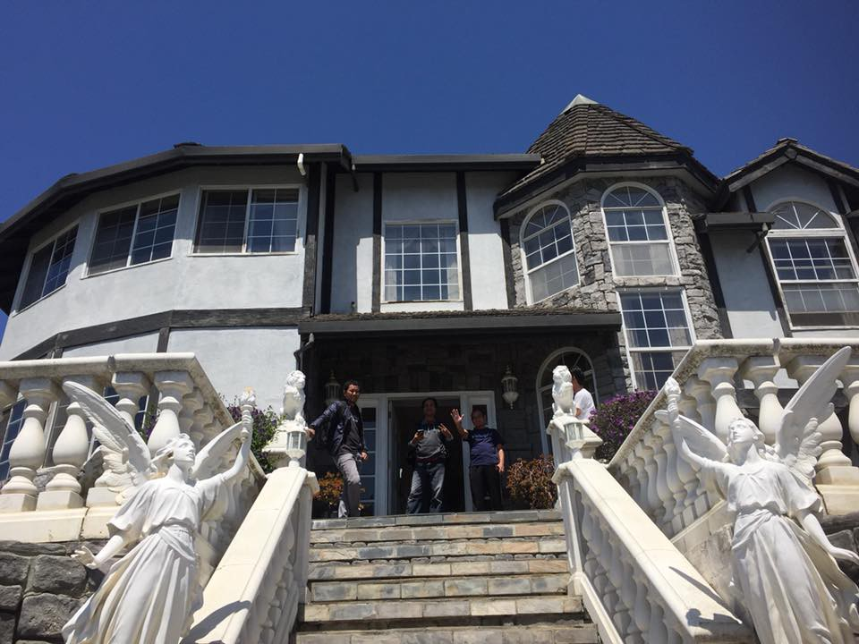*Mansion at Alum Rock*

## Menuju Mountain View

Rencana utama tur hari pertama ini adalah mengunjungi Intel, Nasa dan Google tentunya. Di [Intel](https://www.intel.com/content/www/us/en/company-overview/intel-museum.html) kabarnya ada museum komputer yang keren banget. Nasa juga punya museum yang bisa dikunjungi [Nasa AMES Research Center](https://www.nasa.gov/ames/visitorcenter.html) namanya. Apple juga punya [Apple Park Visitor Center](https://www.apple.com/retail/appleparkvisitorcenter/) yang layak dikunjungi. Karena keterbatasan waktu dan lokasi kita putuskan ingin mengunjungi museum Nasa dan [Googleplex](https://en.wikipedia.org/wiki/Googleplex) saja.

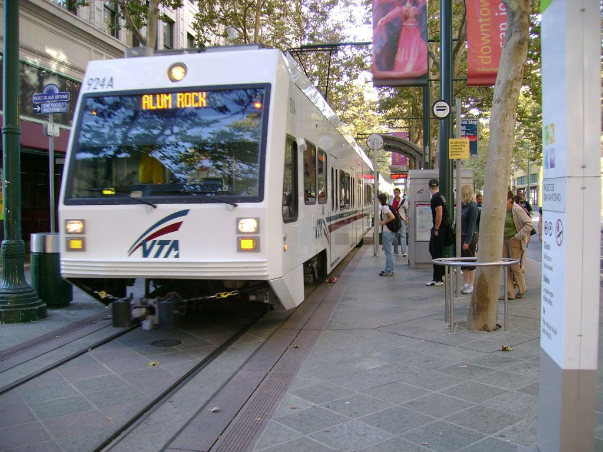*Tram, kereta lambat.*

Sayangnya ngga keburu juga, museum Nasa sudah keburu tutup. Mungkin karena kita naik tram dan sempat salah turun (*my bad*). Kita naik tram dari Alum Rock menuju Downtown Mountain View sebelum bergerak ke Googleplex, kantor Google.

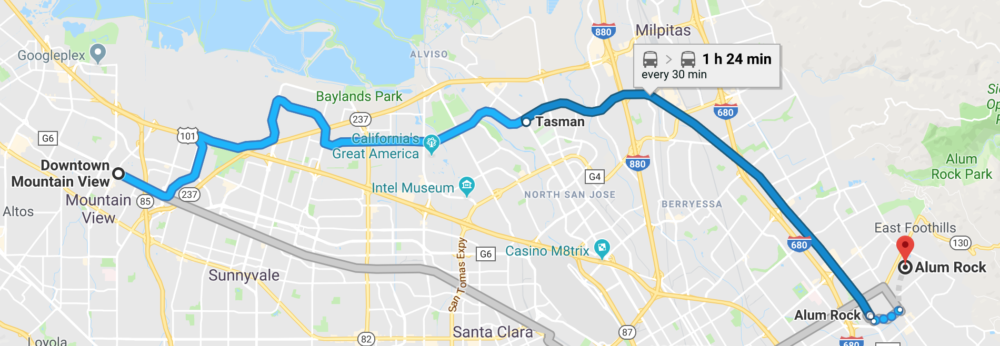*Dari Alum Rock(kiri) ke Mountain View*

Ditengah perjalanan kita sempat melewati kantor Samsung dan ketika ganti tram di stasiun, kita sempatkan berfoto-ria.

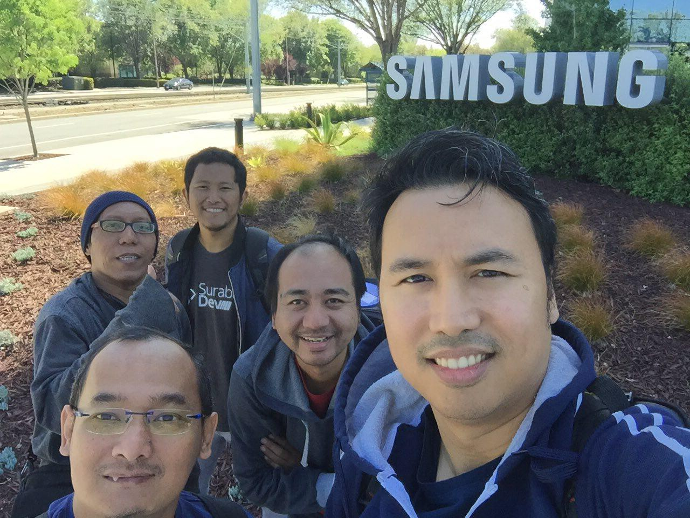*Didepan Kantor Samsung*

## Downtown Mountain View

Sesampainya di Downtown Mountain View, perut sudah terasa lapar. Jalanlah kita menyusuri *downtown* mencari secercah tempat makan halal. Downtown Mountain View ini unik sekali. Beberapa sudut seperti di film-film Hollywood.

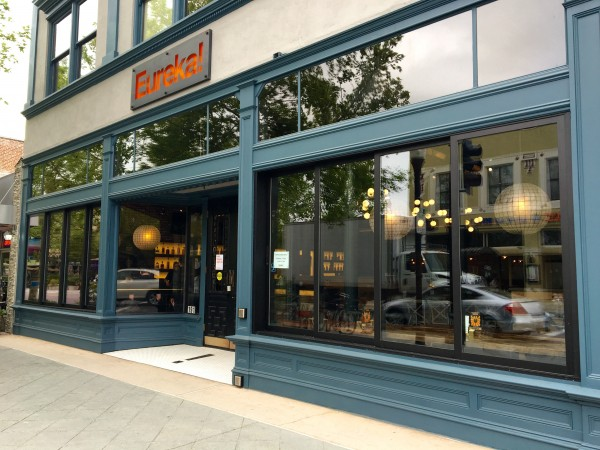

*Sudut ini mengingatkan saya kepada satu scene di film Spiderman.*

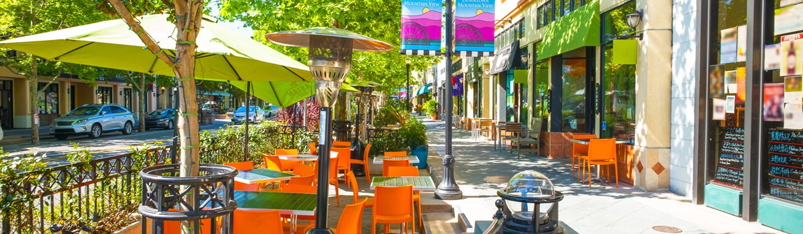*Downtown Mountain View*

Kita tidak terlalu banyak melestarikan momen kita disana karena perut sudah semakin lapar. Hingga akhirnya kita menemukan sebuah cafe menarik, namanya [Cafe Baklava](http://www.cafebaklavamountainview.us/). Cafe ini menyuguhi makanan khas mediterania, khususnya Turki. Meskipun panas terik, (kita disana sekitar jam 6–7 malam, disana matahari mulai tenggelam jam 9-an) kita putuskan untuk memilih tempat duduk yang diluar. Keputusan yang salah, pastinya.

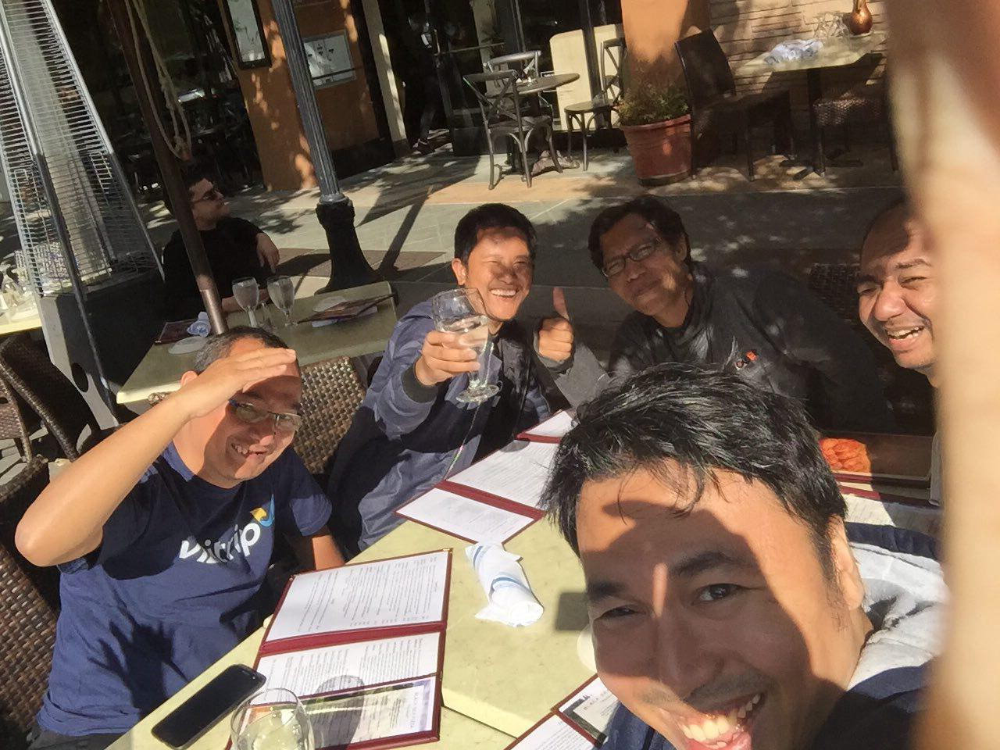*Panas cuy!*

Setelah bingung memilih makanan, melihat menu dan di-*sort by* harga, kita memilih Lamb Pizza. Setelah menunggu cukup lama akhirnya dan beberapa kali refill air putih, akhirnya makananannya datang juga. Ada yang aneh, kita pesan pizza kok yang muncul roti ya?

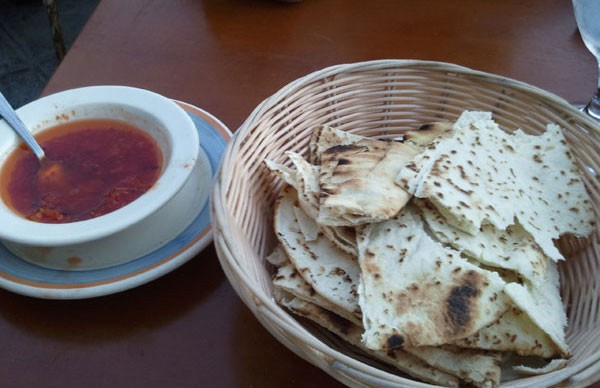

*Roti makanan pembuka*

Karena sudah lapar, apapun yang ada didepan mata kita lahap saja. Rotinya ada kandungan *lamb*-nya, rasa-rasanya. Setelah makanan lenyap sekejap mata, dan karena sudah mulai kepanasan, kita langsung beranjak dan bergegas ke Googleplex. Setelah bayar (terimakasih Om Luri sudah mentraktir kita-kita) kita dikagetkan oleh *waitress* yang mengabari bahwa pizza yang kita pesan masih dalam proses pembuatan dan dia juga meminta maaf karena sedikit lama. Loh?! Jadi yang tadi kita makan apa dong?!

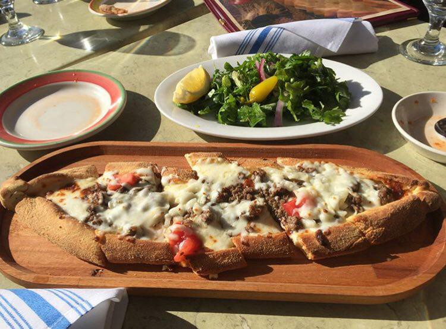

*Lamb Pizza yang sebenarnya*

Ternyata yang tadi kita kira roti pizza dengan aroma kambing adalah roti biasa sebagai makanan pembuka! Dan sebenarnya roti itu ngga ada rasa kambingnya sama sekali. Itu murni hanya halusinasi kita saja. Kenyanglah kita tertawa ngakak tiada henti. Dan setelah kenyang (tertawa), dan juga melahap habis pizza-nya, kita bergegas menuju Googleplex.

## Di Kawasan Googleplex

Sesampainya di Googleplex, kita langsung menaiki sepeda yang disediakan Google untuk berkeliling area Googleplex yang super luas! Sepeda ini memang disediakan sebagai kendaraan untuk karyawan Google berkeliling Googleplex. Kabarnya sepeda ini hanya boleh dinaiki oleh karyawan Google. Tapi kita cuek aja dan ternyata ngga ada satpam yang mengejar kita, untungnya.

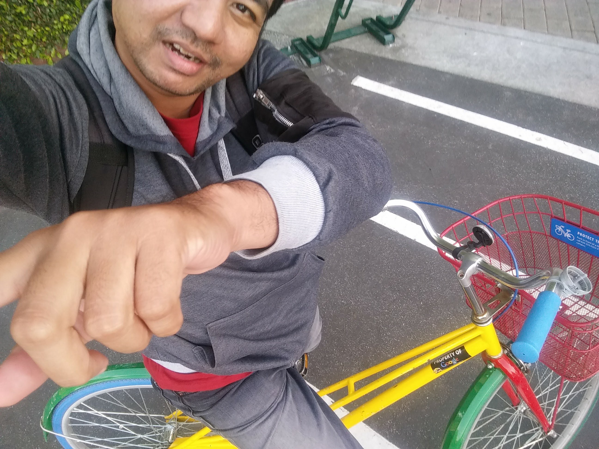*Sulitnya mengendari sepeda sambil selfie.*

Seperti biasa, kita sempatkan untuk melesarikan momen ini dengan foto-foto. *A lot of photos*! Soalnya Googleplex ini cukup [instagramable](https://www.instagram.com/rizafahmi/). Kita foto di patung Android terbaru Oreo (saat artikel ini dipublish mungkin sudah ganti Android P). Dan juga kita foto-foto di [kuburan Android](https://en.wikipedia.org/wiki/Android_lawn_statues), sebuah tempat dimana patung Android yang sudah lewat masanya seperti Donut, Eclair, Jellybean, dll ditempatkan. Sayangnya toko suvenir sudah tutup juga jadi ngga bisa belanja *swag*.

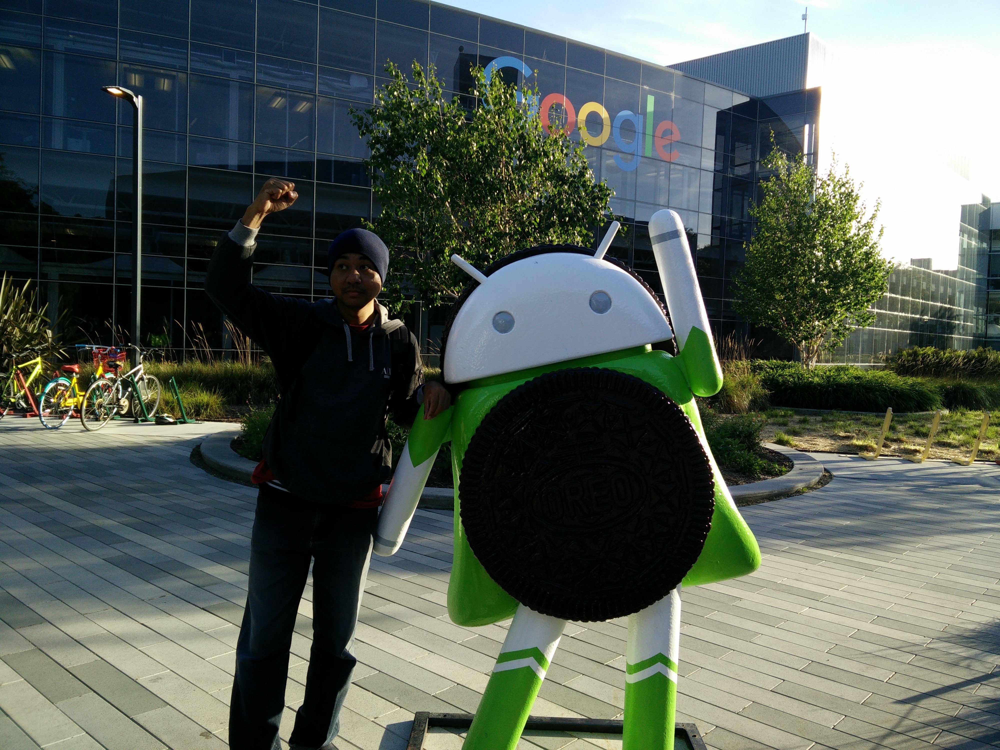*Bersama maskot Android Oreo*

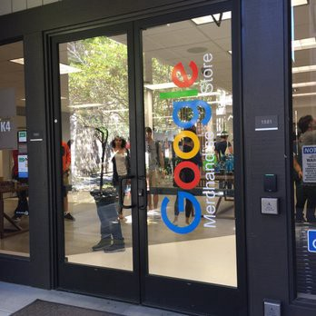

*Google Merchandise Store*

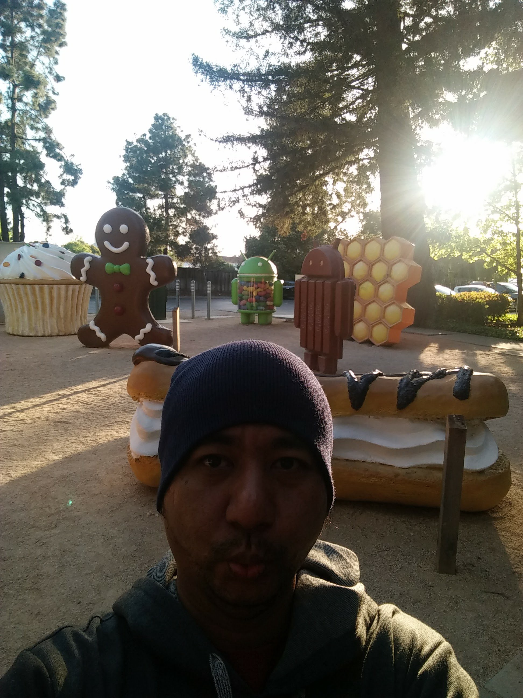*Android Lawn Statues*

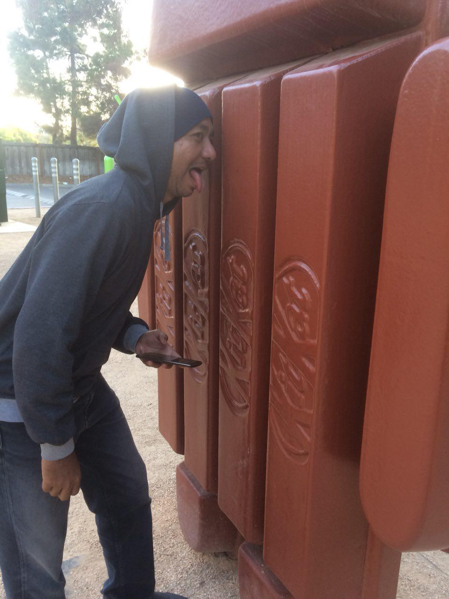*Kitkat si pencuci mulut, setelah melahap Lamb Pizza*

Jika teman-teman ingin tur kedalam kantornya Google, kita harus punya kontak karyawan Google dan setiap karyawan punya hak untuk memberikan tur hingga kedalam kantor Google. Kebetulan saya mengenal beberapa karyawan Google. Hanya sayangnya pada saat itu para personel Google sedang sibuk mempersiapkan [Google I/O](https://events.google.com/io/) sehingga mereka tidak bisa ‘menjamu’ kita untuk tur kedalam kantornya.

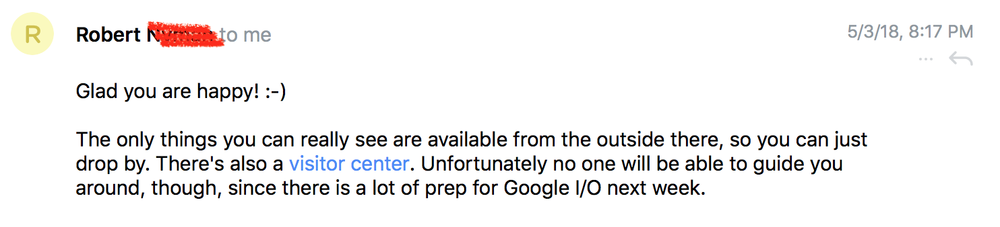*Email dari salah satu karyawan Google*

Setelah puas berkeliling Googleplex, kita kemudian menuju ke tempat makan sebelum kembali pulang ke penginapan.

## Golden Gate Bridge

Besok paginya kita memulai lagi petualangan kita di Bay Area. Destinasi pertama yang dikunjungi adalah [Golden Gate Bridge](https://en.wikipedia.org/wiki/Golden_Gate_Bridge), itu loh jembatan merah yang terkenal itu.

*Adegan golden gate bridge di film x-men.*

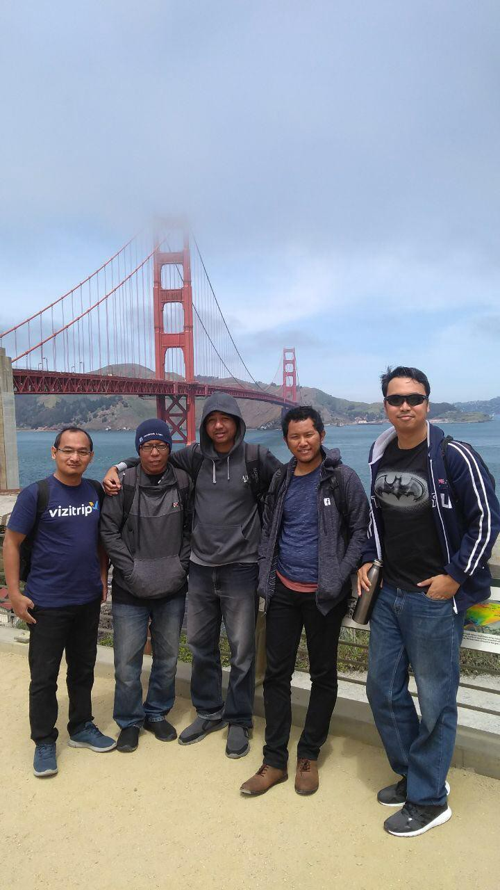

*Golden Gate saat itu sedang berkabut*

Setelah puas foto-foto dan membeli beberapa merchendise, kemudian kita bergerak menuju San Francisco untuk mengunjungi beberapa kantor-kantor *tech company* ternama.

## Tour de San Francisco

Rencana ini agak *gambling* sebenarnya. Kalau ngga punya *contact person* di *tech company* tersebut ngga mungkin bisa masuk ke kantornya. Berhubung sudah terlanjur, ya *show must go on*. Jadilah kita menuju ke area perkantoran para startup tersebut.

Setelah sampai, kita langsung menuju ke kantor [GitHub](https://github.com/). Sayang banget karena tur ke kantor [GitHub](https://github.com/) untuk publik sudah ditiadakan. Ya sudah, kita foto-foto didepan pintunya aja.

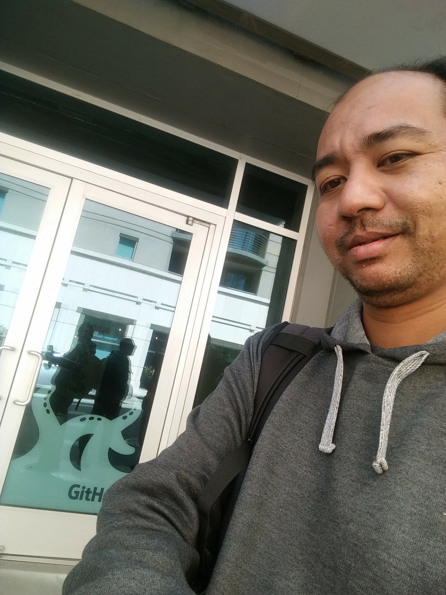*Didepan kantor GitHub*

Jika ada yang beruntung dapat tur masuk kedalam kantornya, berikut kira-kira [gambaran bagian dalamnya](https://www.officelovin.com/2015/03/20/another-look-inside-githubs-san-francisco-headquarters/).

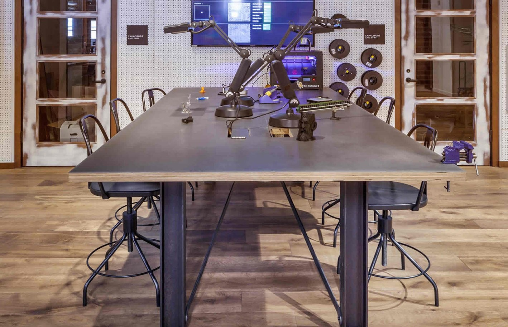*Foto diambil dari officelovin.com*

Setelah dari [GitHub](https://github.com/), saatnya mengisi perut. Kita kembali mencari tempat makan di sekitar area perkantoran ini. Sambil mencari kita juga melewati kantor [Ubisoft](https://www.ubisoft.com/en-gb/). Perusahaan game asal London ini ternyata punya kantor juga di San Francisco.

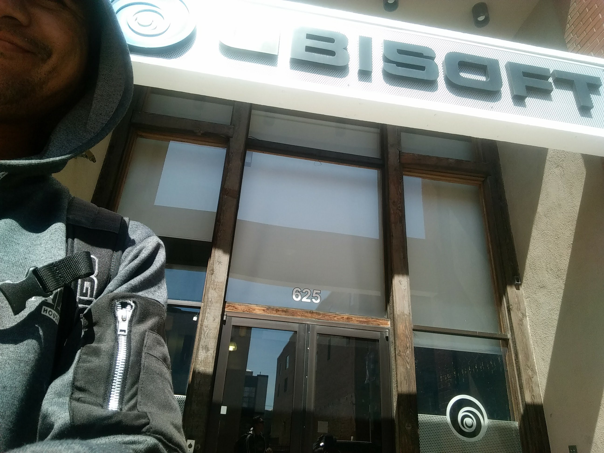*Di Depan Kantor Ubisoft*

Dan berikut tampak dalam kantor Ubisoft seperti yang dirangkum oleh [dynamitedigital.com](https://dynamitedigital.com/large-format-prints-ubisoft-office/).

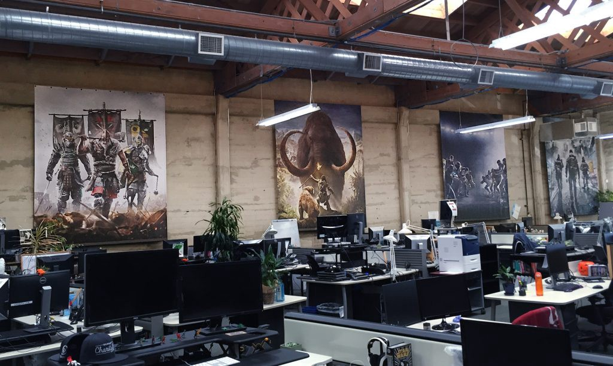*Bagian dalam kantor Ubisoft di San Francisco*

Dan juga melewati sebuah stadion yang cukup megah, AT&T Park. Kandang bagi tim Major League Baseball [San Francisco Giants](https://www.mlb.com/giants).

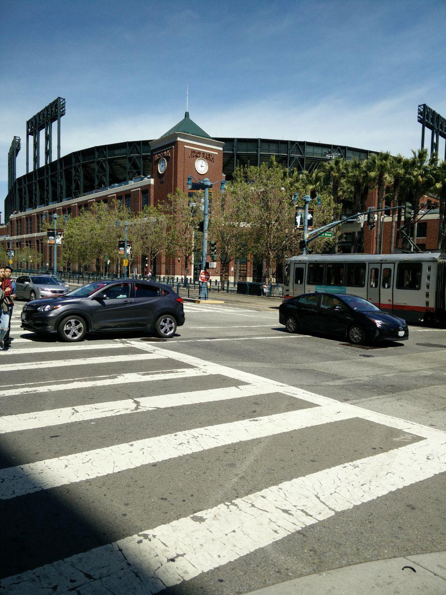*AT&T Park*

Kemudian kita melipir dan makan di [Umami Burger](https://www.umamiburger.com/locations/marina-district/). Kali ini makanannya cukup *straightforward*, jadi tidak ada kejadian lucu seperti yang terjadi di Cafe Baklava kemarin. Sambil makan kita juga merencakanan ulang rute perjalanan kita supaya optimal. Karena kita jalan kaki, jadi rute harus super optimal :)

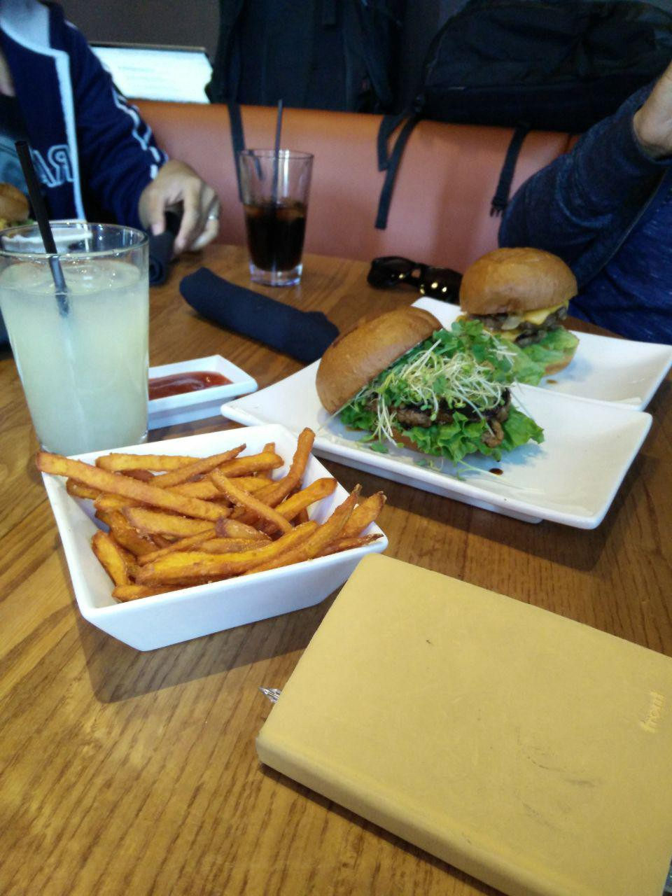*Umami Burger di San Francisco*

Kemudian petualangan pun dilanjutkan kembali. *First stop*, [Dropbox](https://www.dropbox.com/). Kantor [Dropbox](https://www.dropbox.com/) agak sedikit berbeda karena gedungnya cukup besar dan ada beberapa gedung dalam satu kompleks.

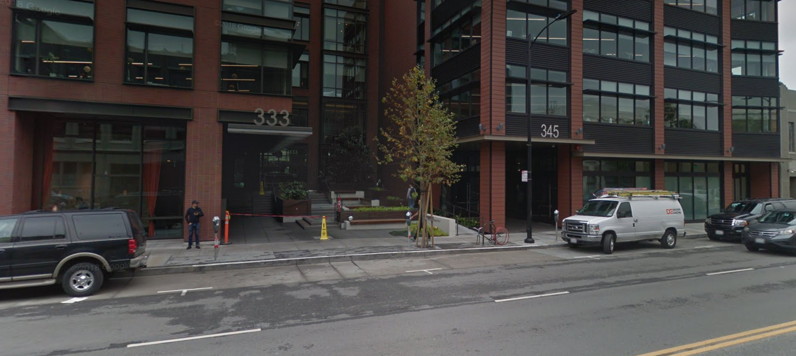*Foto kompleks perkantoran Dropbox diambil dari Google Maps*

Kita melihat sepertinya ada sekelompok orang yang baru selesai tur, karena itu kita memberanikan diri untuk bertanya tentang tur ke resepsionis. Ternyata memang tur tidak dilakukan untuk publik. Mungkin mereka adalah sekawanan mahasiswa *fresh graduate* atau calon *intern*.

Tapi kita tidak patah arang, kita tetap diperbolehkan foto didepan kantor yang ada logonya. *Fair enough.*

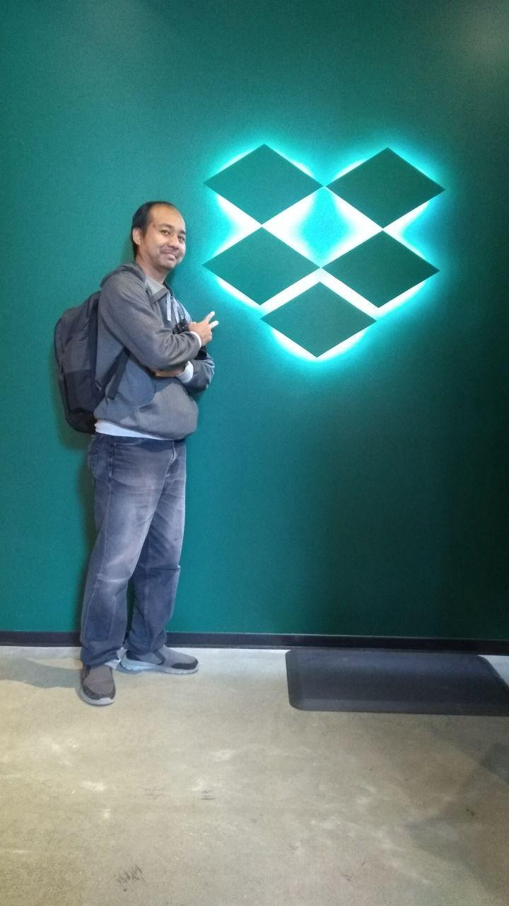*Didepan kantor Dropbox*

Penasaran dengan tampak dalamnya? Bisa dicek di [tautan berikut](https://www.officelovin.com/2016/12/07/tour-dropboxs-stunning-new-san-francisco-headquarters/).

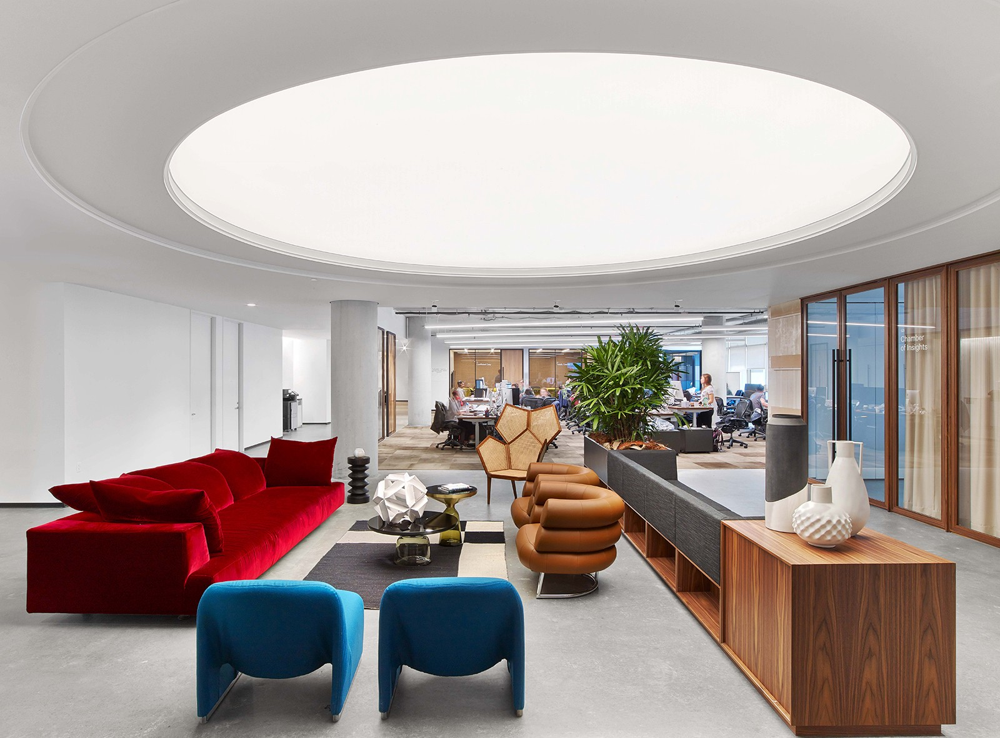*Foto diambil dari situs officelovin.com*

Selanjutnya kita menuju ke kantor [Pinterest](https://www.pinterest.com/). Kita sudah mencoba menembus barikade *front office*-nya dengan pura-pura kebelet dan mau ke toilet. Tapi belum berhasil, alhasil kita cukup foto-foto dari luar kantornya. Oh iya, di San Francisco [Pinterest](https://www.pinterest.com/) punya dua kantor yang terpisah 2–3 blok.

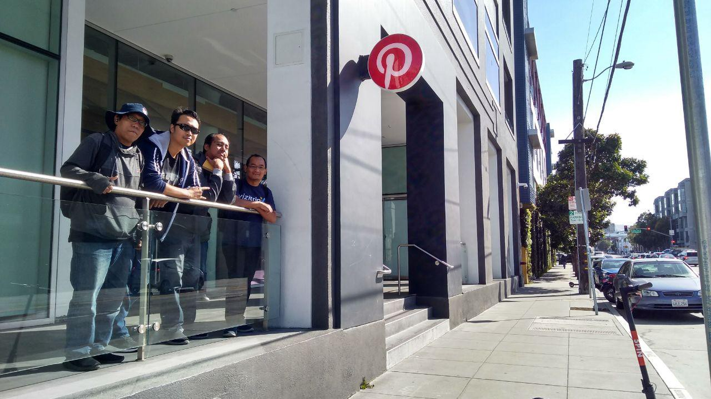*Foto dari luar kantor Pinterest*

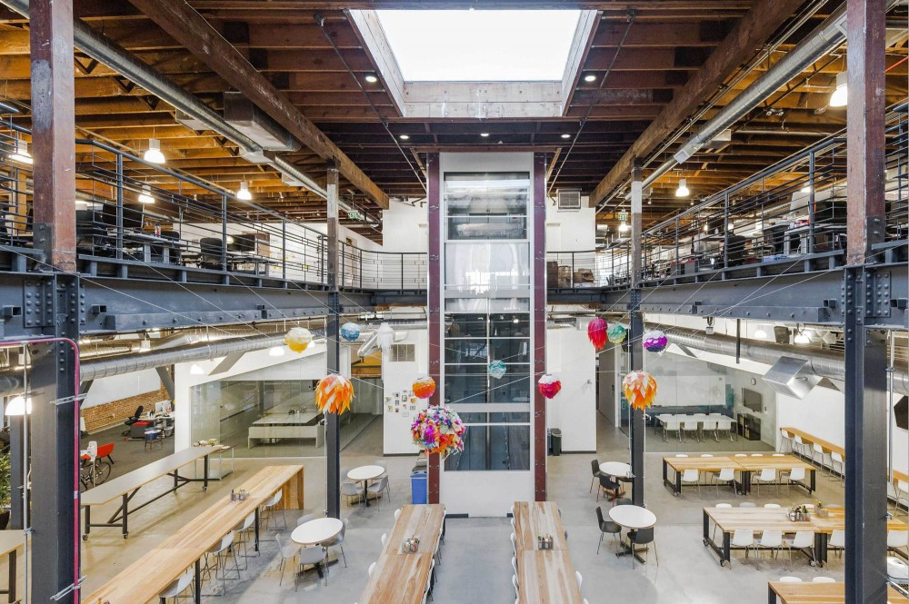*Foto didalam kantor Pinterest. Diambil dari officelovin.com*

Kemudian kita berjalan lagi menyusuri kawasan *tech company* di San Francisco dan sampailah kita di kantor [Heroku](https://www.heroku.com/). Agak sepi apa mungkin sudah pindah atau memang sudah jam bubaran kantor?! Masih menjadi misteri.

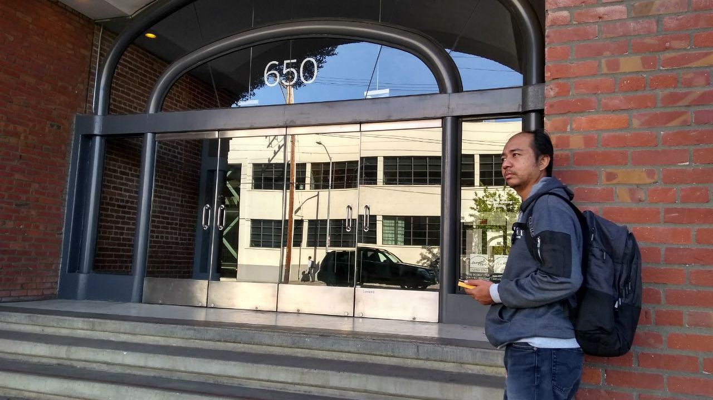*Apakah benar ini kantor Heroku?!*

Jika teman-teman penasaran ingin tahu bagaimana nuansa kantornya, bisa lihat di [link berikut](https://www.officelovin.com/2015/06/01/a-tour-of-herokus-gorgeous-san-francisco-headquarters-2/).

*Seperti ini kantor Heroku dari dalam. Foto diambil dari officelovin.com*

Perjalanan kita lanjutkan hingga secara tidak sengaja bertemu dengan sebuah gedung yang ditutupi logo anjing lucu. Ya, kita ternyata melewati kantor perusahaan game [Zynga](https://www.zynga.com/)! Ternyata itu adalah bagian belakang dari gedung kantornya.

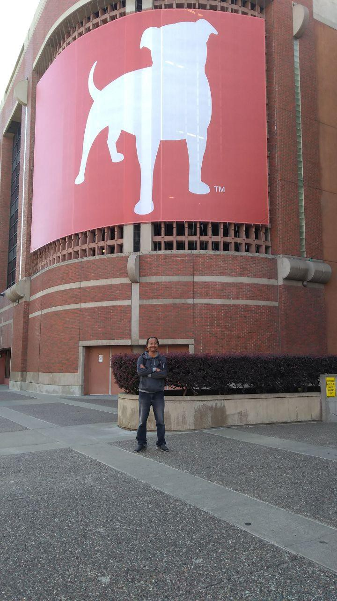

*Bagian belakang kantor Zynga.*

Dan selang beberapa langkah kita akhirnya sampai di depan kantornya.

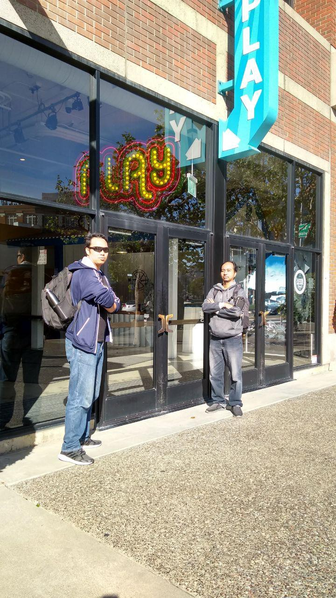

*Tampak depan kantor Zynga.*

Kalau teman-teman masuk kedalamnya, wah dijamin keren banget! Mau tahu isi dalemannya seperti apa? Nih bisa [diintip disini](https://www.officelovin.com/2014/08/14/take-look-zyngas-san-francisco-headquarters/).

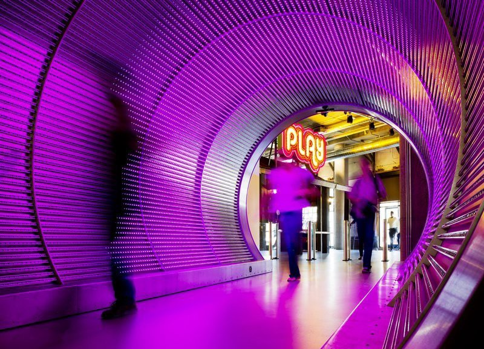*Foto diambil dari officelovin.com*

Dan persinggahan terakhir kita di tur *tech company* kali ini adalah [Airbnb](https://www.airbnb.com.sg/invite?r=50). Untungnya kantor [Airbnb](https://www.airbnb.com.sg/invite?r=50) punya lobby yang dibuka untuk umum, jadi lumayan bisa *ngelempengin* kaki disana.

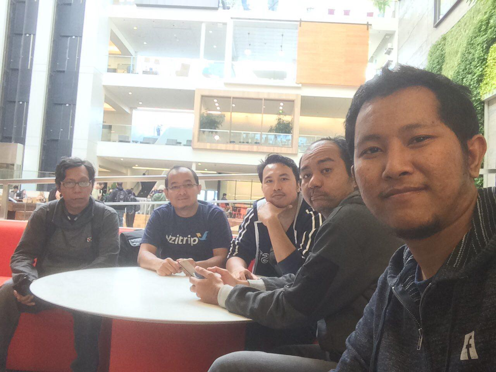*Ngaso di lobby Airbnb*

Lucunya, kantor [Airbnb](https://www.airbnb.com/) ini ngga ada logonya atau tanda-tanda bahwa ini adalah kantor [Airbnb](https://www.airbnb.com/). Tapi ini bener kok kantor [Airbnb](https://www.airbnb.com/), kita ([Firdaus](https://www.facebook.com/firdausious?fref=ufi)) sempat ngobrol dengan salah satu *data scientist* [Airbnb](https://www.airbnb.com/) yang ternyata berasal dari negeri tetangga, Malaysia. Dan dia juga baru sadar kantornya ngga ada logonya.

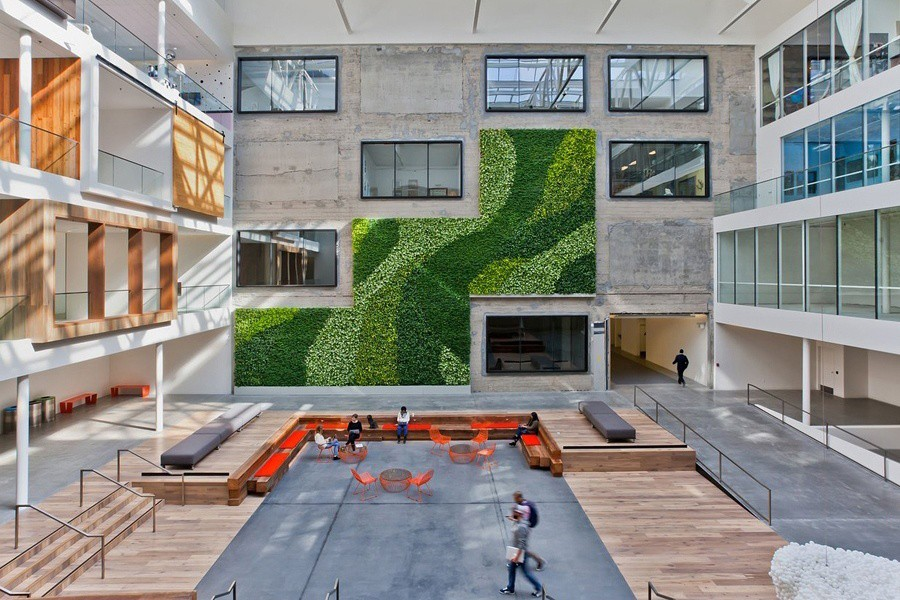*Atrium kantor Airbnb. Foto diambil dari officelovin.com*

Dan selesai sudah tur *tech company* kita. Tapi sebelum pulang ke penginapan, kita menyempatkan untuk mengunjungi daerah pantai San Francisco, [Pier 39](https://www.pier39.com/) dan [Fisherman’s Wharf](https://en.wikipedia.org/wiki/Fisherman%27s_Wharf,_San_Francisco).

## Pier 39 dan Fisherman’s Wharf

Pier 39 ini seperti ‘ancol’-nya San Francisco. Cukup ramai pengunjung, salah satu daya tariknya adalah pemandangan yang sangat indah. Kita bisa melihat sisi lain kota San Francisco dari sini.

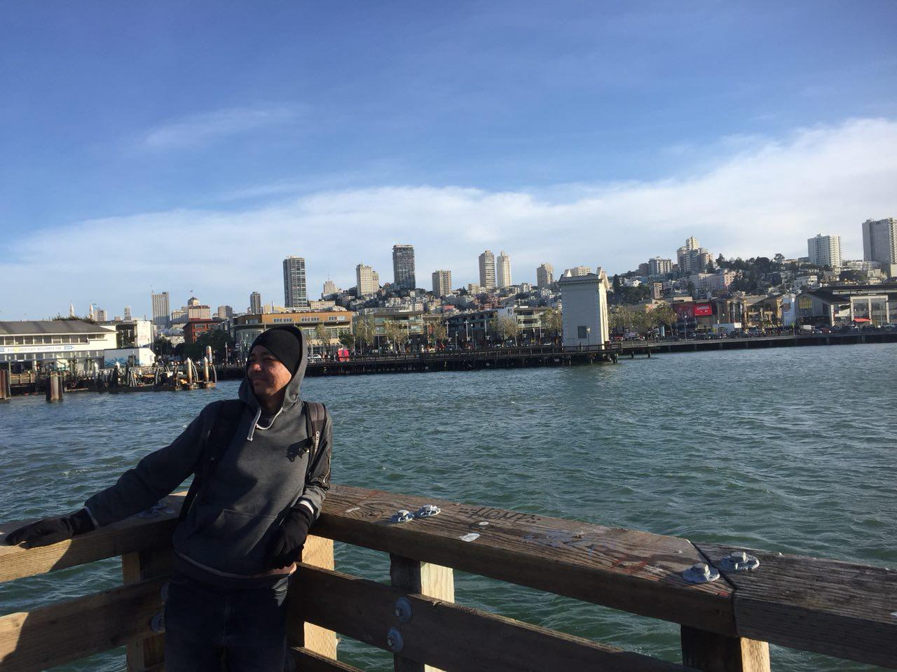*Sisi lain San Francisco*

Kita juga bisa menyaksikan sebuah penjara ditengah pulau, [Alcatraz](https://en.wikipedia.org/wiki/Alcatraz_Island). Penggemar film x-men pasti tahu penjara seperti apa Alcatraz itu. Bahkan kita bisa mengunjungi pulau tersebut dengan menggunakan kapal feri dari Pier 39 ini.

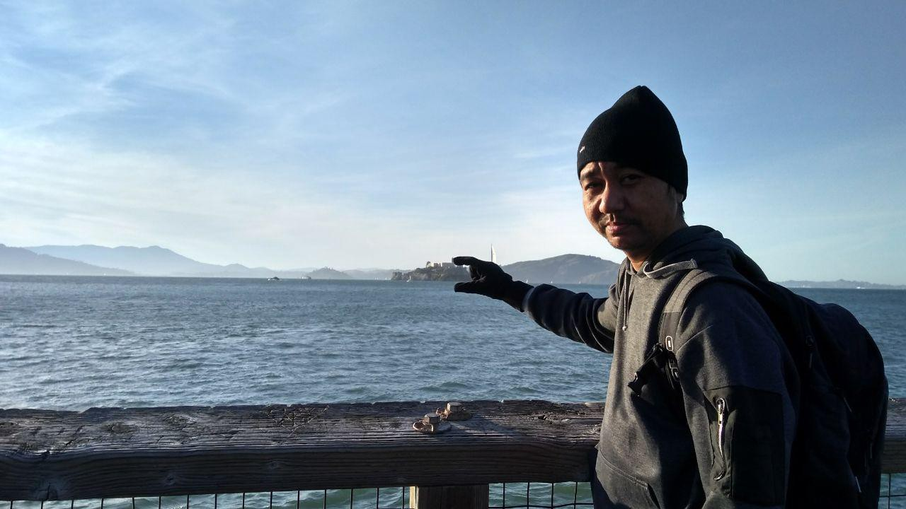*Alcatraz dari kejauhan*

Dan pemandangan terakhir yang bisa kita saksikan adalah singa laut yang sedang berjemur jika musim panas tiba.

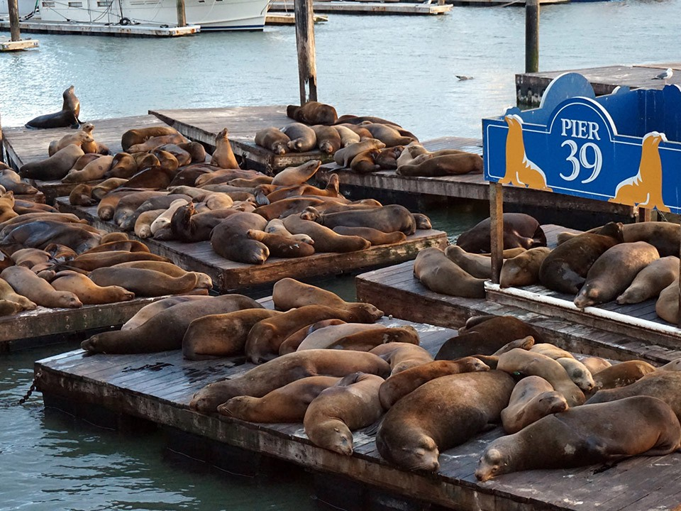*Singa laut sedang berjemur.*

Setelah bergaya menjadi model dadakan disekitar sini, karena memang pemandangannya sangat, sangat indah, kemudian kita sempatkan juga mencari suvenir buat oleh-oleh sebelum akhirnya pulang ke penginapan.

Dengan demikian berakhir sudah perjalanan ke Silicon Valley kali ini. Kritik dan saran silakan dikirimkan via merpati pos 🕊️. Jika ingin mendengarkan laporan perjalanan saya ke kota-kota lainnya, [silakan sponsori saya untuk tiket pesawat dengan segala akomodasinya](mailto:rizafahmi@gmail.com) 😈. Sampai bertemu di lain kesempatan.

Terimakasih banyak saya ucapkan untuk komunitas [facebook DevC Jakarta](https://www.facebook.com/groups/DevCJakarta/) karena tanpa kalian kita para *leads* tidak akan mendapatkan kesempatan langka ini. Terimakasih juga untuk [Facebook](https://facebook.com/rizafahmi) yang sudah mensponsori kita untuk tiket, akomodasi dan acara-acara keren selama disana. Dan tak lupa juga terimakasih banyak [Hacktiv8](https://hacktiv8.com) untuk waktu dan uang sakunya :)
