Salah satu kontribusi besar [ Joe Armstrong ](https://twitter.com/FrancescoC/status/1119596234166218754) yang ketika tulisan ini dibuat baru saja meninggal dunia adalah bahasa pemrograman Erlang beserta BEAM, atau yang lebih dikenal dengan Erlang Virtual Machine. Erlang VM cukup terkenal kehebatannya terutama ketika [ mampu menangani 2 juta koneksi per server di aplikasi chat WhatsApp! ](http://highscalability.com/blog/2014/3/31/how-whatsapp-grew-to-nearly-500-million-users-11000-cores-an.html) Di artikel ini kita akan membedah mekanisme dibalik kemampuan konkurensi yang dimiliki BEAM dengan bahasa pemrograman Elixir. Meskipun demikian, semua yang akan dilakukan di artikel ini dapat pula diimplementasikan di bahasa pemrograman lain yang juga berjalan di BEAM atau Erlang VM seperti Erlang, LFE, Alpaca, Gleam dan lain-lain.

## Mekanisme Konkurensi di BEAM

Ide utama dari BEAM berpusat di sesuatu yang disebut dengan proses atau process. Proses sederhananya adalah program yang berjalan secara sekuensial, baris-per-baris dan tidak dapat berjalan secara paralel atau menjalankan pola konkurensi.

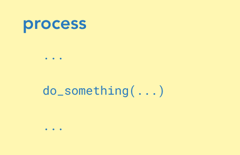

Untuk membuatnya menjadi konkuren, kita harus menjalankan proses lebih dari satu. Di Elixir, hal ini bisa kita lakukan dengan fungsi `spawn`. Dan ketika kita melakukan spawn, aplikasi kita akan memiliki dua proses yang berjalan bersamaan. Proses disini bukanlah proses di level sistem operasi. Proses di BEAM sangat ringan, hanya beberapa kilobytes saja dan kita dapat memiliki proses sebanyak yang kita mau. Satu mesin bisa memiliki hingga 268 juta proses!

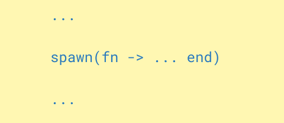

Sebenarnya kita akan memiliki dua program independen yang berjalan terpisah satu
dengan yang lainnya. Mereka tidak berbagi *state* atau apapun, dan tidak memiliki
kesamaan sama sekali. Berada di memori, *stack, heap* yang berbeda, dan juga
*garbage collector* sendiri-sendiri dan tidak saling mengganggu.

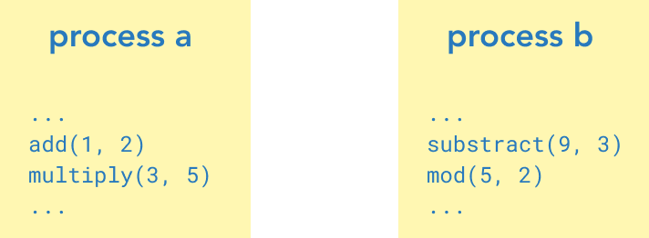

Dan satu-satunya cara untuk membuat kedua proses yang berbeda tadi untuk dapat
bekerjasama adalah dengan saling berkirim pesan. Hal ini juga dikenal dengan
pola konkurensi melalui berkirim pesan (message passing concurrency) atau lebih
dikenal dengan actor model. Pola ini mirip dengan ide mircoservice dimana setiap
service terpisah satu dengan yang lain dan saling berhubungan dengan protokol
HTTP.

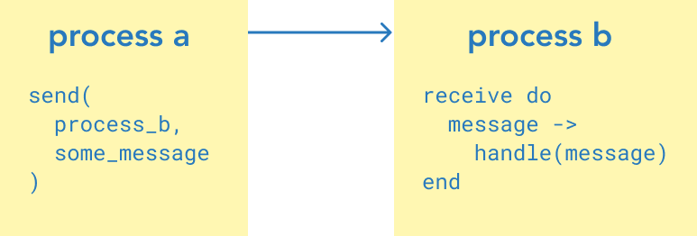

Misalkan proses pertama mengirimkan pesan ke proses kedua. Proses pertama mengirimkan pesan dengan fungsi `send` dan proses kedua menerima fungsi dengan blok `receive` dan kemudian menangani permintaan dari proses pertama.

Ketika aplikasi dijalankan, yang terjadi adalah sebuah proses di sistem operasi
akan muncul. Yap, hanya satu proses di level sistem operasi. Di dalam proses inilah semua proses yang kita `spawn` akan berjalan. Proses-proses yang berjalan secara sekuensial, independen, dan ringan.

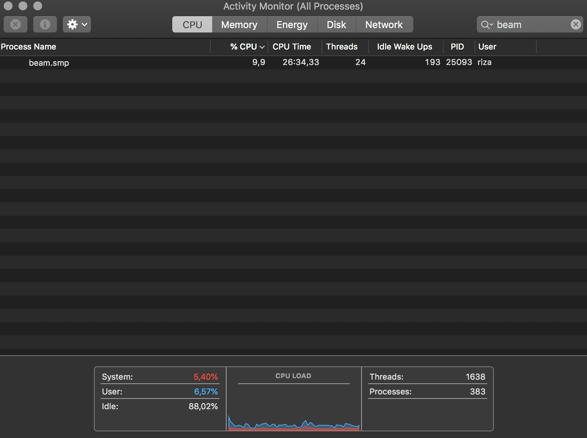


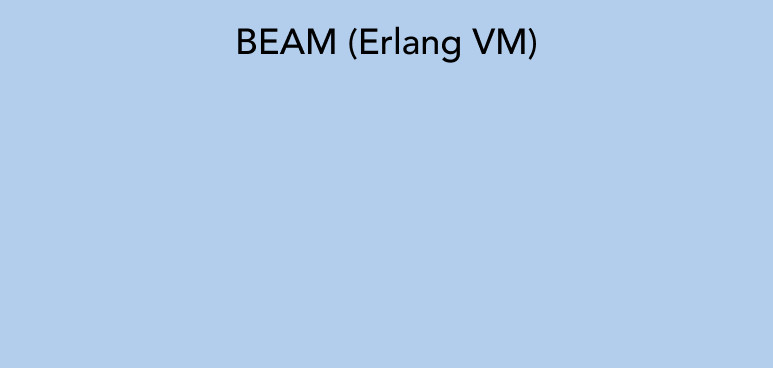

Proses disini bukanlah proses di level sistem operasi. Proses di BEAM sangat ringan, hanya beberapa kilobytes saja dan kita dapat memiliki proses sebanyak yang kita mau. Satu mesin bisa memiliki hingga 268 juta proses!

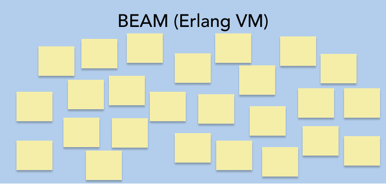

BEAM secara internal kemudian menjalankan threads yang diberi nama penjadwal atau scheduler. Satu penjadwal untu satu inti dari CPU. Jika kita memiliki CPU dengan empat inti, maka penjadwalnya ada empat.

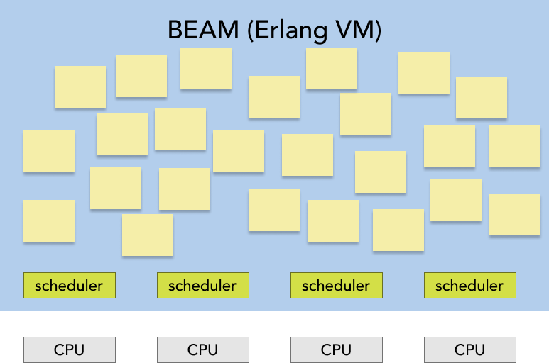

Penjadwal ini yang bertanggungjawab mengeksekusi proses-proses. Sederhananya,
proses akan mengantri di satu jalur dan setiap penjadwal akan bergiliran
mengambil satu proses dan kemudian mengeksekusinya hingga proses tersebut
selesai dan akan mengambil proses di antrian berikutnya. Begitu seterusnya.

## Praktek Menggunakan Konkurensi BEAM

Sekarang pertanyaannya, bagaimana cara kita melakukan implementasi pola proses di aplikasi atau sistem yang kita kembangkan? Bagaimana caranya kita memisahkan tugas-tugas sehingga menjadi proses-proses kecil dan independen? Mari kita lihat demo aplikasi berikut ini.

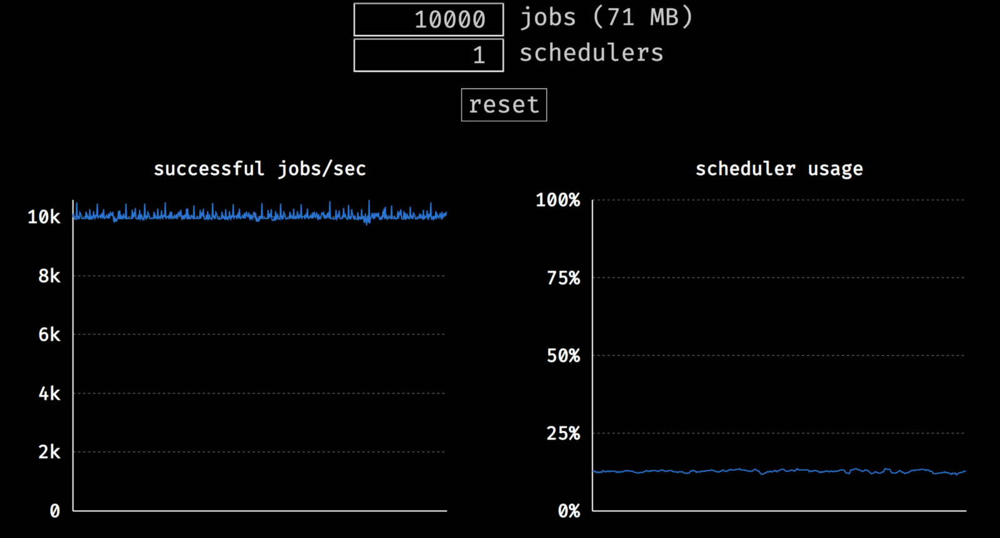

*Jobs* adalah proses yang melakukan *infinite loop*. Didalam *loop* ada tugas
yang dapat menyebabkan *CPU bound* untuk melakukan simulasi tugas yang cukup
berat. Selanjutnya setiap proses yang ditelurkan (*spawn*), pada ilustrasi
diatas terdapat 10.000 proses. Setelah proses selesai mengerjakan tugasnya, ia
akan mengirimkan pesan ke proses lain yang tugasnya melakukan pencatatan bahwa
proses berhasil dieksekusi atau tidak berhasil. Proses-proses yang melakukan
tugas berat kemudian ditidurkan (*sleep*) selama satu detik dan hidup kembali. Begitu seterusnya.

Di demo ini kita hanya menggunakan satu penjadwal (*scheduler*) saja, bukan empat meskipun memiliki empat inti CPU. Tujuannya agar memudahkan saja untuk membuat sibuk CPU.

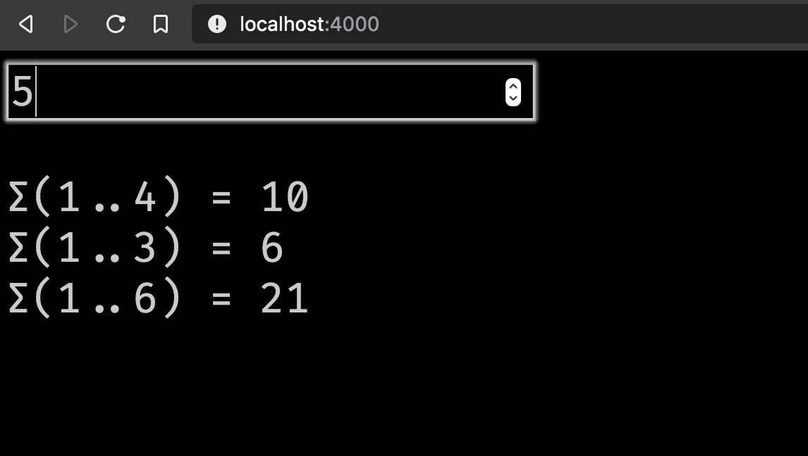

Kemudian di halaman yang dapat diakses pengguna, aplikasinya cukup sederhana namun sudah cukup mewakili aplikasi web secara umum. Ada sebuah input teks yang dapat menerima bilangan bulat positif dan ketika disubmit aplikasi akan menghitung jumlah dari angka tersebut berurutan dari angka satu. Misalnya kita memasukkan angka 3 maka hasilnya menjadi 1 + 2 + 3 yaitu 6 atau jika kita memasukkan angka 4 maka hasilnya menjadi 10 dan seterusnya. Berikut cuplikan kode dari proses kalkulasinya.

```elixir
defp calc_sum(n), do: calc_sum(1, n, 0)
defp calc_sum(from, from, sum), do: sum + from
defp calc_sum(from, to, acc_sum), do: calc_sum(from + 1, to, acc_sum + from)
```

Setiap ada yang membuka halaman ini koneksi akan terbentuk antara klien dan server atau sistem. Dan ketika pengguna memasukkan angka 3 maka sistem akan melakukan perhitungan dan mengembalikan hasilnya dalam hal ini angka 6.

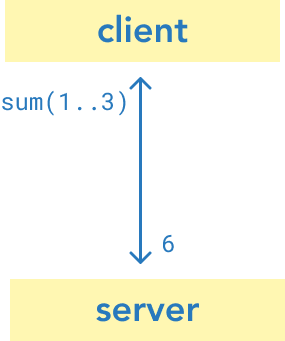

Dan misalkan ada tiga pengguna yang mengakses secara bersamaan, maka akan ada tiga koneksi. Satu untuk setiap pengguna atau setiap sesi (*session*). Begitu pula jika ada 1000 orang, akan ada 1000 koneksi yang terjadi antar proses dan begitu seterusnya.

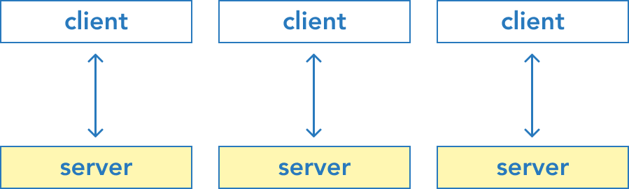

> "We do not have one web server handling 2 millions sessions. We have 2 millions web servers handling one session each." -- Joe Armstrong

Proses kalkulasinya sendiri terjadi di proses yang berbeda. Koneksi menelurkan (*spawn*) proses baru, kita sebut saja sebagai *calculation*. Proses *calculation* melakukan kalkulasi dan mengirimkan hasilnya kembali ke proses *server* untuk seterusnya diteruskan ke proses *client*. Kemudian proses *calculation* berhenti dan mati karena sudah menyelesaikan pekerjaannya.

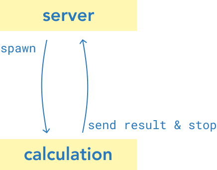

Pola seperti ini dibentuk dengan harapan sistem akan menjadi *fault-tolerant* dan *high availability* untuk menghasilkan servis yang tetap berjalan meski terjadi masalah di *production*.

Situasi yang umum ditemui di *production*, misalnya ada kesalahan, yang akan menghasilkan kesalahan yang belum ditangani (*unhandled exception*) seperti `division by zero` atau `undefined is not a function`. Coba masukkan angka keberuntungan: 13! Terjadi kesalahan dan pesan kesalahan muncul di server.

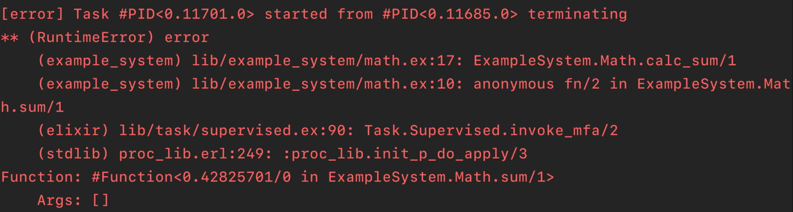

Namun menariknya, sistem tetap berjalan normal. Kita tetap bisa memasukkan angka lain selain angka 13 dan sistem tetap memberikan hasil yang tepat. Hanya satu proses *calculation* angka 13 saja yang bermasalah dan mati. 

**Catatan penting**: Sampai tahapan ini kita berhasil memisahkan kesalahan-kesalahan (*failures*) dengan cara mendelegasikannya kedalam proses-proses kecil.


## Praktek Sistem Latensi

Mari kita coba memasukkan angka yang cukup besar agar sistem bisa menghitung lebih lama seperti angka 999999999. Otomatis load di dasbor pun meningkat. Meski demikian, sistem tetap reaktif menerima angka lain sambil menunggu hasil dari 999999999! Hal ini karena yang sibuk menghitung hanyalah satu proses saja. Proses lainnya dapat berjalan normal seperti tidak terjadi apa-apa. Buat saya, ini adalah definisi dari *high availability*.


## Simulasi Kesalahan Yang Lebih Fatal

Sekarang kita akan melihat kesalahan yang lebih berbahaya. Kita akan memasukkan
angka negatif, misalnya -1 yang akan menyebabkan CPU menjadi 100% karena sistem
yang dikembangkan sebenarnya hanya menerima bilangan bulat negatif. Namun kita
lupa untuk menangani jika pengguna memasukkan angka negatif. Hal yang biasa
terjadi kan?!


Dan benar saja, ketika -1 diinput, yang terjadi adalah CPU langsung 100% dalam waktu yang cukup lama, bahkan terus menerus karena proses kalkulasi terus terjadi dan tidak dapat berhenti. Meski demikian, sistem tetap jalan, dan kita tetap bisa menggunakan aplikasi dan sistem tetap dapat digunakan seperti biasa.

Masalah semakin rumit ketika tidak ada informasi apapun di catatan (*log*) sistem. Seolah tidak terjadi apa-apa. Yang kita dapatkan adalah CPU 100% terus menerus.

## Bug Fixing di *Production*

Mari sekarang kita telusuri dan mencari tahu apa yang terjadi. Ceritanya kita mendapatkan notifikasi bahwa sistem mencapai CPU 100% dalam waktu yang lama meski proses lainnya bekerja seperti biasa. Dapat dipastikan dari dasbor terlihat sepuluh ribu tugas yang kita instruksikan tetap berjalan dan memiliki tingkat kesuksesan nyaris 100%.

Mari kita ssh ke server dan melihat apa yang terjadi. Ternyata tidak ada informasi apapun dari catatan sistem (*log*).


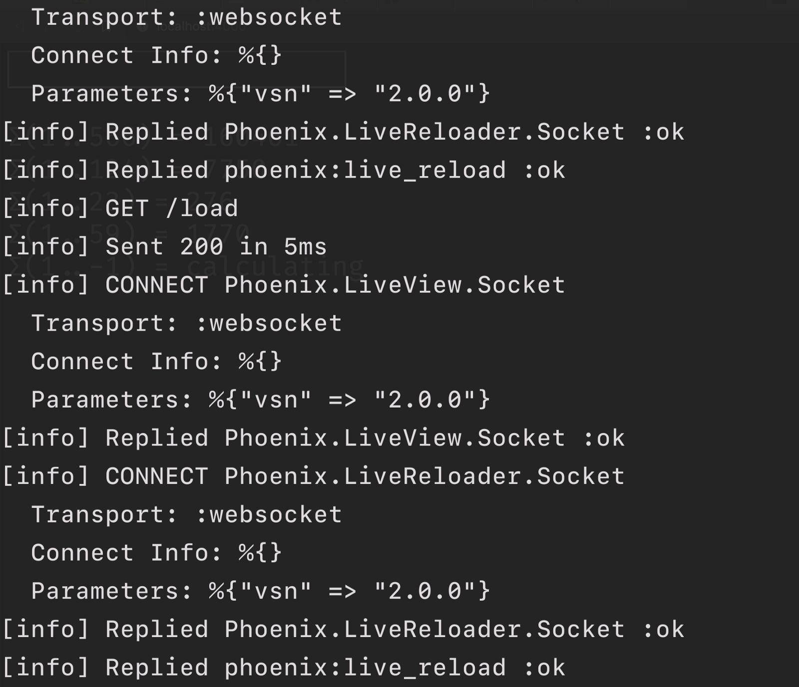

Berhubung hanya ada satu proses di level sistem operasi, kita tidak bisa membunuh proses tersebut di level sistem operasi dengan menggunakan manajemen tugas (*task manager*) misalnya. Apabila hal ini kita lakukan, seluruh sistem akan berhenti. Untuk itu kita harus masuk kedalam sistem.

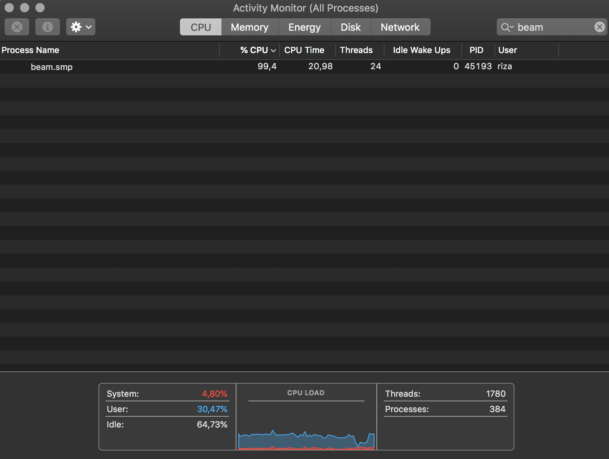

Kita bisa melakukannya dengan perintah `_build/prod/rel/system/bin/system remote_console` dari direktori aplikasi berada untuk masuk ke sesi IEx dengan konteks sistem yang sedang berjalan dan kita bisa melakukan investigasi disana. IEx adalah REPL Elixir dan dengan menggunakan perintah diatas, kita akan mendapatkan sesi IEx didalam sistem berjalan dan konteks sistem yang sedang berjalan sehingga kita bisa melakukan investigasi.

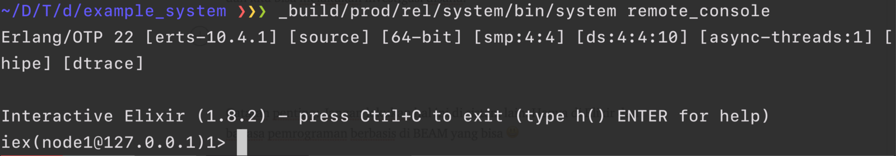

Di sesi IEx kita bisa melakukan apapun yang biasa kita lakukan. Misalnya `1 + 2`. Kita bisa melihat daftar proses yang sedang berjalan dengan fungsi `Process.list()`.

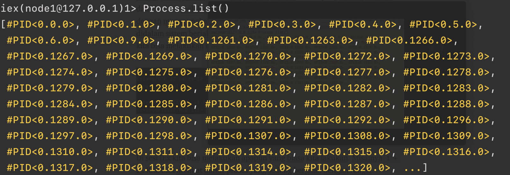

Dan kita bisa mendapatkan informasi dari sebuah proses dengan fungsi `Process.info()`.

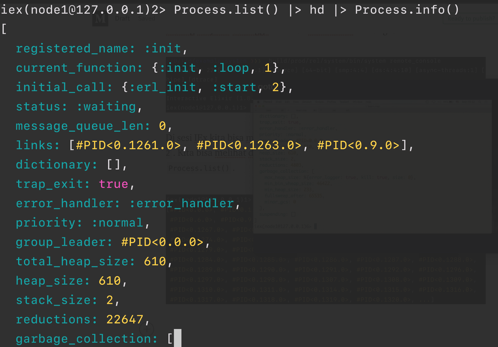

Dan kita bisa mendapatkan informasi proses mana yang membuat *CPU load* yang tinggi dengan melakukan agregasi dari informasi yang didapat dari `Process.info()`. Di sistem sudah disiapkan sebuah fungsi untuk agregasi dengan menjalankan `Runtime.top()`.

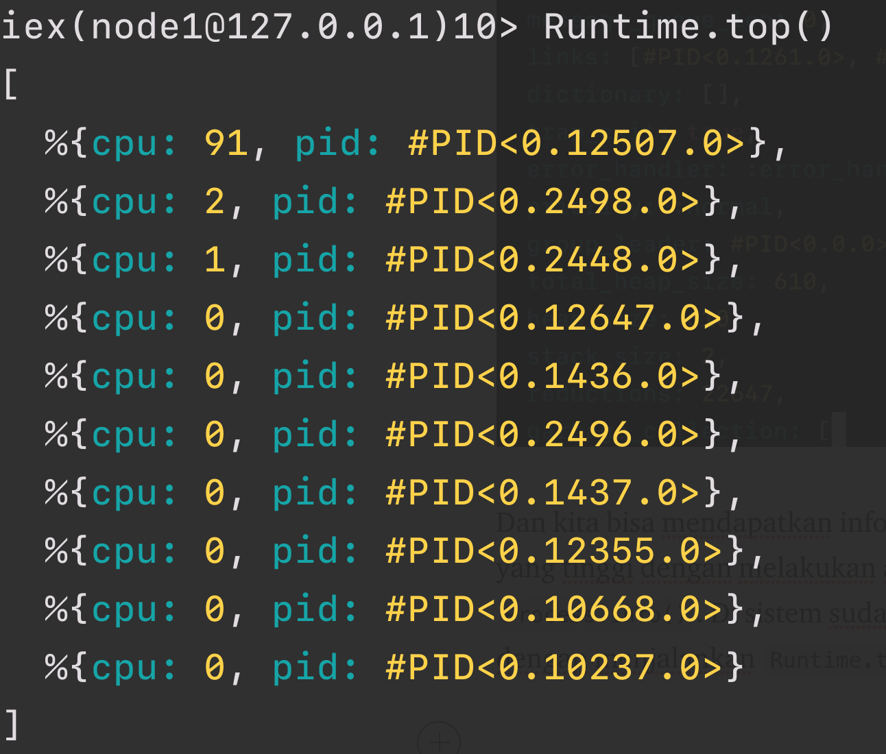

Jalankan fungsi ini beberapa kali untuk memastikan id proses (PID) dengan CPU tertinggi adalah id proses yang sama. Dan kita sudah bisa menyimpulkan bahwa id proses yang bermasalah adalah `#PID<0.12507.0>`. Kita simpan informasi id proses kedalam sebuah variable untuk mendapatkan informasi lebih rinci dengan `Process.info()`. Dan kita bisa mendapatkan informasi seperti `current_stacktrace`. Dan disana kita dapat melihat sistem menjalankan modul `ExampleSystem.Math` dan fungsi `calc_sum` dengan jumlah argumen 3 dengan kode sumber berada di `lib/example_system/math.ex` dibaris ke-20.

Dan kita bisa membunuh proses tersebut dengan fungsi `Process.kill()` dan sistem kembali _cool down_. Dan di sisi klien akhirnya setelah sekian lama, pesan kesalahan akhirnya muncul.

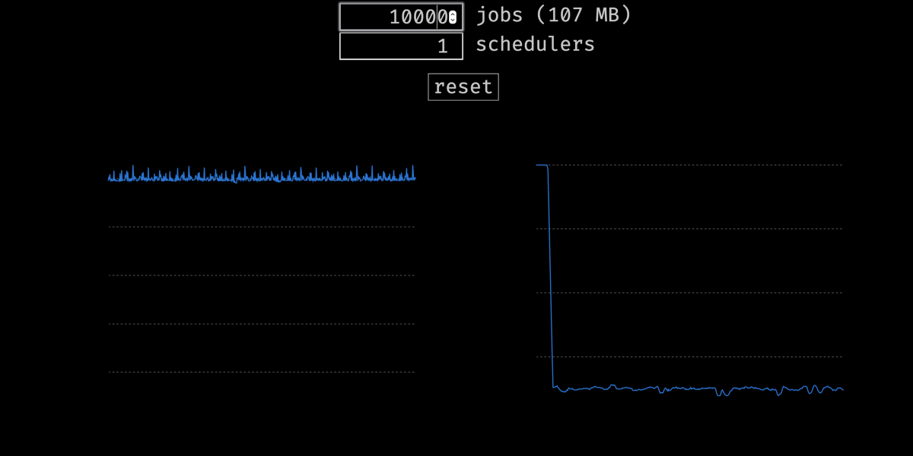 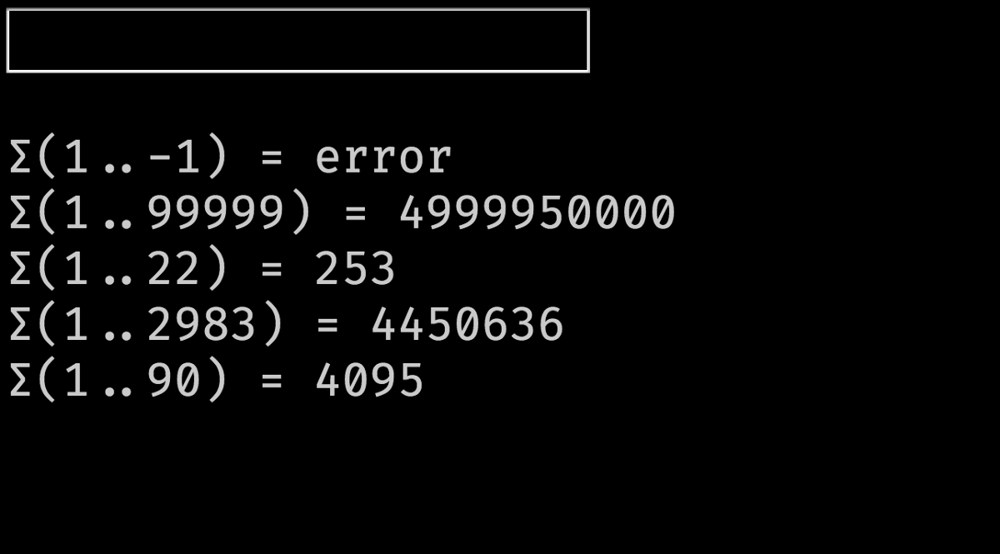

Setelah sistem mereda, langkah selanjutnya yang biasa kita lakukan adalah memperbaiki kesalahan tersebut. Kita sebelumnya sudah mendapatkan informasi bahwa terakhir kali dieksekusi adalah baris ke-20 dari file `lib/example_system/math.ex`. Mari kita lihat kodenya.

```elixir
defp calc_sum(n), do: calc_sum(1, n, 0)
defp calc_sum(from, from, sum), do: sum + from
defp calc_sum(from, to, acc_sum), do: calc_sum(from + 1, to, acc_sum + from)
```

Dan fungsi `calc_sum` ini dipanggil dari `lib/example_system_web/math/sum.ex`. Dan benar saja, nilai negatif belum ditangani. Memperbaikinya cukup mudah, tinggal tambahkan satu kasus dimana input lebih kecil dari 0 dan kita nyatakan input yang tidak valid.

```diff
defp start_sum(socket, str_input) do
  operation =
      case Integer.parse(str_input) do
      :error ->
          %{pid: nil, input: str_input, result: "invalid input"}
  
      {_input, remaining} when byte_size(remaining) > 0 ->
          %{pid: nil, input: str_input, result: "invalid input"}
  
+     {input, ""} when input <= 0 ->
+         %{pid: nil, input: input, result: "invalid input"}
  
      {input, ""} ->
          do_start_sum(input)
      end
  
  socket |> update(:operations, &[operation | &1]) |> assign(:data, data())
end
```

Namun jika diperhatikan , fungsi calc_sum kita juga terdapat beberapa kesalahan. Pertama, penanganan input 13 yang memang sengaja dibuat *error*. Dan proses kalkulasinya kurang optimal. Dengan kekuatan *googling* dan *stackoverflow*, saya mendapatkan perhitungan yang lebih optimal.

```diff
-defp calc_sum(n), do: calc_sum(1, n, 0)
-defp calc_sum(from, from, sum), do: sum + from
-defp calc_sum(from, to, acc_sum), do: calc_sum(from + 1, to, acc_sum + from)
+defp calc_sum(n), do: div(n * (n + 1), 2)
```

Setelah kesalahan diperbaiki, jalankan *test* untuk memastikan bahwa semua sudah sesuai ekspektasi. Lalu, *moment of truth!* Kita bisa melakukan peluncuran ulang (*deployment*) dengan *zero downtime* dengan perintah `mix system.upgrade`! Ini terbukti dengan aplikasi dasbor yang tetap menyala.

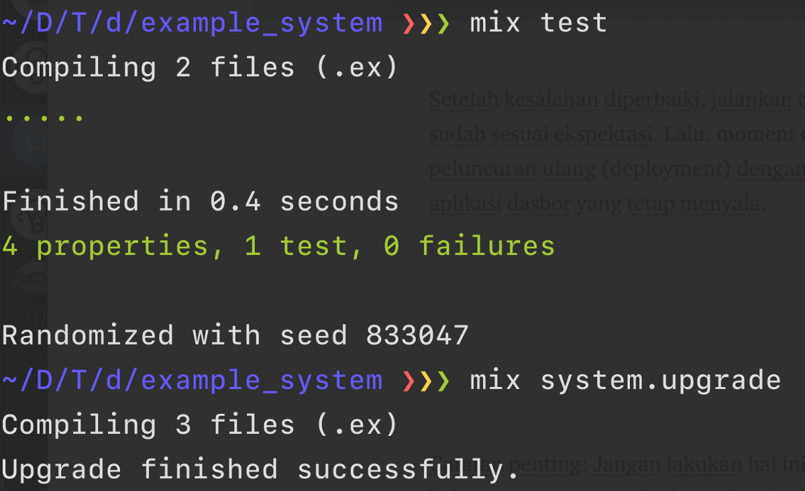
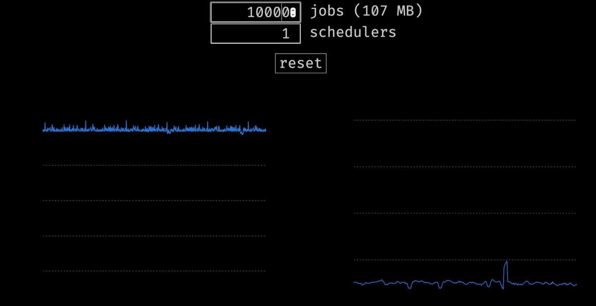

Dan sekarang kita bisa mencoba kembali kesalahan-kesalahan yang tadi kita
lakukan bahkan tanpa menghentikan sistem secara keseluruhan. Dan karena
perhitungan sudah lebih optimal, perhitungan yang tadinya berjalan cukup lama,
sekarang sudah jauh lebih cepat tanpa memberatkan CPU sama sekali.

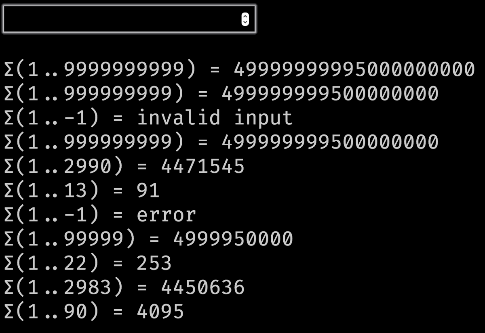
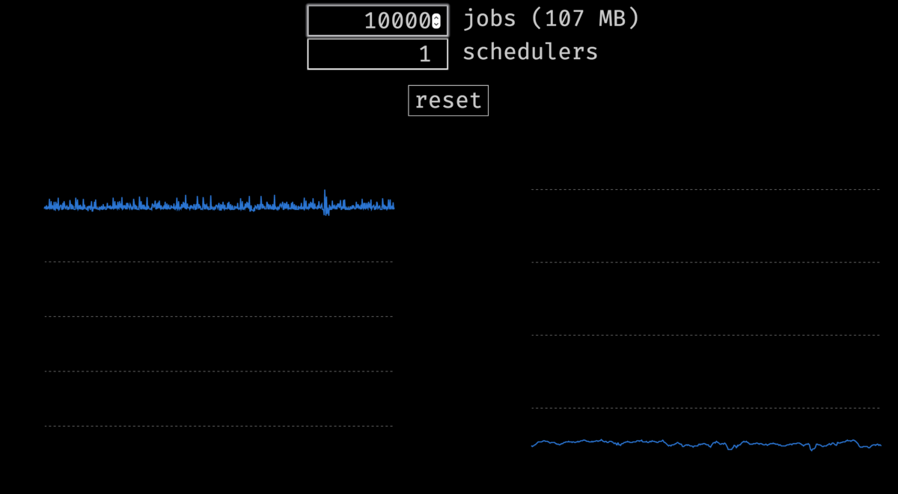


**Catatan penting**: Jangan lakukan hal ini di sistem lain. Hanya di Elixir dan
bahasa-bahasa yang berjalan diatas BEAM yang bisa 😃. Hal ini juga dapat dibuktikan dengan Erlang yang digunakan di sistem telekomunikasi Ericsson yang ketika kode baru diluncurkan ketika kita sedang melakukan percakapan di telepon, telepon tidak terputus.

<iframe width="560" height="315" src="https://www.youtube.com/embed/BXmOlCy0oBM" frameborder="0" allow="accelerometer; autoplay; encrypted-media; gyroscope; picture-in-picture" allowfullscreen></iframe>

<hr />

Kode dapat dilihat di https://github.com/rizafahmi/demo_system. Untuk belajar
lebih lanjut tentang Elixir dan BEAM silakan baca buku [ Elixir in Action
](https://medium.com/r/?url=https%3A%2F%2Fwww.manning.com%2Fbooks%2Felixir-in-action)
karya Sasa Juric dan [ Little Elixir & OTP Guidebook
](https://medium.com/r/?url=https%3A%2F%2Fwww.manning.com%2Fbooks%2Fthe-little-elixir-and-otp-guidebook)
karya Ben Tan Wei Hao.

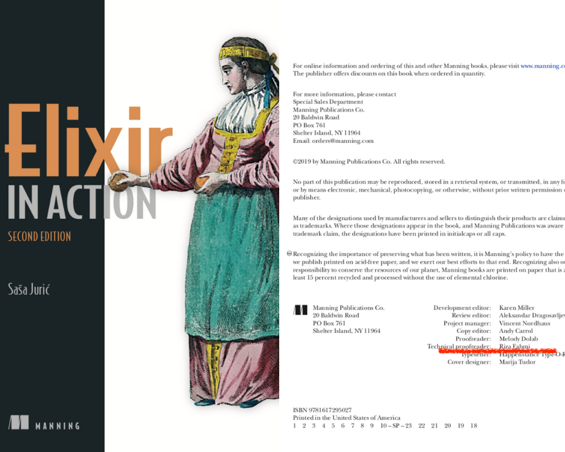
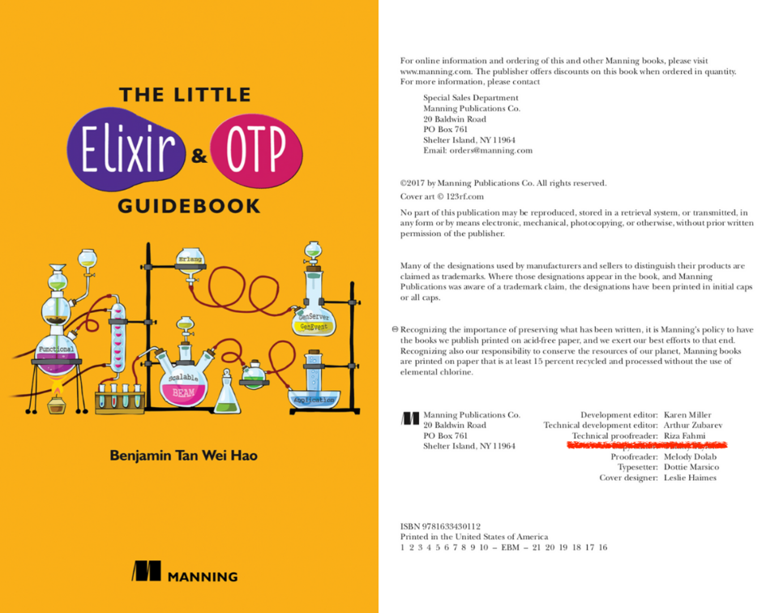
