# Ekosistem JavaScript di Indonesia

This article also available in [ Engilish](./en).

Artikel ini akan membahas tentang bagaimana perkembangan ekosistem JavaScript di
Indonesia. Namun sebelum kita masuk ke pembahasan utama, mari kita bahas dulu
tentang definisi ekosistem di konteks artikel ini. Topik ini merupakan materi
yang saya bawakan ketika mengisi keynote di [ JSDay 2019 ](https://jsday.id).

## Daftar Isi

* [Tentang Ekosistem JavaScript](#tentang-ekosistem-javascript)
* [Sudut Pandang Pembahasan](#sudut-pandang-pembahasan)
  - [Sudut Pandang Pemula](#sudut-pandang-pemula)
      + [Mulai Dari Mana?](#mulai-dari-mana)
      + [Belajar Framework Apa?](#belajar-framework-apa)
      + [Literatur atau Buku Tersedia](#literatur-atau-buku-tersedia)
      + [Kursus Video Online](#kursus-video-online)
  - [Sudut Pandang Profesional](#sudut-pandang-profesional)
      + [Contoh Aplikasi](#contoh-aplikasi)
      + [Tutorial Berbahasa Indonesia](#tutorial-berbahasa-indonesia)
      + [Alat Bantu dan Boilerplate](#alat-bantu-dan-boilerplate)
      + [Mulai Menggunakan](#mulai-menggunakan)
      + [Dukungan Komunitas](#dukungan-komunitas)
      + [Pustaka Pendukung](#pustaka-pendukung)
      + [Performa](#performa)
      + [Lowongan Pekerjaan](#lowongan-pekerjaan)
  - [Sudut Pandang Master](#sudut-pandang-master)
      + [Talenta Tersedia](#talenta-tersedia)
      + [Tingkat Maturity](#tingkat-maturity)
* [Kesimpulan](#kesimpulan)

<blockquote class="twitter-tweet"><p lang="en" dir="ltr"> Riza is delivering keynote at <a href="https://twitter.com/hashtag/jsdayid?src=hash&amp;ref_src=twsrc%5Etfw">#jsdayid</a>. First JavaScript conference in Indonesia. <a href="https://twitter.com/rizafahmi22?ref_src=twsrc%5Etfw">@rizafahmi22</a> <a href="https://t.co/yxXKm1cNxM">pic.twitter.com/yxXKm1cNxM</a></p>&mdash; Jecelyn Yeen (@JecelynYeen) <a href="https://twitter.com/JecelynYeen/status/1177778326758277120?ref_src=twsrc%5Etfw">September 28, 2019</a></blockquote> <script async src="https://platform.twitter.com/widgets.js" charset="utf-8"></script>

# Tentang Ekosistem JavaScript

> “An ecosystem is a community of living organisms and their interactions with their abiotic (non-living) environment.” — Ecology of ecosystems

Yang dimaksud ekosistem disini diantaranya adalah komunitas, grup dan diskusi sekitar sebuah tools, alat bantu, framework dan JavaScript secara umum. Dalam konteks ini kita akan membahas empat elemen berikut:

- Sumber belajar seperti artikel, buku, video tutorial dan lain sebagainya
- Kelengkapan alat bantu seperti pustaka, boilerplate, contoh aplikasi dan lain-lain
- Dukungan komunitas di sekitar alat bantu dan juga lingkungan sekitar
- Pembahasan akan fokus di frontend karena JavaScript di sisi backend cukup _straightforward_.

# Sudut Pandang Pembahasan

Artikel ini akan membagi pembahasan kepada tiga sudut pandang. Sudut pandang pertama ditujukan untuk yang baru mulai belajar, kita sebut saja pemula. Kita akan mencoba menjawab beberapa pertanyaan yang sering muncul di benak pemula ketika ingin belajar JavaScript. Kemudian kita juga akan membahas JavaScript dari sudut pandang teman-teman yang sudah pernah membuat aplikasi dan ingin belajar hal baru terutama teknologi web. Kita sebut saja sebagai profesional. Sudut pandang terakhir diperuntukkan kepada para pengambil keputusan seperti Vice President, Chief Technology Officer, Team Lead dan lain sebagainya. Kita menyebutnya sebagai sudut pandang master.

## Sudut Pandang Pemula

Sudut pandang ini diperuntukkan kepada teman-teman fresh graduate, developer profesional dengan pengalaman setahun atau kurang, dan yang 'terjebak'. Terjebak sudah terlebih dahulu masuk ke sebuah perusahaan yang ternyata sudah menggunakan pustaka atau framework tertentu. Kita akan menjawab pertanyaan-pertanyaan yang seringkali muncul di benak seorang pemula.

### Mulai Dari Mana?

Biasanya pertanyaan yang pertama kali muncul kalau mau mulai belajar, mulainya dari mana? Dan berikut adalah beberapa pertanyaan terkait memulai belajar pustaka atau _framework_ JavaScript. Namun sebelum itu pastikan teman-teman sudah menguasai JavaScript itu sendiri beserta HTML dan sedikit CSS. Jika merasa belum terlalu menguasai, teman-teman bisa mulai belajar dari hal-hal tersebut.

Berikutnya kita akan membahas beberapa pertanyaan berikut:

1. Sebaiknya belajar framework apa ya?
2. Lingkungan sekitar banyak menggunakan yang mana? Hal ini cukup penting terutama buat yang baru belajar
3. Kemudian kita juga akan melihat seberapa banyak artikel, buku yang tersedia untuk mendukung proses belajar
4. Dan tentunya kita juga akan mengeksplorasi seberapa banyak kursus video online yang ada

### Belajar Framework Apa?

Framework JavaScript banyak sekali pilihannya. Terkadang untuk yang mulai belajar, pemilihan framework menjadi sesuatu yang cukup sulit. Ada yang bilang framework ini bagus. Opini lain mengatakan framework lain lebih cepat dan lain sebagainya. Untuk itu saya memilihkan enam opsi yang dapat dipilih. Keenam framework ini memiliki karakteristik yang cukup berbeda yang menurut saya mewakili framework lain yang tersedia.

Untuk framework dengan fitur lengkap diwakili oleh Angular dan Ember, yang cukup lengkap ada React dan Vue, pustaka untuk memanipulasi DOM dan cukup terkenal di masanya, jQuery. Dan terakhir ada framework yang melakukan kompilasi ke JavaScript vanilla yang mungkin akan menjadi tren kedepan yaitu Svelte.

<blockquote class="twitter-tweet"><p lang="in" dir="ltr"> Salfok sama slide presentasi dari om <a href="https://twitter.com/rizafahmi22?ref_src=twsrc%5Etfw">@rizafahmi22</a> 😹 <a href="https://twitter.com/hashtag/JSDayID?src=hash&amp;ref_src=twsrc%5Etfw">#JSDayID</a> <a href="https://t.co/W5XnrDEits">pic.twitter.com/W5XnrDEits</a></p>&mdash; FarahLuthfiOktarina (@FarahOktarina) <a href="https://twitter.com/FarahOktarina/status/1177780426800128001?ref_src=twsrc%5Etfw">September 28, 2019</a></blockquote> <script async src="https://platform.twitter.com/widgets.js" charset="utf-8"></script>

Dari keenam framework dan pustaka diatas, mari kita lihat bagaimana ekosistemnya dengan melihat komunitas disekitar framework dan pustaka tersebut. Peran komunitas ini penting untuk mendukung kita belajar terutama untuk mempercepat proses belajar. Berikut adalah gambaran komunitas JavaScript secara umum di berbagai kota yang datanya berhasil saya dapatkan. Masih banyak kota-kota lain yang memiliki komunitas JavaScript sebenarnya.

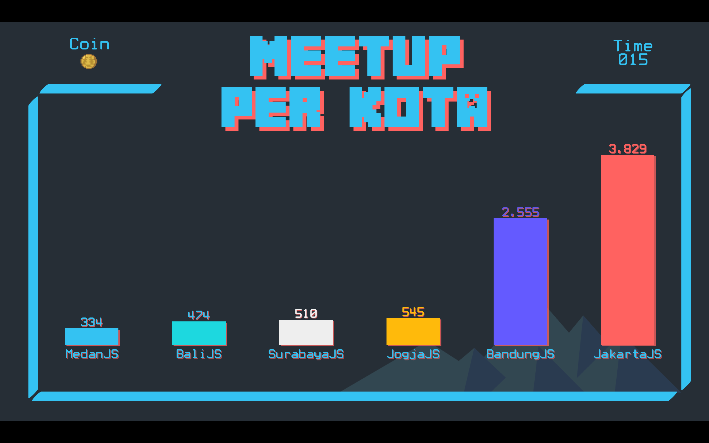

Seperti yang dapat dilihat, komunitas MedanJS memiliki total 334 anggota meskipun saat ini sedang vakum. BaliJS ada 474 anggota, SurabayaJS ada 510, JogjaJS 545. Sedangkan jumlah anggota terbanyak masih berada di kota Bandung dengan 2.500 anggota dan Jakarta yang nyaris mencapai 4.000 anggota.

Dan berikut adalah komunitas untuk beberapa framework yang berhasil saya dapatkan datanya. Saya berhasil mendapatkan tiga komunitas framework, yaitu: Vue, Angular dan juga React.

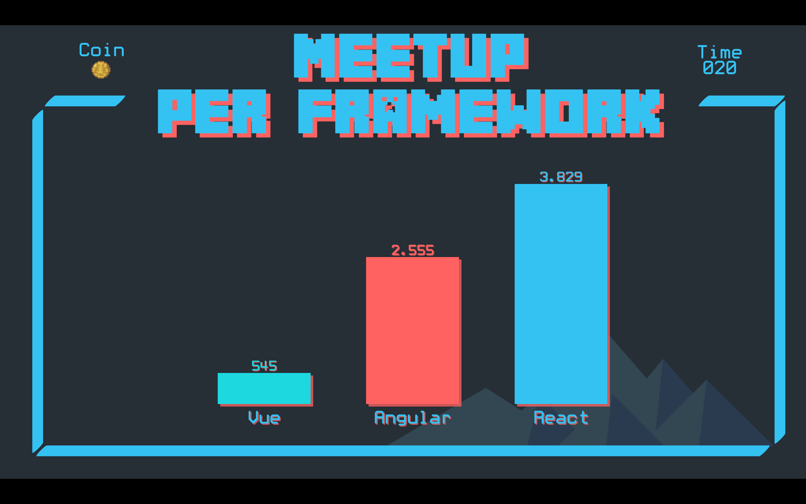

Ternyata untuk komunitas per framework masih didominasi oleh React dan Angular. Sedangkan komunitas Vue agak jauh perbedaannya dibandingkan React dan Angular.

Data berikutnya yang akan kita lihat adalah grup facebook dari tiap-tiap framework atau pustaka yang berhasil saya dapatkan. Semua grup ini spesifik yang berbahasa Indonesia saja. Saya juga menambahkan informasi jumlah anggota, umur dari grup dan juga percakapan yang terjadi per tahunnya.

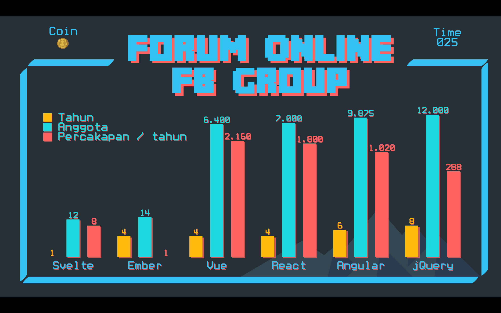

Hasilnya cukup menarik. Anggota yang paling banyak tentu saja grup jQuery, karena memang termasuk pustaka yang paling lama senior. jQuery sendiri sudah menemani developer JavaScript sejak tahun 2006 sehingga tidak heran jumlah anggotanya yang paling banyak.

Sedangkan grup yang paling aktif bukanlah jQuery ternyata. Grup React, Angular dan Vue tercatat memiliki anggota yang paling aktif.

Sedangkan untuk grup Svelte dan Ember memiliki anggota yang paling sedikit dibandingkan framework atau pustaka lainnya. Svelte tentu saja karena merupakan framework yang tergolong baru. Sedangkan Ember anggotanya masih sedikit, meskipun umur grupnya sudah 4 tahun.

Satu data lagi terkait komunitas, yaitu grup di platform Telegram yang lumayan menarik terutama untuk yang mulai serius belajar pemrograman.

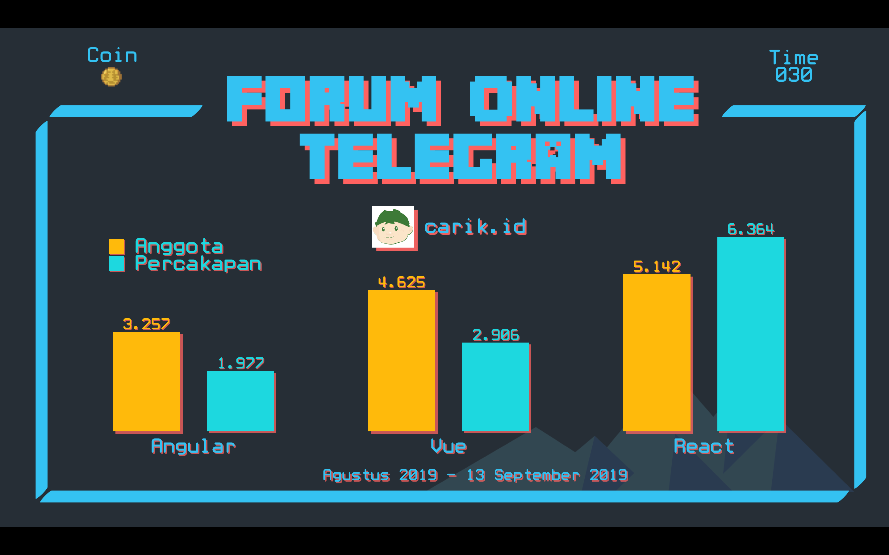

Di Telegram, saya juga baru berhasil mendapatkan tiga komunitas yaitu Angular, Vue dan React. Data ini didapat dengan bantuan [ carikbot ](https://carik.id). Saya berhasil mendapatkan informasi jumlah anggota dan percakapan yang terjadi sepanjang agustus sampai pertengahan september 2019.

Yang paling aktif dan paling banyak anggotanya, React disusul Vue dan disusul Angular.

### Literatur atau Buku Tersedia

Dan dibagian ini kita akan membahas tentang ketersediaan literatur, dalam hal ini adalah buku. Pertanyaannya apakah buku masih relevan sebagai sumber belajar? Terutama buku berbahasa Indonesia. Untuk saya pribadi sih jawabannya masih relevan. Apalagi buat teman-teman mahasiswa yang ingin belajar dan menggunakan framework atau pustaka tertentu di tugas akhirnya. Kan keren kalau ada buku yang bisa dijadikan referensi belajar dan bisa dikutip juga untuk skripsi atau tugas akhir.

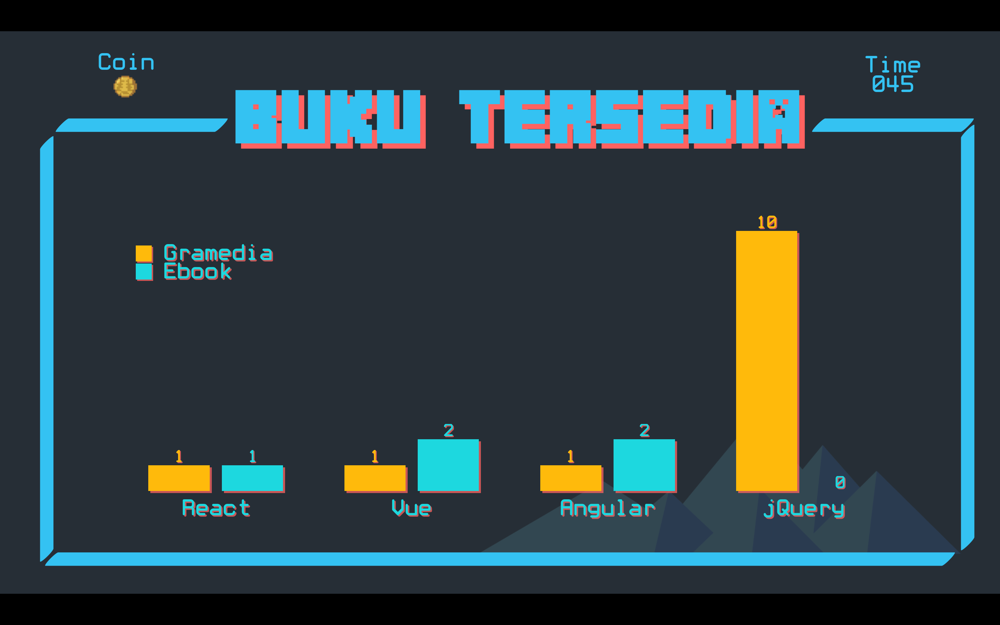

Mungkin sebagian besar dari kita sudah bisa menebak hasilnya. Cukup menyedihkan karena jumlah buku yang tersedia masih sangat sedikit. Ini khusus buku berbahasa Indonesia. Untuk mendapatkan data ini saya melakukan pencarian dari gramedia online dan juga google. Untuk buku fisik yang tersedia, jQuery merupakan pustaka yang paling banyak sumber bacaannya. Sedangkan framework lainnya terhitung masih sangat sedikit.

Tidak puas dengan buku fisik, saya juga melakukan pencarian buku elektronik berbahasa Indonesia yang sebenarnya cukup menarik. Untuk format buku elektronik, Angular ada dua buku, namun masih membahas tentang Angular versi 1 yang cukup jauh berbeda dengan Angular versi terbaru saat ini. Buku elektronik tentang Vue dan React juga hanya tersedia sedikit.

<blockquote class="twitter-tweet"><p lang="en" dir="ltr"> <a href="https://twitter.com/rizafahmi22?ref_src=twsrc%5Etfw">@rizafahmi22</a> kick off <a href="https://twitter.com/hashtag/JSDayID?src=hash&amp;ref_src=twsrc%5Etfw">#JSDayID</a> with a talk about JavaScript ecosystem. There&#39;s still very few technical book in Bahasa Indonesia. But that means we still have lots of opportunity 😉 <a href="https://t.co/JCU23Surj2">pic.twitter.com/JCU23Surj2</a></p>&mdash; Kiki ✈️ (@kelimuttu) <a href="https://twitter.com/kelimuttu/status/1177780009450127361?ref_src=twsrc%5Etfw">September 28, 2019</a></blockquote> <script async src="https://platform.twitter.com/widgets.js" charset="utf-8"></script>

### Kursus Video Online

Berikutnya kita akan bahas tentang kursus video online. Disini saya batasi khusus untuk kursus video online yang cukup lengkap dan ada learning path. Bukan sembarang video tutorial berbahasa Indonesia yang ada di Youtube.

Ada beberapa platform kursus video online yang membahas tentang pemrograman, lebih spesifiknya tentang JavaScript dan berbagai frameworknya. Ada malescast, dumbways, idrails, sekolah koding dan juga kode.id.

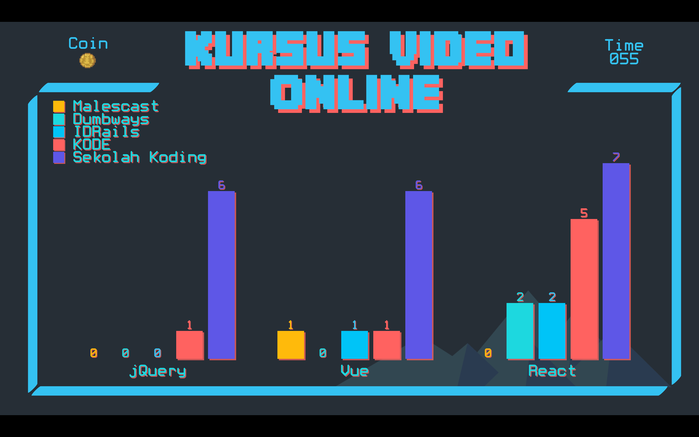

Seperti yang sama-sama bisa kita lihat, yang paling produktif menghasilkan kursus video online terkait JavaScript adalah sekolah koding karena memang sudah berdiri sejak lama, 2016. Dumbways lebih banyak menghasilkan materi seputar framework React. Sedangkan malescast lebih fokus menghasilkan materi tentang vue. Sedangkan idrails memiliki materi seputar vue dan react.

Selanjutnya kita akan melihat jumlah viewer dikelompokkan berdasarkan pustaka dan framework.

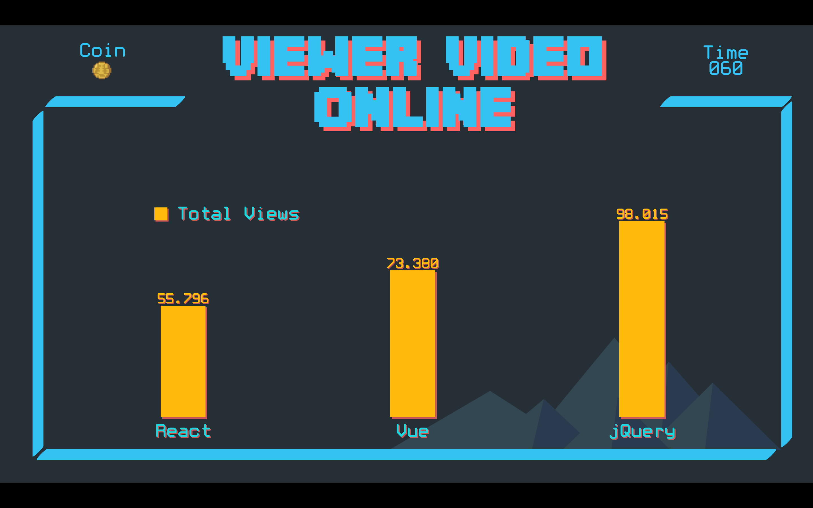

Ternyata jQuery merajai jumlah view dari kursus video online dengan angka nyaris seratus ribu. Kontribusi terbesar dari sekolah koding yang memang sudah memproduksi video course dari 2016. Diikuti vue dengan angka sekitar tuju puluh ribuan dan disusul react dengan lima puluh ribuan.

## Sudut Pandang Profesional

Kita masuk ke sudut pandang yang kedua. Kita akan melihat dari sudut pandang seseorang yang memiliki pengalaman lebih banyak dibandingkan sudut pandang pertama. Yang masuk kategori ini adalah teman-teman yang setidaknya sudah pernah merasakan bagaimana mengembangkan sebuah aplikasi, aplikasi web misalnya. Di sudut pandang ini, kita tidak lagi bertanya bagaimana cara memulai, tapi lebih ke bagaimana cara belajar yang efektif. Kita akan menjawab beberapa pertanyaan terkait bagaimana cara belajar sesuatu. Cara belajar merupakan topik yang subjektif. Masing-masing individu memiliki cara belajar yang berbeda-beda. Jadi kita akan mencoba menjawab beberapa pertanyaan umum tentang cara belajar, seperti berikut:

1. Buat yang suka dengan cara belajar melihat contoh, kita akan melihat berapa banyak contoh aplikasi yang tersedia untuk masing-masing pustaka atau framework.
2. Kemudian kita akan melihat ketersediaan tutorial berbahasa Indonesia untuk masing-masing kandidat pustaka dan juga framework.
3. Kemudian kita akan melihat beberapa alat bantu dan boilerplate yang bisa kita gunakan untuk membuat project baru.
4. Terakhir kita akan melihat bagaimana cara penggunaan masing-masing pustaka dan framework. Kita akan membuat aplikasi hello world satu per satu.

### Contoh Aplikasi

Sekarang kita akan melihat berapa banyak contoh aplikasi yang bisa kita lihat sebagai referensi dan panduan. Saya mencoba melakukan pencarian di berbagai servis seperti glitch.com, codepen namun tidak ada informasi pasti jumlah contoh aplikasi untuk keenam pustaka dan framework tadi.

<blockquote class="twitter-tweet"><p lang="in" dir="ltr"> sebuah slide yang sangat ciamik dari mas <a href="https://twitter.com/rizafahmi22?ref_src=twsrc%5Etfw">@rizafahmi22</a> ntah berapa lama buatnya 😅😅 <a href="https://t.co/kAbOiUmMdI">pic.twitter.com/kAbOiUmMdI</a></p>&mdash; Adib Firman (@dibfirman) <a href="https://twitter.com/dibfirman/status/1177855341788160000?ref_src=twsrc%5Etfw">September 28, 2019</a></blockquote> <script async src="https://platform.twitter.com/widgets.js" charset="utf-8"></script>

Satu-satunya yang bisa mendapatkan total jumlah aplikasi per framework atau pustaka adalah dari codesandbox. Dan disini sangat jauh perbedaan antar framework. React mendominasi dengan nyaris ada 2 juta contoh aplikasi. Sangat jau dibandingkan vue yang hanya dua ratus ribuan.

Data dari codesandbox ini agak bias, karena codesandbox awalnya hanya mendukung React cukup lama. Baru kemudian setelah beberapa lama mendukung framework lain. Itulah sebabnya React sangat mendominasi.

### Tutorial Berbahasa Indonesia

Untuk mendapatkan jumlah tutorial berbahasa Indonesia, saya melakukan pencarian via google dengan kata kunci “nama framework tutorial indonesia” dan buka tautannya satu per satu sampai halaman ketiga dan memastikan bahwa tutorial tersebut benar-benar valid dikategorikan sebagai tutorial dan berbahasa Indonesia. Dan berikut hasilnya.

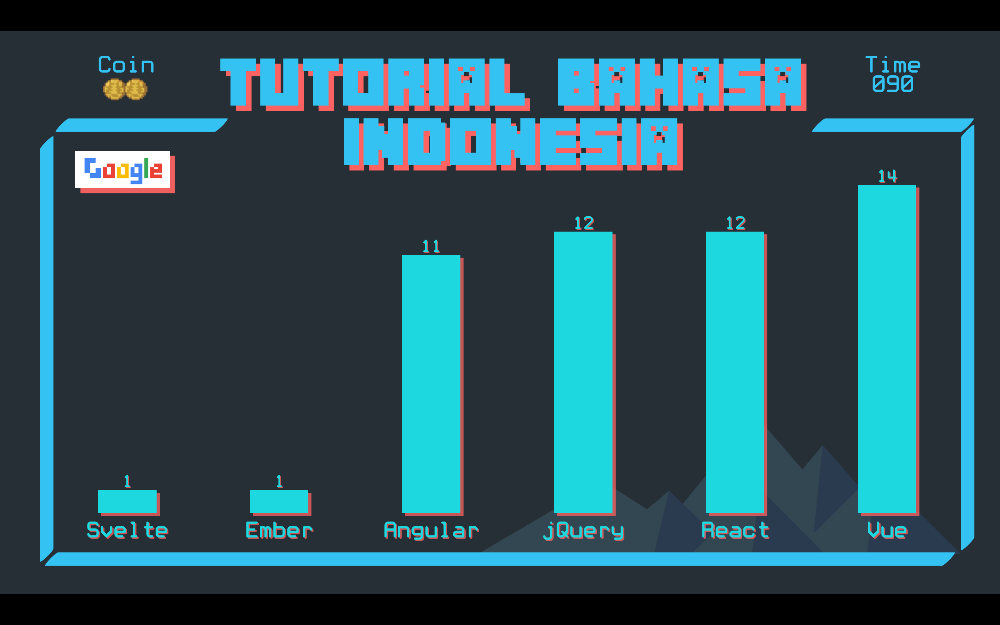

Disini Angular, jQuery, React dan Vue jumlahnya nyaris sama berkisar antara 10 hingga 15. Sedangkan Svelte dan Ember agak susah dicari tutorial berbahasa Indonesia. Sebenarnya secara umum jumlah artikel berbahasa Indonesia ini jumlahnya masih terbilang sedikit. Sama halnya dengan literatur dalam format buku. Ini sebenarnya peluang buat teman-teman yang ingin membuat konten spesifik berbahasa Indonesia.

### Alat Bantu dan _Boilerplate_

Berikutnya kita akan membahas tentang alat bantu dan _boilerplate_ yang tersedia. Framework, apalagi pustaka umumnya dikelilingi oleh berbagai alat bantu dan juga _boilerplate_ yang tujuannya adalah memudahkan kita untuk menggunakan framework atau pustaka tersebut.

Kita akan melihat beberapa alatbantu seperti ketersediaan di Content Delivery Network atau CDN. Adanya CDN memudahkan jika teman-teman tidak ingin menggunakan command line interface atau CLI. Jadi semudah metambahkan link script via CDN.

Tentu kita juga akan melihat dukungan berupa CLI, apakah sudah tersedia fitur seperti routing, state, alat bantu pengembangan atau devtools dan juga CLI untuk generator yang dapat meningkatkan produktifitas kita sebagai developer.

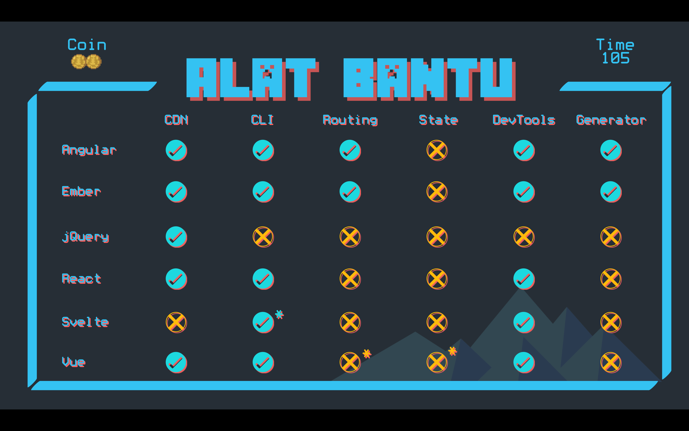

Seperti bagan diatas terlihat bedanya pustaka dengan framework. Angular dan Ember secara fitur sangat lengkap. Sementara Svelte, vue dan React cukup lengkap, sedangkan jQuery jauh dari lengkap karena memang jQuery pada dasarnya hanyalah pustaka untuk manipulasi DOM.

Yang menarik dari bagan diatas ada satu pustaka atau framework yang tidak mendukung CDN yaitu Svelte. Hal ini dikarenakan Svelte adalah framework yang melakukan kompilasi JavaScript sehingga menjadi Vanilla JavaScript.

### Mulai Menggunakan

Sekarang kita akan melihat bagaimana cara menggunakan masing-masing framework dan pustaka dengan cara yang paling mudah diikuti berdasarkan langkah-langkah yang disediakan oleh dokumentasi resmi. Ada beberapa framework yang menyarankan menggunakan CLI, dan ada beberapa yang lain tidak.

#### Angular

Untuk Angular, pertama kita instal alat bantu CLI dengan npm. Kemudian CLI kita gunakan untuk men-_generate_ proyek Angular baru. Serve untuk kemudian dibuka di browser.

```shell
$ npm install -g @angular/cli
$ ng new jsday
$ cd jsday
$ ng serve --open
```

Kemudian kita akan membuat hello world, dengan komponen dengan membuat file baru `jsday.component.ts`.

```typescript
// src/app/jsday.component.ts

import { Component } from '@angular/core';

@Component({
  selector: 'jsday',
  template: '<h2>JSDay 2019!!!</h2>'
})
export class JSDayComponent {}
```

Pertama kita buat file baru di `src/app/jsday.component.ts`. Nah disini angular menyarankan kita menggunakan TypeScript sedari awal. Buat yang belum tahu, TypeScript adalah _subset_ dari JavaScript yang menambahkan salah satunya _type system_ kedalam JavaScript.

Selanjutnya kita import component dari angular core. Lalu kita gunakan decorator component dengan nama selector atau tag yaitu jsday, dengan isinya header level 2. Jangan lupa kemudian juga di eksport komponen-nya.

```typescript
// src/app/app.module.ts

import { BrowserModule } from '@angular/platform-browser';
import { NgModule } from '@angular/core';

import { AppRoutingModule } from './app-routing.module';
import { AppComponent } from './app.component';
import { JSDayComponent } from './jsday.component';

@NgModule({
  declarations: [AppComponent, JSDayComponent],
  imports: [BrowserModule, AppRoutingModule],
  providers: [],
  bootstrap: [AppComponent]
})
export class AppModule {}
```

Kemudian kita akan menggunakan komponen jsday di file utama `app.module.ts`. Import dan deklarasikan di decorator NgModule. Langkah terakhir, tinggal menggunakan komponen jsday di `app.component.html` misalnya.

```html
<!-- src/app/app.component.html -->

<jsday></jsday>
```

#### Ember

Langkah-langkahnya hampir mirip dengan Angular, pertama kita lakukan instalasi alat bantu CLI. Kemudian kita Ggunakan CLI untuk men-generate proyek baru. Masuk ke direktor dan jalankan ember serve.

```shell

    $ npm install -g ember-cli
    $ ember new jsday
    $ cd jsday
    $ ember serve
```

Kita mulai dengan membuat komponen baru di file baru di `app/components/jsday.js`. Import component dari pustaka `ember/component`, dan kemudian di extend untuk membuat komponen baru.

```javascript
// app/components/jsday.js

import Component from '@ember/component';

export default Component.extend({
  componentMessage: 'JSDay 2019!!!'
});
```

Dan kita buat sebuah file template dengan format handlebars dan menampilkan `message` didalam tag header level 2.

```html
<!-- app/templates/components/jsday.hbs -->

<h2>
  {{componentMessage}}
</h2>
```

Dan sekarang kita dapat menggunakan komponen jsday di template seperti ini.

```html
<!-- app/templates/application.hbs -->

{{jsday}} {{outlet}}
```

#### jQuery

Untuk jQuery cukup straigthforward penggunaannya, buat sebuah folder dan sebuah file.

```shell
    $ mkdir jsday
    $ cd jsday
```

Kemudian tambahkan CDN jQuery dan dapat segera digunakan.

```html
<!-- index.html -->

<!DOCTYPE html>
<html lang="en">
  <head>
    <meta charset="UTF-8" />
    <title>JSDay 2019!!</title>
    <script
      type="text/javascript"
      src="https://code.jquery.com/jquery-3.4.1.min.js"
    ></script>
  </head>
  <body>
    <div id="app"></div>
    <script src="app.js"></script>
  </body>
</html>
```

Di file dengan ekstensi JavaScript, `app.js` kita tambahkan header level 2 dengan pesan jsday 2019 didalamnya.

```javascript
// app.js

$(document).ready(function() {
  $('#app').html('<h2>JSDay 2019!!!</h2>');
});
```

#### React

Bagaimana dengan React? Karena di tutorial resminya menggunakan CDN, maka kita akan menggunakan CDN. Langkah-langkahnya mirip dengan jQuery sebenarnya. Dimulai dengan membuat folder dan file html.

```shell
    $ mkdir jsday
    $ cd jsday
```

Gunakan CDN untuk pustaka react dan react-dom didalam file `index.html`. Kodenya sendiri kita akan tulis di file terpisah `app.js`.

```html
<!-- index.html -->

<!DOCTYPE html>
<html lang="en">
  <head>
    <meta charset="UTF-8" />
    <title>JSDay 2019</title>
    <script
      src="https://unpkg.com/react@16/umd/react.development.js"
      crossorigin
    ></script>
    <script
      src="https://unpkg.com/react-dom@16/umd/react-dom.development.js"
      crossorigin
    ></script>
  </head>
  <body>
    <div id="root"></div>
    <script src="app.js"></script>
  </body>
</html>
```

Di app.js kita juga tidak menggunakan babel ataupun jsx. Komponen menggunakan sintaksis class, me-render sebuah komponen header leel 2 dengan teks JSDay 2019. Lalu kemudian kita render dengan ReactDOM dan di cemplungin ke div dengan id root.

```javascript
// app.js

'use strict';

class App extends React.Component {
  render() {
    return React.createElement('h2', {}, 'JSDay 2019!!!');
  }
}
ReactDOM.render(React.createElement(App), document.getElementById('root'));
```

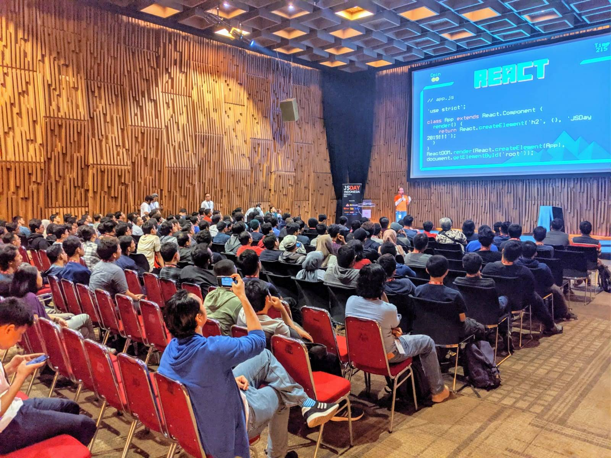

#### Svelte

Sekarang kita masuk ke framework berikutnya, Svelte. Svelte memang tidak memiliki CLI bawaan seperti halnya Angular atau Ember. Tapi di dokumentasinya kita disarankan menggunakan tools yang namanya degit. Sederhananya degit ini melakukan clone template yang sudah disiapkan di git atau github untuk proyek svelte ataupun proyek lainnya secara umum. Setelah menjalankan degit dengan npx kita jalankan npm install dan jalankan dengan npm run dev.

```shell
    $ npx degit sveltejs/template jsday
    $ cd jsday
    $ npm install
    $ npm run dev
```

Selanjutnya kita buat komponen baru dengan header level 2 dengan nama `jsday.svelte`.

```html
<!-- src/JSDay.svelte -->

<h2>JSDay 2019!!!</h2>
```

Dan kita tinggal gunakan komponen JSDay. Jangan lupa diimport agar dapat digunakan di komponen atau file lain.

```html
<!-- src/App.svelte -->

<script>
  import JSDay from './JSDay.svelte';
</script>

<style></style>

<div>
  <JSDay />
</div>
```

#### Vue

Kita masuk ke framework terakhir yaitu Vue. Vue juga di awal tutorialnya menyarankan menggunakan CDN sama halnya seperti React dan jQuery. Jadi tinggal buat sebuah folder dan buat sebuah file html.

```shell
    $ mkdir jsday
    $ cd jsday
```

Kemudian load vue dari CDN. Dan tulis kode vue di bagian script dibawah atau di file terpisah.

```html
<!-- index.html -->

<!DOCTYPE html>
<html>
  <head>
    <title>JSDay 2019</title>
    <script src="https://unpkg.com/vue"></script>
  </head>
  <body>
    <div id="app">
      <h2>{{ message }}</h2>
    </div>

    <script>
      var app = new Vue({
        el: '#app',
        data: {
          message: 'JSDay 2019!!!'
        }
      });
    </script>
  </body>
</html>
```

### Dukungan Komunitas

Yang tidak kalah penting adalah dukungan komunitas di sekitar kita. Ketika kita belajar kita butuh dukungan komunitas. Kita butuh teman belajar. Proses belajar tentu akan lebih cepat.

Tadi di bagian pertama kita sudah membahas tentang _meetup_, grup di facebook dan grup telegram. Nah sekarang kita akan fokus gimana kalau kita kesulitan dan butuh mencari solusi jika menemukan masalah. Sayangnya belum ada forum tanya jawab \*\*di Indonesia atau yang berbahasa Indonesia. Sehingga data diambil dari stackoverflow.

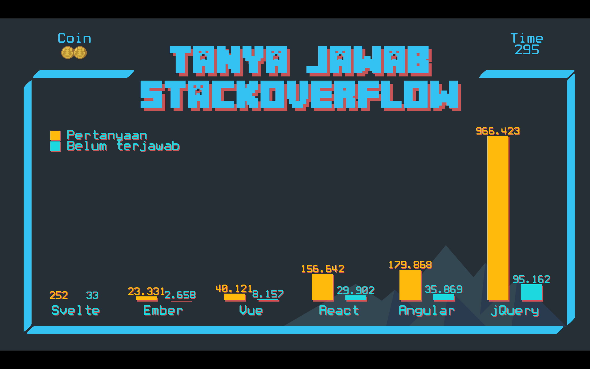

Disini jquery sangat jauh mengungguli jumlah pertanyaan karena memang yang paling senior, otomatis pertanyaan juga yang paling banyak. Kemudian diikuti Angular, React, Vue, Ember dan terakhir Svelte.

Jika kita kelompokkan, ada empat kelompok. Kelompok pertama adalah jQuery yang sangat jauh berbeda. Kelompok kedua ada React dan Angular. Vue dan ember ada di kelompok ketiga. Svelte menjadi kelompok terakhir.

Pertanyaan terkait Angular dan React banyak sekali, sementara dibandingkan kelompok kedua, vue dan Ember yang bisa dibilang hanya 1/4 nya saja. Ember dan Angular bisa diasumsikan umurnya mendekati jika dihitung dari angular versi pertama. React dan Vue lahirnya juga hampir bersamaan.

Data berikutnya, sedikit seru-seruan, mari kita bandingkan pengikut masing-masing akun resmi tiap framework dan pustaka di twitter.

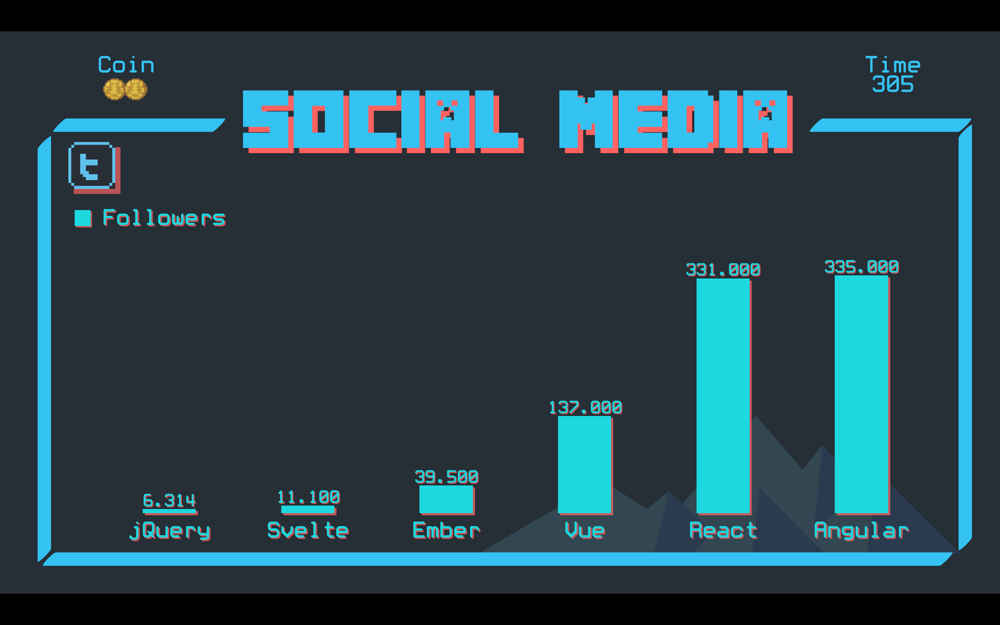

React dan Angular cukup jauh meninggalkan teman-teman yang lainnya dari sisi pengikut atau _follower_ yang mencapai tiga ratus ribuan. Vue dan Ember juga cukup jauh sekitar seratus ribuan. Yang menarik jQuery pengikutnya paling sedikit. Bahkan sudah dilewati Svelte yang umurnya paling muda.

Statistik berikutnya yang akan kita lihat adalah dari repositori GitHub.

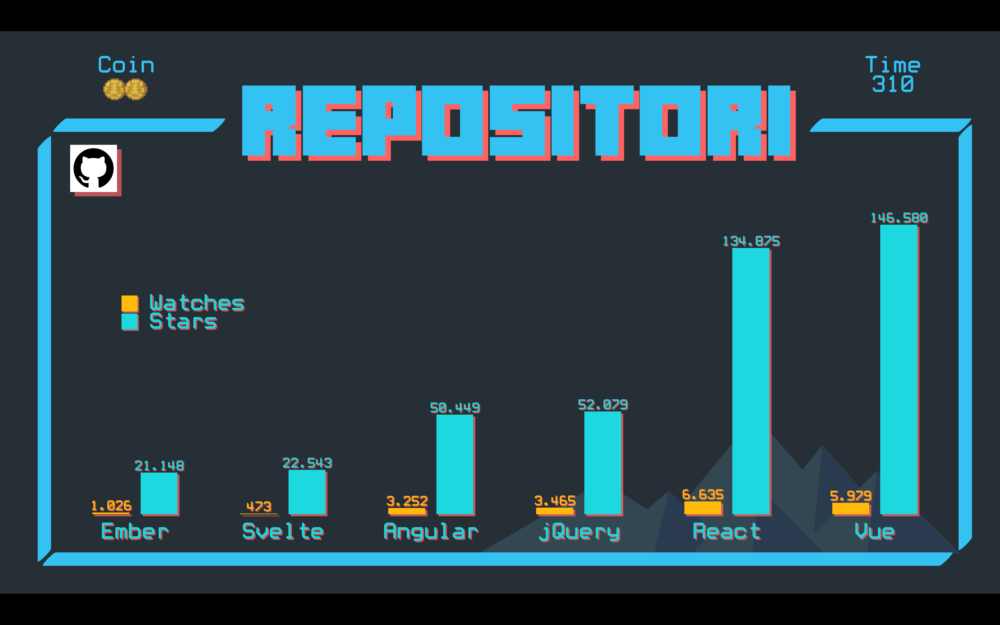

Nah kalo di repositori GitHub, Vue cukup merajai. Disini seperti ada tiga kelompok:

1. Vue dan React,
2. Angular dan jQuery,
3. Svelte dan Ember

Untuk jumlah _watches_ React merupakan pustaka yang paling banyak jumlah 'pengintainya'.

Masih dari repositori GitHub, beberapa statistik menarik lainnya, yaitu jumlah _commit_, jumlah kontributor dan umurnya di GitHub.

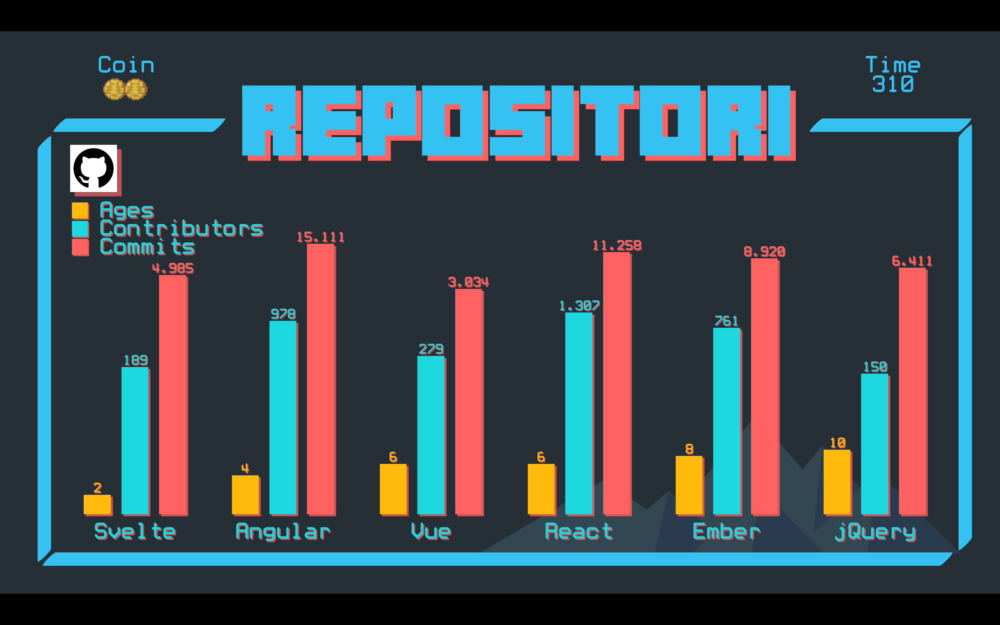

Beberapa hal menarik disini pertama tentang Svelte. Dengan umur yang baru dua tahun bisa mengalahkan vue dari sisi jumlah _commit_. Padahal jumlah kontributornya tidak terlalu jauh berbeda. Apakah artinya kontributorSsvelte menerapkan strategi _commit often_?

Disini juga dapat dilihat framework seperti Angular, React, dan Ember memiliki kontributor yang sangat banyak dibandingkan framework atau pustaka lainnya.

### Pustaka Pendukung

Cepat atau lambat sebuah pustaka dan framework membutuhkan bantuan tambahan dalam bentuk pustaka atau _library_, terutama untuk framework yang minimalis. Framework seperti Svelte atau pustaka jquery apalagi, pasti akan butuh pustaka tambahan. Nah disini saya melakukan pencarian dari npm dengan tag angular, ember, jquery, react, svlete dan vue.

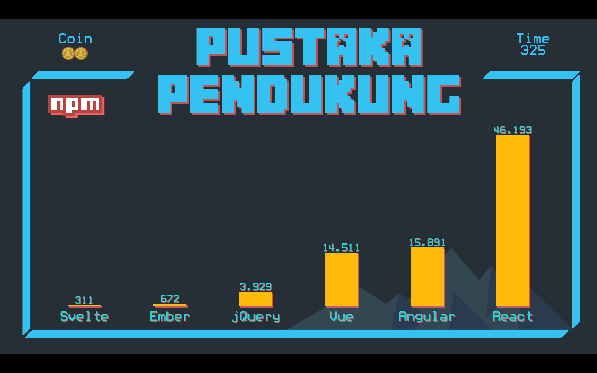

Terlihat React melesat sendirian dengan jumlah pustaka terbanyak, nyaris lima puluh ribu. Disini terlihat jelas perbedaannya, React dipasarkan sebagai pustaka bukan framework, makanya banyak pustaka tambahan bermunculan. Bahkan beberapa pustaka _de facto_ seperti redux, react router, create react app muncul sebagai pustaka yang dikembangkan oleh komunitas. Meskipun React dikembangkan oleh Facebook.

Kemudian framework seperti Angular dan Ember yang memang tidak terlalu membutuhkan pustaka tambahan karena memang secara fitur sudah cukup lengkap.

Sedangkan Svelte jumlahnya sedikit, wajar karena masih baru. Namun ada yang menarik, meskipun bentuknya pustaka, jQuery pustaka tambahan sedikit sekali ada di npm. Mungkin karena diawal, jQuery hidupnya bukan di npm. jQuery lahir lebih dulu sebelum ada npm.

### Performa

Nah sekarang kita masuk ke pembahasan yang cukup menarik dibahas, yaitu performa. Salah satu konsiderasi developer senior adalah seberapa cepat sebuah framework memanjakan penggunanya dalam hal kecepatan.

Disini saya tidak menggunakan metode benchmark yang kadang ‘menyesatkan’ dan subjektif, namun saya akan menggunakan metode yang sebenarnya cukup subjektif, yaitu Chrome UX Report. Chrome UX Report adalah data yang secara anonymous didapat dari pengguna browser chrome. Jadi disini pengguna browser lain tidak dihitung. Data diambil dari 2014 hingga awal september 2019.

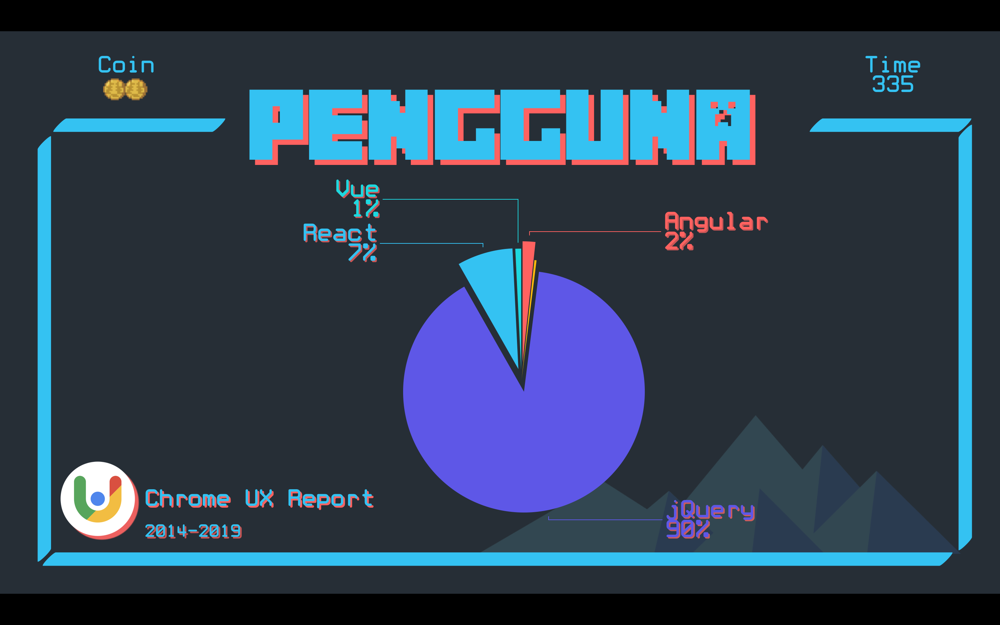

Dari Chrome UX Report saya bisa mendapatkan informasi jumlah pengguna yang mengakses website. Dari situ kemudian dipilah lagi website yang diakses menggunakan framework apa.

Hasilnya, ternyata penggunaan pustaka dan framework dunia masih dikuasai secara dominan oleh jQuery. Hanya 10 persen sisanya dibagi-bagi ke framework dan pustaka lainnya.

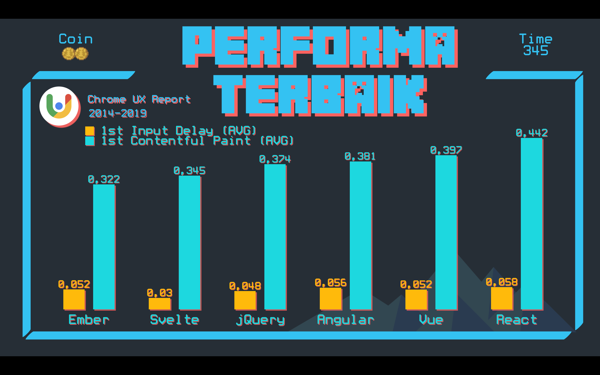

Untuk performanya sendiri. Kita akan lihat dua metrik: first contentful paint dan first input delay. First Contentful Paint atau FCP adalah saat pertama kali konten atau isi dari sebuah web atau dicetak ke browser. FCP bergantung pada performa server rendered, dan seberapa efektif sebuah framework melakukan proses rendering.

Sedangkan First Input Delay atau FID adalah seberapa lama waktu yang dibutuhkan agar pengguna dapat berinteraksi dengan aplikasi web kita, seperti scroll, klik, ketik dan lain sebagainya. FID biasanya bergantung ke ukuran aplikasi atau ukuran pustaka atau framework itu sendiri.

Dan secara umum yang memiliki performa tercepat adalah Ember. Svelte sendiri memiliki kemampuan FID tercepat karena memang JavaScript yang dihasilkan termasuk yang paling kecil.

### Lowongan Pekerjaan

Setelah belajar framework baru, dan sudah mendapatkan gambaran performa untuk masing-masing pustaka atau framework, sekarang kita akan mencoba menjawab kira-kira dari daftar framework ini prospek nya gimana saat ini dan kedepannya.

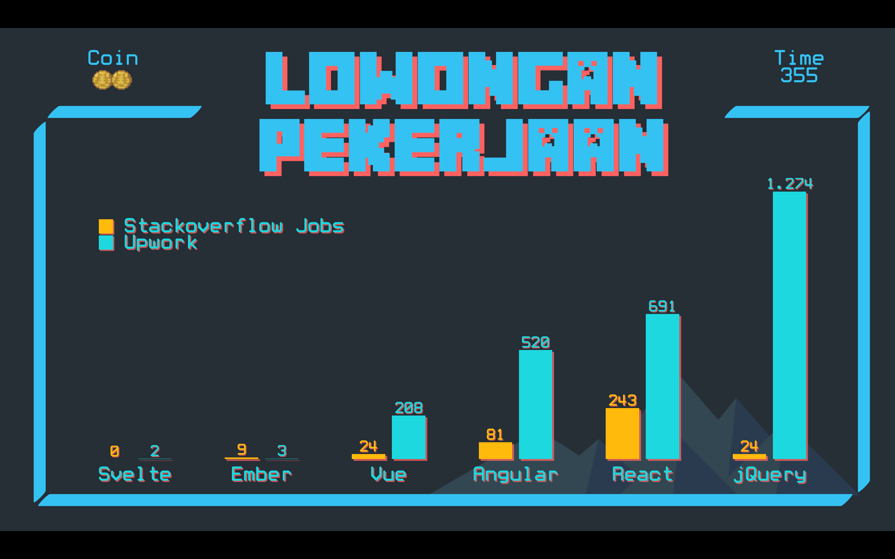

Pertama kita lihat jumlah lowongan pekerjaan tersedia di dunia. Disini saya melakukan pencarian data di stackoverflow jobs dan upwork untuk pekerjaan lepas atau _freelance_ dan juga *remote working. S*engaja saya tampilkan data seluruh dunia supaya bisa dikomparasi juga dengan perkembangan di Indonesia. Untuk stackoverflow jobs sendiri, talenta jQuery terlihat sudah mulai menurun. Lowongan React paling banyak, diikuti Angular, jQuery, Vue dan Ember.

Dan untuk data dari upwork, jQuery masih merajai. Jauh sekali dibandingkan React, Angular, Vue, Ember dan diikuti dengan Svelte.

Bagaimana dengan lowongan pekerjaan di Indonesia? Disini saya menyajikan data dari dua sumber: LinkedIn dan juga Urbanhire.

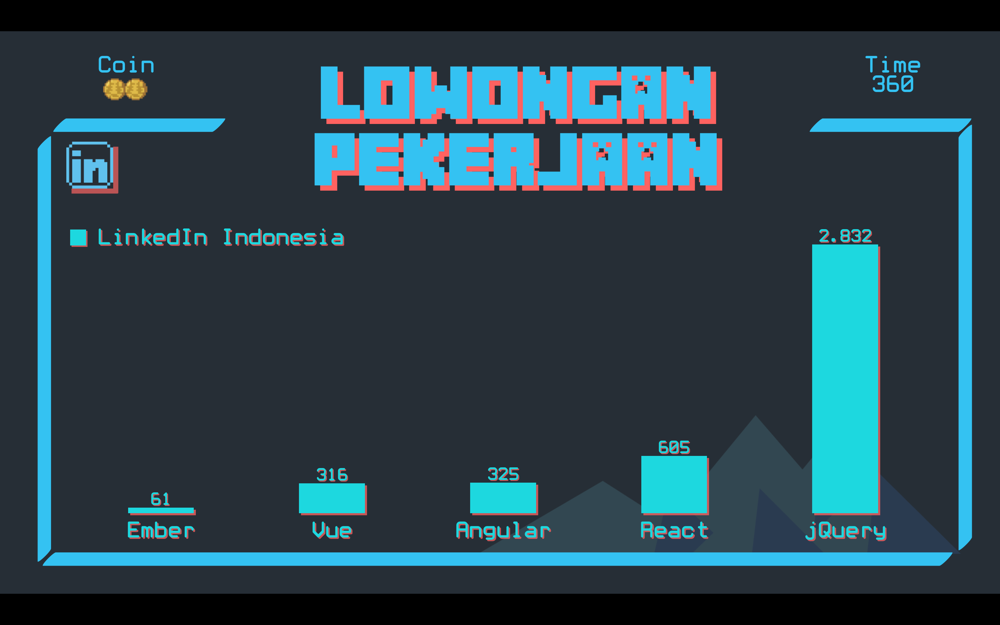

Dan ternyata masih banyak sekali yang mencari developer yang bisa jQuery, nyaris mencapai tiga ribu lowongan. Sementara lowongan rReact dan yang lainnya berkisar di enam ratus atau lebih rendah. Data dari Linkedin ini sedikit bias karena saya melakukan proses pencarian di LinkedIn pribadi. Kemungkinan besar di lingkaran saya masih banyak yang membuka lowongan yang membutuhkan kemampuan jQuery.

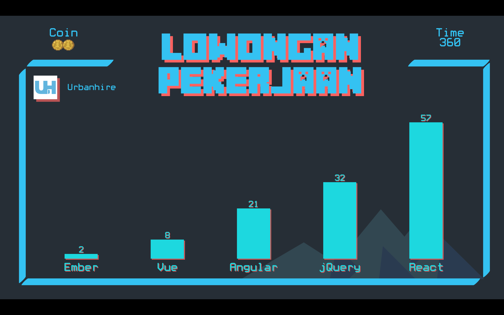

Saya juga melakukan pencarian data lowongan di Urbanhire yang mungkin lebih objektif dan tidak bias. Di platform pencarian lowongan pekerjaan di Indonesia ini, ternyata jumlah lowongan React lebih banyak dari jQuery dan yang lainnya meski tidak terlalu signifikan perbedaannya. Cukup berimbang.

## Sudut Pandang Master

Dan di bagian ini kita akan menjawab pertanyaan-pertanyaan dari golongan yang termasuk kedalam pengambil keputusan seperti team lead, arsitek, Vice President of Engineering hingga Chief Technology Officer atau CTO. Dan kita akan melihat beberapa hal seperti: jumlah talenta tersedia dan tingkat maturity dari sebuah framework atau pustaka.

### Talenta Tersedia

Disini saya kembali menggunakan fitur pencarian di [ LinkedIn ](https://linkedin.com/in/rizafahmi) untuk mencari banyaknya talenta untuk setiap framework dan pustaka.

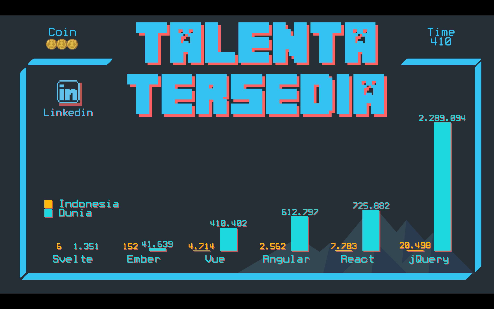

Dan ternyata yang menguasai jQuery masih sangat banyak baik di Indonesia ataupun di dunia. Dan jaraknya masih cukup jauh antara jQuery dengan framework lainnya.

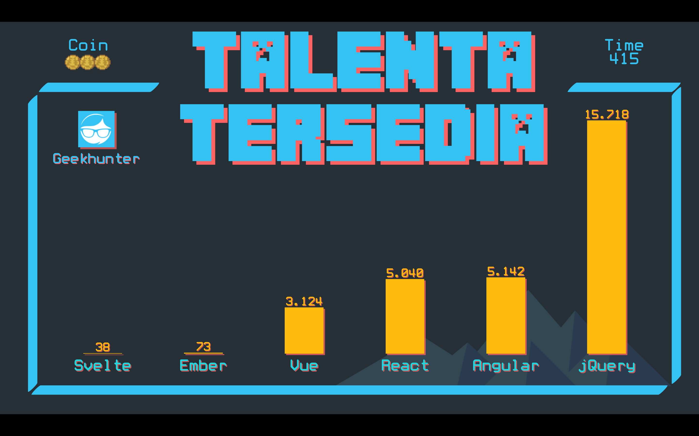

Dan berikut data yang ada di database [ geekhunter ](https://geekhunter.co). Seperti yang bisa dilihat, jQuery masih merupakan pustaka yang paling banyak dikuasai.

### Tingkat Maturity

Dibagian ini kita akan membahas tentang kedewasaan framework atau maturity. Disini kita akan melihat hal-hal seperti _release cycle_, jumlah pengelola, _issues_, _pull request_ dan juga _testing._

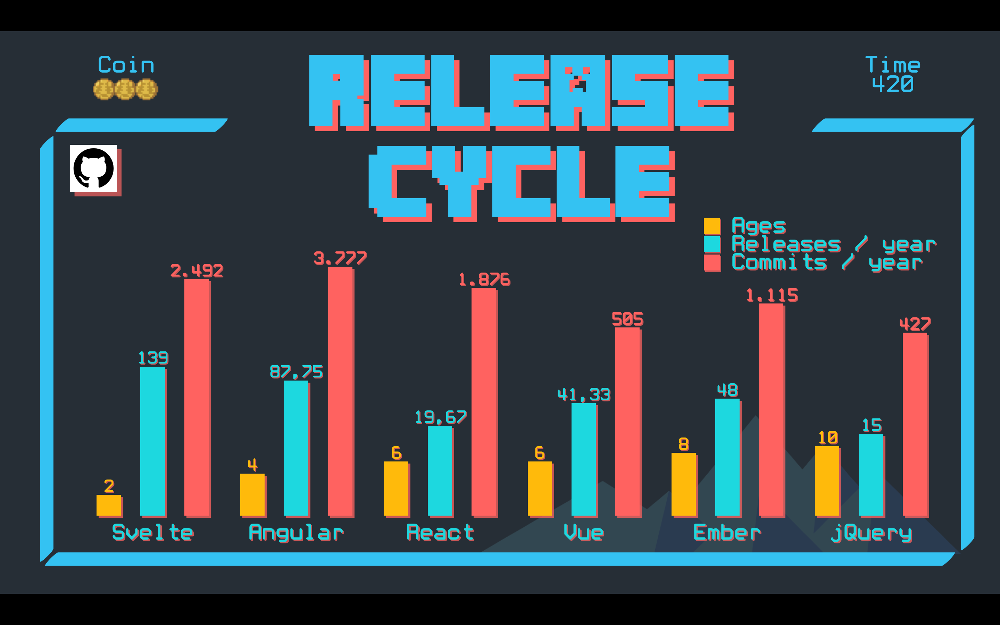

Disini data saya dapatkan dari GitHub dan terlihat ada beberapa _insight_ menarik. Pertama yang menarik adalah Svelte. Framework termuda disini rilis per tahunnya paling tinggi. Wajar karena masih baru, jadi jangan kaget kalau masih sering terjadi perubahan API atau belum stabil. Bandingkan dengan jQuery yang secara umur adalah yang paling tua. Rilis per tahunnya paling kecil karena sudah berumur 10 tahun.

Repositori yang paling produktif adalah Angular dalam hal jumlah _commit_. Nyaris empat ribu _commit_ per tahun. Dan Angular memiliki _release cycle_ cukup tinggi dibandingkan framework lain, mungkin karena umurnya tergolong lebih muda. Disini saya hanya menggunakan repositori Angular versi kedua atau yang lebih baru, bukan Angular versi pertama. Sedangkan Ember adalah satu-satunya framework yang menggunakan metode release cycle secara konsisten. Menghasilkan rilis baru setiap 6 minggu.

React sendiri meskipun disini umurnya 6 tahun namun React sudah dikembangkan dan digunakan jauh sebelum itu. Angka 6 tahun disini adalah umur saat kodenya menjadi sumber terbuka atau open source.

Berikutnya kita melihat jumlah issue di GitHub. Issue github ini merupakan salah satu metrik untuk menilai apakah sebuah proyek open source itu sehat atau tidak.

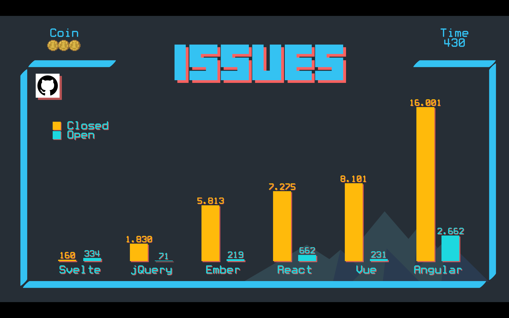

Disini Angular adalah pemilik issues terbanyak baik yang sudah selesai atau _closed_ maupun yang masih belum diselesaikan atau _open._ Perbedaannya cukup signifikan. Hal ini mungkin disebabkan karena Angular punya banyak fitur yang harus dikembangkan dan dikelola. Namun Ember dengan fitur yang cukup lengkap juga jumlah _issue_-nya tidak sebanyak Angular, bahkan lebih sedikit jika dibandingkan React dan Vue.

Svelte adalah satu-satunya framework yangjumlah open issue-nya lebih banyak daripada yang closed. Mungkin karena mereka sedang _heavy development_.

Berikutnya kita melihat seberapa banyak pull request atau PR yang terjadi.

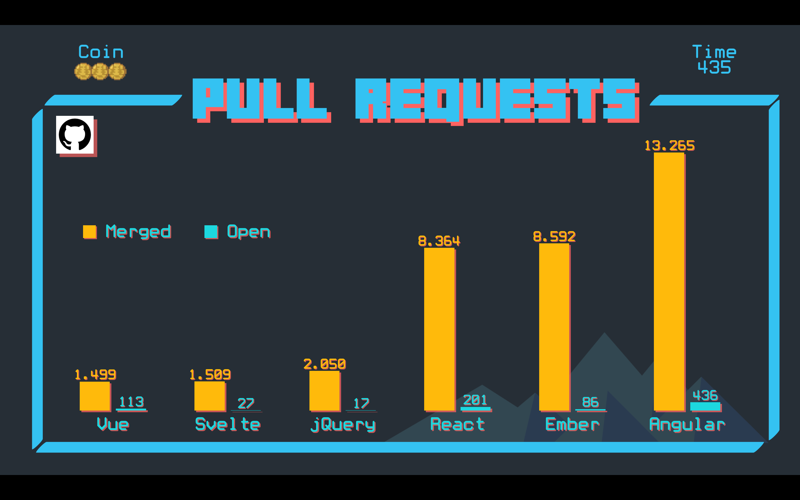

jQuery sudah tidak terlalu banyak pull request yang open karena mungkin sudah cukup _mature_ atau sudah tidak terlalu banyak fitur yang dikembangkan. Atau juga sudah tidak memiliki banyak bugs. Sedangkan kontributor Angular ternyata adalah yang paling produktif mengirimkan pull request sementara Vue memiliki jumlah pull request yang paling sedikit.

Selanjutnya kita akan melihat sebeapa banyak testing yang dilakukan oleh masing-masing framework dibandingkan dengan jumlah baris kode.


Angular memiliki baris kode yang paling banyak dengan jumlah test case juga yang paling banyak. Yang agak mengejutkan disini adalah Ember ternyata jumlah baris kodenya hampir sama dengan Vue tapi dengan jumlah test case yang lebih banyak bahkan lebih banyak dibandingkan React. Svelte juga jumlah test case-nya cukup banyak jika dibandingkan dengan jumlah baris kodenya, secara rasio.

Maksud saya menampilkan data ini bukan untuk adu siapa yang paling banyak jumlah test, tapi lebih melihat gambaran _framework_ mana yang peduli dengan testing. Dan data ini bisa jadi bereleasi dengan seberapa mudah aplikasi kita di test nantinya.

# Kesimpulan

Masa-masa saat ini adalah masa yang sangat menyenangkan dan _exciting_ terutama untuk developer JavaScript. Ekosistem pendukung semakin matang, pilihan untuk belajar sangat banyak, begitu juga media dan pilihan cara belajar. Bisa belajar dari artikel, buku hingga format video. Ada pustaka atau framework yang sangat _developer friendly_, dengan beberapa langkah kita sudah bisa membuat aplikasi. Ada juga yang sangat _user friendly_ dalam artian mungkin untuk _development_ butuh waktu yang agak panjang dan tidak semudah yang lain, namun hasil akhirnya sangat memanjakan. Aplikasinya cepat dan ringan tidak memberatkan pengguna.

Teman-teman bisa jadikan statistik-statistik ini sebagai bahan untuk _learning path_. Baru belajar? Mulai dari sudut pandang pertama: junior. Buat yang ingin belajar hal baru bisa dilihat dari sudut pandang kedua: senior. Mau bikin produk atau membangun tim? Konsiderasi hal-hal yang kita bahas di sudut pandang ketiga.

Apapun piilihan teman-teman, yang penting semua itu bisa membantu teman-teman dalam berkarya, baik karya yang sederhana hingga karya yang luar biasa.

Untuk sudut pandang pengambil keputusan, meskipun memilih teknologi berdasarkan _hype_ atau tren bukanlah hal yang salah, tapi perlu dikonsiderasi juga talenta tersedia dan jika saya diperbolehkan menambahkan opini pribadi, kadang kita perlu melawan arus, melakukan apa yang tidak dilakukan orang lain, anti mainstream.

Ada yg namanya [ python paradox ](http://www.paulgraham.com/pypar.html) dimana kita sengaja pilih teknologi yang jarang digunakan agar memikat talenta-talenta yang memang tertarik dengan teknologi tersebut sekaligus tidak perlu bersaing dengan para _unicorn_ untuk merekrut developer. Ada juga yang mengambil jalur untuk memilih teknologi yang sudah matang, _obvious_, teknologi yang sudah membosankan, _boring technology club_.

Tujuan disajikannya data ini bukan untuk melihat framework atau pustaka mana yang paling bagus, tapi lebih kepada framework atau pustaka mana yang cocok buat kita dari ketiga sudut pandang tadi.

<hr class="border-b" />

PS: Terimakasih banyak saya ucapkan kepada beberapa teman yang sudah membantu menyusun materi ini. Orang pertama yang saya hubungi ketika mulai menyusun topik ini adalah [Yohan Totting](https://twitter.com/tyohan). Dari awal _brainstorm_ materi sampai hari h di mentorin oleh beliau.

<blockquote class="twitter-tweet"><p lang="en" dir="ltr"> Helping <a href="https://twitter.com/rizafahmi22?ref_src=twsrc%5Etfw">@rizafahmi22</a> to prepare his keynote for <a href="https://twitter.com/hashtag/JSDayID?src=hash&amp;ref_src=twsrc%5Etfw">#JSDayID</a> <a href="https://t.co/miuEfuqNzz">pic.twitter.com/miuEfuqNzz</a></p>&mdash; Yohan Totting (@tyohan) <a href="https://twitter.com/tyohan/status/1161617348228292610?ref_src=twsrc%5Etfw">August 14, 2019</a></blockquote> <script async src="https://platform.twitter.com/widgets.js" charset="utf-8"></script>

Terimakasih juga buat [ Herlambang](https://www.instagram.com/herlambang_srihartono/), [ Rizqi ](https://twitter.com/rizqme) dan [ Hisma ](https://twitter.com/hismamaz) alias Mamaz yang juga ikut _brainstorming_ dari awal. Terimakasih juga untuk [ Jecelyn Yeen ](https://twitter.com/JecelynYeen) yang menghubungkan saya dengan salah satu kontributor Angular. Tak lupa terimakasih untuk om [Luri Darmawan](https://www.facebook.com/luridarmawan/) yang sudah membagikan data terkait percakapan di telegram via [carikbot](https://carik.id) dan juga [ Ken Ratri ](https://twitter.com/kenratriiswari) dari [ geekhunter ](http://geekhunter.co) yang udah bagi data talenta di Indonesia.


```

```
