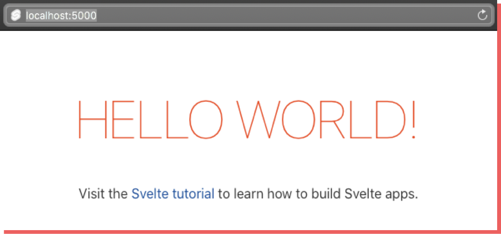
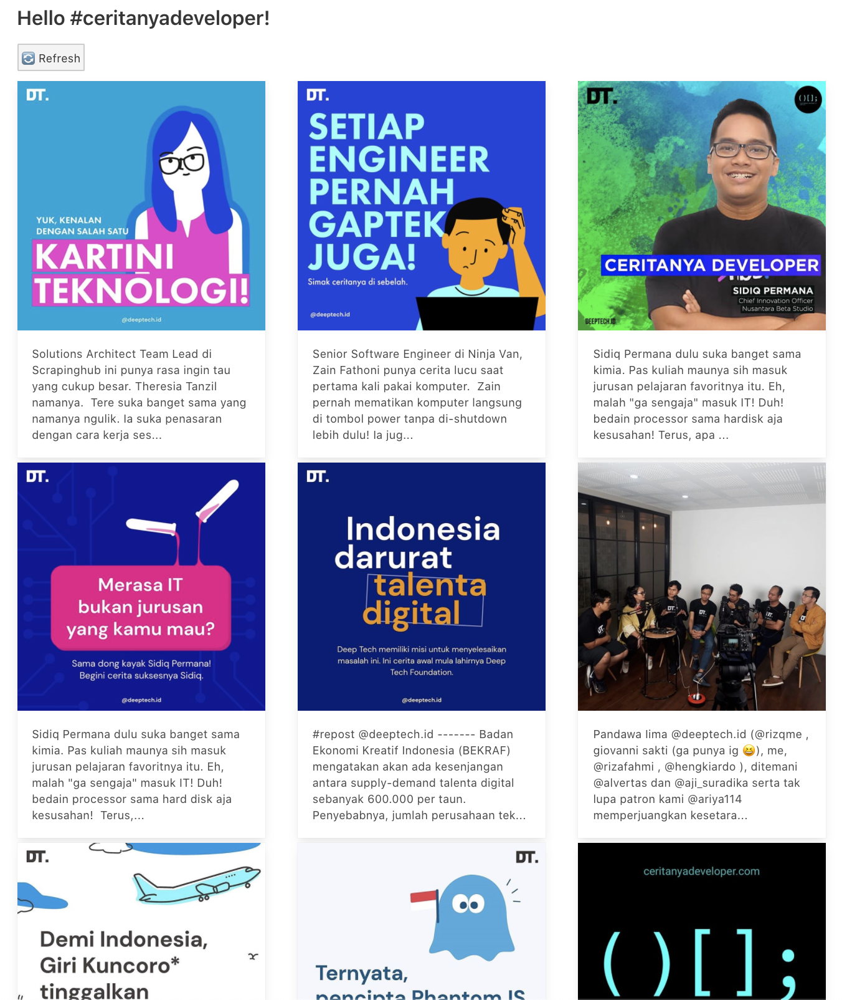
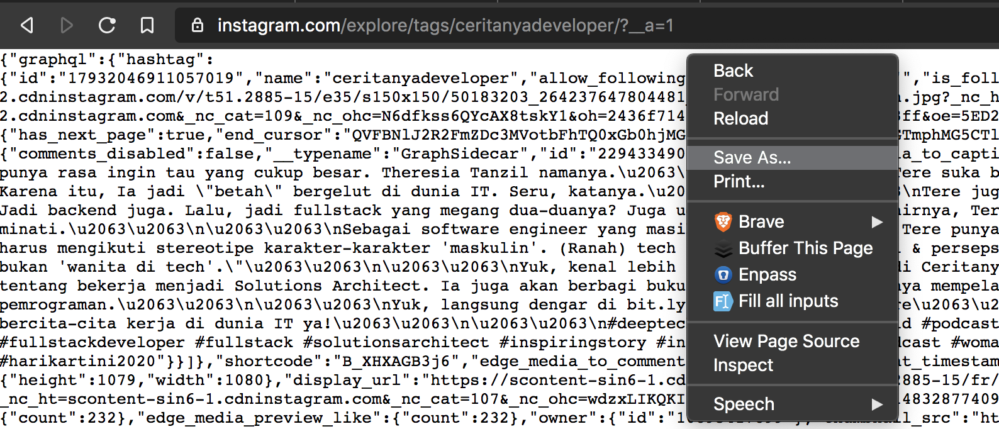
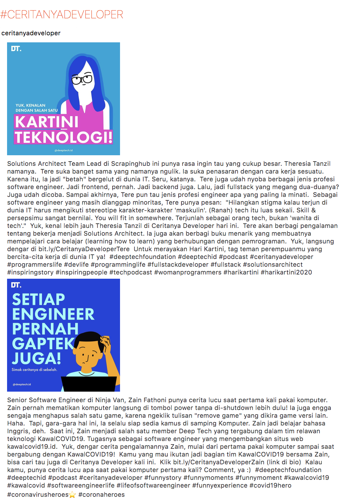
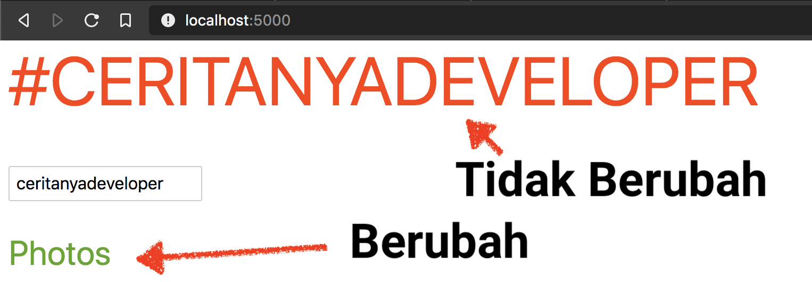
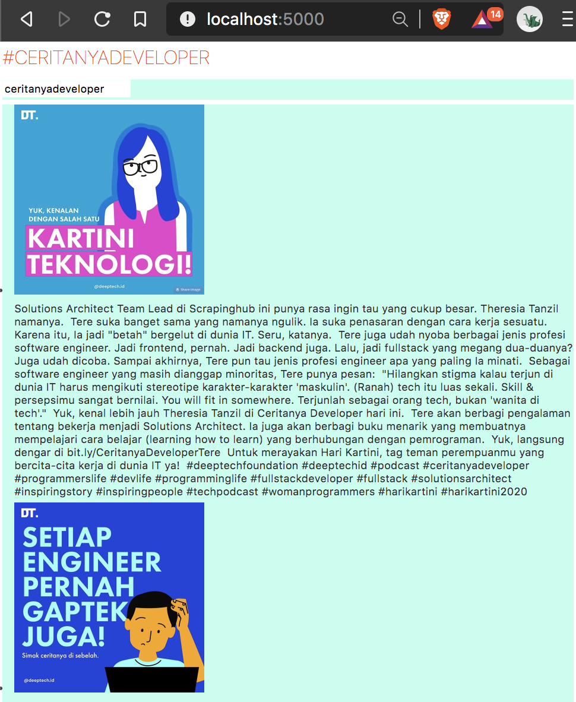

Svelte sederhananya adalah sebuah framework JavaScript untuk menulis komponen antarmuka atau _user interface_. Namun, menurut Rich Harris, Svelte bukan hanya sekedar framework tapi lebih dari itu. Menurutnya Svelte adalah semacam _compiler_, maksudnya kode yang kita tulis di Svelte dikonversi menjadi JavaScript yang sudah dioptimasi.

Salah satu fitur kunci dari Svelte adalah ukuran aplikasi yang kita tulis menjadi lebih kecil karena proses kompilasi yang dilakukan. Dan semua itu dicapai tanpa bantuan virtual DOM sama sekali. Seperti yang sama-sama kita ketahui, beberapa framework modern seperti React, Vue, Angular dan lainnya menggunakan alat bantu virtual DOM di framework mereka. Dengan tidak menggunakan virtual DOM maka ukuran aplikasi Svelte menjadi relatif lebih kecil.

Ada beberapa fitur Svelte yang lainnya seperti _reactive_ dan juga _less code_. Teman-teman bisa mengetahuinya lebih lengkap di [website utamanya](https://svelte.dev). Svelte dibuat untuk memecahkan masalah yang sama dengan framework lain seperti React dan Vue, namun dengan cara yang berbeda.

## Memulai Svelte

Untuk menggunakan Svelte, disarankan menggunakan alat bantu [degit](https://github.com/Rich-Harris/degit) untuk membangun kerangka aplikasi. Node dan npm juga merupakan keharusan untuk menggunakan framework ini.

```shell
$ npx degit sveltejs/template my-svelte-project
$ cd my-svelte-project
$ npm install
$ npm run dev
```

Buka browser, dan arahkan ke alamat localhost dengan port 5000.



Sebelum kita _intip_ kode sumbernya, mari kita lihat terlebih dahulu struktur foldernya.

```text
.
├── public
│   ├── build
│   ├── favicon.png
│   ├── global.css
│   └── index.html
├── src
│   ├── App.svelte
│   └── main.js
├── .gitignore
├── README.md
├── package-lock.json
├── package.json
└── rollup.config.js
```

Kita akan fokus kepada `package.json` dan kode-kode yang ada di folder `src/`.

## `package.json`

File `package.json` adalah daftar _dependencies_ yang digunakan sebuah proyek JavaScript ataupun Node.js. File ini juga terdapat perintah-perintah yang tersedia seperti bagaimana menjalankan proyek, melakukan test atau mempersiapkan proyek untuk siap diluncurkan atau _deploy_.

```json
{
  "name": "svelte-app",
  "version": "1.0.0",
  "scripts": {
    "build": "rollup -c",
    "dev": "rollup -c -w",
    "start": "sirv public"
  },
  "devDependencies": {
    "@rollup/plugin-commonjs": "^11.0.0",
    "@rollup/plugin-node-resolve": "^7.0.0",
    "rollup": "^1.20.0",
    "rollup-plugin-livereload": "^1.0.0",
    "rollup-plugin-svelte": "^5.0.3",
    "rollup-plugin-terser": "^5.1.2",
    "svelte": "^3.0.0"
  },
  "dependencies": {
    "sirv-cli": "^0.4.4"
  }
}
```

Seperti yang dapat dilihat, Svelte menggunakan [rollup]() sebagai module bundler. Selain rollup, juga bisa menggunakan webpack. Selanjutnya kita juga dapat melihat bagaimana caranya menjalankan server dengan mode _development_ dengan cara `$ npm run dev` dan juga melakukan _bundling_ dengan perintah `$ npm run build`.

## `src/main.js`

Berikutnya kita akan melihat kode yang menjadi pintu gerbang atau _endpoint_ pertama dari aplikasi Svelte yang sudah kita buat.

```javascript
import App from './App.svelte';

const app = new App({
  target: document.body,
  props: {
    name: 'world'
  }
});

export default app;
```

Dibaris pertama kita melakukan import dari sebuah file `src/App.svelte` dan kemudian diinsialisasi dengan memberikan informasi `target` dan `props` sebagai datanya.

## `src/App.svelte`

File dengan ekstensi svelte biasanya memiliki tiga bagian: `<script></script>` untuk kode JavaScript, `<style></style>` untuk css dan terakhir untuk HTML.

```html
<script>
  export let name;
</script>

<main>
  <h1>Hello {name}!</h1>
  <p>
    Visit the
    <a href="https://svelte.dev/tutorial">Svelte tutorial</a>
    to learn how to build Svelte apps.
  </p>
</main>

<style>
  main {
    text-align: center;
    padding: 1em;
    max-width: 240px;
    margin: 0 auto;
  }

  h1 {
    color: #ff3e00;
    text-transform: uppercase;
    font-size: 4em;
    font-weight: 100;
  }
</style>
```

Untuk membaca data `props` yang dikirimkan dari `main.js`, kita harus melakukan export terlebih dahulu seperti yang ada di baris ke-2 untuk kemudian ditampilkan di HTML dengan notasi `{}`, dalam hal ini `{name}` seperti yang ada di baris ke-6.

Cukup bersahabat bukan sintaksis dari Svelte? Sekarang mari kita coba membuat proyek sederhana dengan Svelte.

## Membuat Aplikasi dengan Svelte

Kita akan membangun sebuah aplikasi sederhana yang membaca data dari Instagram dan menampilkan foto-foto dengan tag yang sudah kita tentukan. Kita namakan saja Sveltagram. Hasil akhirnya kurang-lebih seperti ini. Kita akan menggunakan proyek yang sudah kita buat dibagian sebelumnya.



Kita akan membangun aplikasi sveltagram sembari melihat beberapa fitur dari Svelte.

### Persiapan Awal

#### `src/main.js`

Kita akan mengirimkan _hashtag_ yang ingin kita tampilkan daftar fotonya, karena itu kita bisa memanfaatkan `props` untuk mengirimkan data ke `App.svelte`.

```diff
import App from './App.svelte';

const app = new App({
  target: document.body,
  props: {
-    name: 'world'
+    hashtag: 'ceritanyadeveloper'
  }
});

export default app;
```

### Komponen Bersarang atau Nested Component

Svelte mendukung pemanggilan komponen dari komponen lainnya atau dengan kata lain komponen bersarang (_nested component_). Karena tidak mungkin sebuah aplikasi hanya terdiri dari satu komponen saja. Caranya cukup mudah, mirip dengan cara penggunaan import dan export dengan gaya ES Module. Kita akan membuat sebuah komponen baru yang akan digunakan di komponen App.

#### `src/components/BigHeader.svelte`

Komponen `BigHeader` akan menjadi judul dari aplikasi yang akan dipanggil di komponen App untuk mendemokan bagaimana komponen bersarang bekerja.

```html
<script>
  export let hashtag;
</script>

<h1>#{hashtag}</h1>

<style>
  h1 {
    color: #ff3e00;
    text-transform: uppercase;
    font-size: 4em;
    font-weight: 100;
  }
</style>
```

Kode dari `BigHeader` cukup sederhana. Komponen ini menerima sebuah properti dengan nama `hashtag` dan menampilkannya dengan tag header level 1 atau h1.

#### `src/App.svelte`

Sekarang kita akan memanggil komponen `BigHeader` dari komponen `App`.

```javascript
 <script>
  import BigHeader from './components/BigHeader.svelte';
  export let hashtag;
 </script>

 <main>
  <BigHeader hashtag={hashtag} />
 </main>

 <style>
 </style>
```

### Data Binding

Dengan Svelte kita dapat secara langsung mengubah sebuah variable dari hasil masukan dari pengguna dengan memanfaatkan fitur data binding. Kita akan tambahkan sebuah input text untuk mengubah variable `hashtag` di komponen App.

```diff
<script>
  import BigHeader from './components/BigHeader.svelte';
  export let hashtag;
</script>

<main>
  <BigHeader hashtag={hashtag} />
+  <input type="text" bind:value={hashtag} />
</main>

<style>
</style>
```

Dan sekarang kita dapat mengubah judul atau variable `hashtag` secara _real-time_. Hal ini disebut juga sebagai _data binding_.

<video autoplay loop style="width: 100%">
  <source src="binding.mov" />
</video>

### Data Dummy Dari JSON

Berhubung data yang akan kita gunakan bentuknya JSON, kita akan membaca data contoh berbentuk JSON yang dapat kita unduh langsung dari instagram. Contohnya jika menggunakan _hashtag_ "ceritanyadeveloper", maka kita dapat mengakses datanya dari `https://www.instagram.com/explore/tags/ceritanyadeveloper/?__a=1`. Kita bisa simpan dengan ekstensi json dan disimpan ke folder `src/`.



Kita akan import data json tersebut di komponen App seperti berikut.

```diff
<script>
  import BigHeader from './components/BigHeader.svelte';
+ import data from './instagram.json';

  export let hashtag;
</script>

<main>
  <BigHeader hashtag={hashtag} />
  <input type="text" bind:value={hashtag} />
</main>

<style>
</style>
```

Akan tetapi jika kita lihat di terminal, maka terdapat pesan kesalahan, kurang lebih seperti berikut.

```text
[!] Error: Unexpected token (Note that you need @rollup/plugin-json to import JSON files)
src/instagram.json (2:13)

...
```

Pesan kesalahannya cukup jelas dan sudah menyertakan solusinya. Jadi svelte saat ini belum dapat melakukan import dari file dengan format JSON. Dan untuk dapat melakukan import dari JSON, kita dapat menggunakan plugin `@rollup/plugin-json`.

```shell
$ npm install --save-dev @rollup/plugin-json
```

#### `rollup.config.js`

Kemudian ubah konfigurasi rollup untuk mengakomodasi plugin yang baru saja kita install di file `rollup.config.js`.

```diff
import svelte from 'rollup-plugin-svelte';
import resolve from '@rollup/plugin-node-resolve';
import commonjs from '@rollup/plugin-commonjs';
import livereload from 'rollup-plugin-livereload';
import { terser } from 'rollup-plugin-terser';
+import json from '@rollup/plugin-json';

const production = !process.env.ROLLUP_WATCH;

export default {
  input: 'src/main.js',
  output: {
    sourcemap: true,
    format: 'iife',
    name: 'app',
    file: 'public/build/bundle.js'
  },
  plugins: [
    svelte({
      // enable run-time checks when not in production
      dev: !production,
      // we'll extract any component CSS out into
      // a separate file - better for performance
      css: (css) => {
        css.write('public/build/bundle.css');
      }
    }),

    // If you have external dependencies installed from
    // npm, you'll most likely need these plugins. In
    // some cases you'll need additional configuration -
    // consult the documentation for details:
    // https://github.com/rollup/plugins/tree/master/packages/commonjs
    resolve({
      browser: true,
      dedupe: ['svelte']
    }),
    commonjs(),

    // In dev mode, call `npm run start` once
    // the bundle has been generated
    !production && serve(),

    // Watch the `public` directory and refresh the
    // browser on changes when not in production
    !production && livereload('public'),

    // If we're building for production (npm run build
    // instead of npm run dev), minify
-   production && terser()
+   production && terser(),
+   json()
  ],
  watch: {
    clearScreen: false
  }
};

function serve() {
  let started = false;

  return {
    writeBundle() {
      if (!started) {
        started = true;

        require('child_process').spawn('npm', ['run', 'start', '--', '--dev'], {
          stdio: ['ignore', 'inherit', 'inherit'],
          shell: true
        });
      }
    }
  };
}

```

Jalankan kembali server development dengan perintah `$ npm run dev` dan pesan kesalahan sudah menghilang.

#### `src/App.svelte`

Sekarang kita sudah dapat menggunakan data yang berasal dari `instagram.json` dan untuk memastikan, kita akan menampilkan salah satu datanya.

```diff
<script>
  import BigHeader from './components/BigHeader.svelte';
  import data from './instagram.json';

  export let hashtag;
</script>

<main>
  <BigHeader hashtag={hashtag} />
  <input type="text" bind:value={hashtag} />
+  <pre>{data.graphql.hashtag.edge_hashtag_to_media.edges[0].node.accessibility_caption}</pre>
</main>

<style>
```

### Iterasi Data Foto

Data sudah siap digunakan, sekarang saatnya kita menampilkan data tersebut dalam bentuk _list_ atau daftar. Kita akan buat sebuah komponen baru untuk menampilkan data foto-foto yang ada di instagram. Untuk melakukan iterasi dari data instagram, Svelte menggunakan notasi `{#each}{/each}`.

#### `src/components/PhotoList.svelte`

```html
<script>
  import data from '../instagram.json';
  const photos = data.graphql.hashtag.edge_hashtag_to_media.edges;
</script>

<div>
  <ul>
    {#each photos as photo}
    <li>
      
      <p>{photo.node.edge_media_to_caption.edges[0].node.text}</p>
    </li>
    {/each}
  </ul>
</div>
<style></style>
```

#### `src/App.svelte`

Kemudian kita panggil komponen `PhotoList` yang baru kita buat di komponen utama `App`.

```diff
<script>
  import BigHeader from './components/BigHeader.svelte';
- import data from './instagram.json';
+ import PhotoList from './components/PhotoList.svelte';

  export let hashtag;
</script>

<main>
  <BigHeader hashtag={hashtag} />
  <input type="text" bind:value={hashtag} />
-  <pre>{data.graphql.hashtag.edge_hashtag_to_media.edges[0].node.accessibility_caption}</pre>
+ <PhotoList />
</main>

<style>
</style>

```

Hasilnya seperti berikut. Semua data yang dibutuhkan sudah kita dapatkan meskipun secara tampilan masih biasa saja.



### CSS

Sekarang saatnya 'mendandani' aplikasi kita dengan CSS. Di Svelte, ada beberapa opsi menggunakan CSS. Opsi pertama adalah menggunakan `<style></style>` seperti yang sudah kita lihat sebelumnya. Sedikit berbeda dengan _style_ di HTML yang sifatnya global, _style_ seperti yang kita gunakan sifatnya lokal per komponen. Misalkan saya memiliki _styling_ untuk `h1` di komponen `App` maka yang berubah hanyalah `h1` yang berada di komponen `App`. Komponen lainnya yang juga memiliki `h1` tidak akan terkena efeknya.

##### `src/App.svelte`

```diff
 <main>
   <BigHeader hashtag={hashtag} />
   <input type="text" bind:value={hashtag} />
+  <h1>Photos</h1>
   <PhotoList />
 </main>

 <style>
+  h1 {
+    color: #57A71C;
+  }
 </style>
```

Maka yang terkena efeknya hanyalah `h1` yang ada di komponen `App`, sedangkan `h1` yang ada dikomponen lain seperti di `BigHeader` tidak terkena efeknya. Begitu pula sebaliknya.



Nah jika ingin menambahkan CSS yang sifatnya global, berlaku untuk seluruh aplikasi, kita bisa menambahkan tag `<link rel="stylesheet"></link>` sebagaimana biasanya. Kita bisa menambahkan CSS tersebut di `public/index.html` di bagian `<head></head>` atau kita bisa melakukannya di level komponen dengan tag spesial `<svelte:head></svelte:head>`.

#### `src/components/PhotoList.svelte`

```diff
</script>
  import data from '../instagram.json';
  const photos = data.graphql.hashtag.edge_hashtag_to_media.edges;

 </script>

+<svelte:head>
+  <link href="./PhotoList.css" rel="stylesheet" />
+</svelte:head>
 <div>
   <ul>
     {#each photos as photo}

```

Kemudian kita menambahkan sebuah file `PhotoList.css` di folder `public/`. Ya, file `PhotoList.css` harus berada di folder `public/` atau satu level dengan file `index.html` yang juga ada di folder yang sama.

#### `public/PhotoList.css`

```css
div {
  background-color: #c0ffee;
}
```

Maka secara otomatis seluruh tag `<div>` yang ada di aplikasi akan berubah warna latarnya atau dengan kata lain CSS berlaku secara global.



### Menggunakan CSS Framework

Tenang saja, kita tidak akan menulis CSS dari awal seperti contoh diatas. Kita akan menggunakan CSS framework dalam hal ini kita akan menggunakan [Bulma](https://bulma.io/) dan akan digunakan secara global seperti contoh diatas untuk mempersingkat tutorial ini.

#### `src/components/PhotoList.svelte`

```diff
 <script>
   import data from '../instagram.json';
   const photos = data.graphql.hashtag.edge_hashtag_to_media.edges;

+  function truncate_words(text, length) {
+    if (text.length <= length) {
+      return text;
+    } else {
+      return `${text.slice(0, length)}...`;
+    }
+  }
 </script>

-<svelte:head>
-  <link href="./PhotoList.css" rel="stylesheet" />
-</svelte:head>
-<div>
-  <ul>
-    {#each photos as photo}
-      <li>
+
+<div class="container photolist">
+  {#each photos as photo}
+    <div class="card">
+      <figure class="image">
         
-        <p>{photo.node.edge_media_to_caption.edges[0].node.text}</p>
-      </li>
-    {/each}
-  </ul>
+      </figure>
+      <div class="card-content">
+        <div class="content">
+          <p>{truncate_words(photo.node.edge_media_to_caption.edges[0].node.text, 200)}</p>
+        </div>
+      </div>
+    </div>
+  {/each}
 </div>
-<style></style>
+<style>
+  .container {
+    display: grid;
+    grid-template-columns: repeat(auto-fill, minmax(350px, 1fr));
+    grid-gap: 0.5em;
+  }
+
+  .card {
+    max-width: 90%;
+    height: max-content;
+    border: 1px solid #cacaca;
+    box-shadow: 5px 5px 5px 0px rgba(202, 202, 202, 1);
+  }
+</style>

```

Supaya lebih rapi, kita pindahkan `<svelte:head>` ke komponen utama `App`. Kemudian kita bisa menggunakan beberapa _class_ yang sudah disediakan oleh Bulma seperti container, card dan lain sebagainya. Sekaligus kita juga menambahkan beberapa _style_ tersendiri.

Dan supaya deskripsi foto tidak terlalu panjang, kita juga membuat fungsi _helper_ dengan nama `truncate_words` yang fungsinya kita definisikan di bagian `<script>` dengan JavaScript tentunya.

#### `src/App.svelte`

```diff
 <script>
   export let hashtag;
 </script>

+<svelte:head>
+  <link href="https://cdnjs.cloudflare.com/ajax/libs/bulma/0.8.0/css/bulma.min.css" rel="stylesheet" />
+</svelte:head>

-<main>
+<main class="container">
   <BigHeader hashtag={hashtag} />
   <PhotoList />
</main>

<style>
</style>
```

Berikut hasilnya. Lumayan keren kan ya? Kita lanjutkan pembelajaran kita dengan mengambil data langsung dari instagram.


### Siklus Hidup Komponen Svelte

Sebagaimana komponen framework lainnya, komponen yang dibuat dengan Svelte juga memiliki siklus hidup.

- `onMount`: akan dieksekusi ketika komponen di-_render_.
- `onDestroy`: akan dieksekusi setelah komponen dihancurkan atau _destroy_.
- `beforeUpdate`: akan dieksekusi sebelum DOM di _update_.
- `afterUpdate`: akan dieksekusi setelah DOM di _update_.

Sebelumnya kita sudah menampilkan data dari file JSON yang kita unduh dari instagram. Sekarang kita akan melakukan pengambilan data secara langsung yang akan dieksekusi ketika komponen di-_render_ atau menggunakan `onMount`.

```diff
 <script>
-  import data from '../instagram.json';
-  const photos = data.graphql.hashtag.edge_hashtag_to_media.edges;
+  import { onMount } from 'svelte';
+
+  let photos = [];
+
+  onMount(async function() {
+    try {
+      const res = await fetch(`https://www.instagram.com/explore/tags/ceritanyadeveloper/?__a=1`);
+      const data = await res.json();
+      photos = data.graphql.hashtag.edge_hashtag_to_media.edges;
+    } catch (err) {
+      console.error(err);
+    }
+  });

   function truncate_words(text, length) {
     if (text.length <= length) {
...
```

Jika dilihat di browser, hasilnya pun nyaris sama dengan tampilan sebelumnya, bedanya sekarang data didapat langsung dari instagram. Dan terdapat keterlambatan beberapa waktu sebelum data ditampilkan. Hal ini terjadi karena untuk mengambil data dari internet dibutuhkan waktu dan merupakan sesuatu yang sifatnya _asynchronous_.

<video loop autoplay style="width: 100%">
  <source src="fetch.mov">
</video>

### Peluncuran atau Deployment

Cara termudah untuk meluncurkan aplikasi atau _deployment_ svelte adalah dengan alat bantu seperti Netlify, Now (namanya berganti menjadi Vercel sekarang), Surge ataupun servis sejenis. Tinggal jalankan perintah `$ npx now` dan selesai. Semudah itu! Silakan langsung kunjungi [https://sveltagram.now.sh](https://sveltagram.now.sh). Atau silakan cek kodenya di [https://github.com/rizafahmi/sveltagram](https://github.com/rizafahmi/sveltagram).
