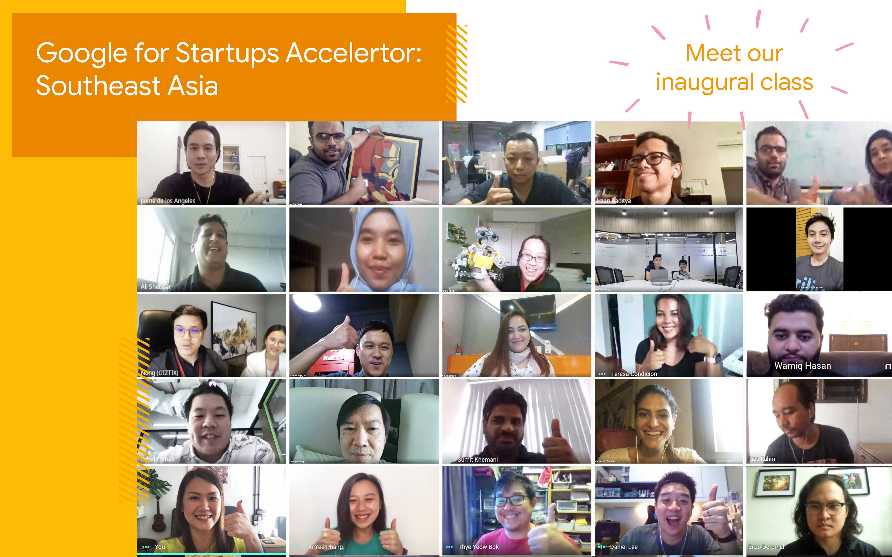
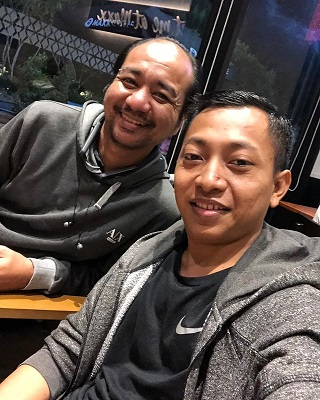

Sebentar lagi 2020 akan segera berakhir. Mari review apa yang terjadi sepanjang 2020 di kehidupan profesional saya. Saya sarankan teman-teman juga melakukan hal yang sama agar mendapat _insight_ menuju tahun yang akan datang.

## Covid-19

2020 identik dengan Covid-19 atau virus Corona pastinya. Apa dampaknya terhadap hidup saya? Semuanya! Saya memang ada wacana ingin bekerja dari rumah, apalagi peran yang saya emban di [HACKTIV8](https://hacktiv8.com/) dua tahun terakhir lebih banyak berpergian keluar kota. Tapi _ngga gini juga_ :) Untuk bekerja dirumah butuh persiapan matang sebelum dieksekusi. Butuh ruangan tersendiri, koneksi yang mumpuni dan banyak lagi tentunya.

Ketika PSBB diterapkan di Jakarta saya sedang melakukan _in-house training_. Terpaksa tetap mengisi disaat awal dengan protokol kesehatan tentunya, namun akhirnya dua sesi terakhir dilakukan dirumah.

Dampak bagi [HACKTIV8](https://hacktiv8.com/) secara umum? Luar biasa! Untuk _coding bootcamp_ yang awalnya dilakukan secara offline terpaksa harus _pivot_ menjadi online. Apalagi beberapa kampus tambahan sudah disiapkan. Diawal pandemi, peminat yang ingin ikut _coding bootcamp_ sempat menurun drastis meskipun beberapa bulan kemudian peminatnya kembali dan bahkan meningkat jauh.

Syukur alhamdulillah transisi dari offline menuju online akhirnya berjalan cukup lancar, meskipun ada kendala disana-sini. Semakin menggembirakan karena akhirnya peminatnya semakin meningkat setiap bulannya.

Yang cukup menyedihkan buat saya pribadi adalah keharusan untuk melakukan proses _layoff_ untuk menjaga buku kas tetap seimbang. Termasuk kehilangan beberapa sosok kunci :'( Ini adalah salah satu sisi yang tidak mengenakkan menjadi pemilik bisnis atau _co-founder_.

Untuk kehidupan saya pribadi bekerja dirumah memiliki kelebihan tersendiri. Punya lebih banyak waktu untuk keluarga, dan punya lebih banyak waktu untuk mengerjakan sesuatu. Sekarang saya punya waktu 1 sampai 1.5 jam tambahan karenta tidak harus menempuh macetnya Jakarta menuju ke kantor.

## HACKTIV8 Berhasil Masuk dan Menyelesaikan Program Google for Startups Accelerator

Agak diluar ekspektasi karena tidak direncanakan sebelumnya, HACKTIV8 berhasil masuk ke program [ Google for Startups Accelerator ](https://startup.google.com/accelerator/southeast-asia/) atau GfSA South East Asia! Selama beberapa bulan tim HACKTIV8 akan mengikuti _bootcamp_ yang diadakan secara online.

Saya sempat menceritakan tentang GfSA ini di podcast "Ngobrolin Startup dan Teknologi" bareng [Imre Nagi](https://twitter.com/imrenagi). Sayang sekali kesempatan mengunjungi negeri Paman Sam sirna karena program akselerator kali ini diselenggarakan secara online.

<iframe src="https://open.spotify.com/embed-podcast/episode/5ETnXDtyd9eTVMQTzaAFAO" width="100%" height="232" frameborder="0" allowtransparency="true" allow="encrypted-media"></iframe>

## Podcast Ceritanya Developer

Tahun 2020 ini menginjak tahun ketiga. Ditahun ketiga ini saya mendapat dukungan penuh dari [deeptech](https://deeptech.id) untuk melanjutkan produksi podcast. Banyak perubahan signifikan yang terjadi mulai dari desain _cover_ tiap episode, kualitas (terutama episode sebelum pandemi) dan durasi ditingkatkan menjadi 22 episode dalam setahun. Sedangkan sebelumnya setahun hanya delapan episode saja.

Pendengarnya pun meningkat secara signifikan, meningkat hingga 600%!. Terimakasih banyak untuk para pendengar setia dan para pendengar baru. Terimakasih juga untuk para narasumber yang sudah berbagi cerita dan inspirasi.

<blockquote class="twitter-tweet" data-theme="light">
2020 sebentar lagi kita lewati. <a href="https://twitter.com/hashtag/podcast?src=hash&amp;ref_src=twsrc%5Etfw">#podcast</a> <a href="https://twitter.com/hashtag/ceritanya?src=hash&amp;ref_src=twsrc%5Etfw">#ceritanya</a> <a href="https://twitter.com/hashtag/developer?src=hash&amp;ref_src=twsrc%5Etfw">#developer</a> berhasil menelurkan 22 episode! Pendengar bertumbuh sampai 600%! Didengar di 33 negara! Selamat datang para pendengar dari US, should I talk in english now? 😅 <a href="https://t.co/XUODhXpzKs">pic.twitter.com/XUODhXpzKs</a>
&mdash; youtube.com/rizafahmi (@rizafahmi22) <a href="https://twitter.com/rizafahmi22/status/1335037030888181760?ref_src=twsrc%5Etfw">December 5, 2020</a></blockquote>

## Podcast Hikayat Punggawa Teknologi

Selain podcast Ceritanya Developer, saya sempat diajak Mas [Ariya Hidayat](https://twitter.com/AriyaHidayat) untuk membuat podcast baru. Salah satu tujuan dibuatnya podcast ini adalah untuk membuka cakrawala kita sebagai pengembang aplikasi untuk mendapatkan sumber inspirasi dari sosok punggawa teknologi. Disini fokusnya kepada sosok yang mungkin jarang terdengar di jagad internet, namun kontribusinya di dunia pemrograman tidak dapat diejawantahkan.

<iframe width="560" height="315" src="https://www.youtube.com/embed/ONoUsSo23l0" frameborder="0" allow="accelerometer; autoplay; clipboard-write; encrypted-media; gyroscope; picture-in-picture" allowfullscreen></iframe>

Baru berjalan tiga episode, sayangnya belum dapat dilanjutkan lagi karena jadwal Mas Ariya yang secara mendadak menjadi padat dan kita belum menemukan waktu yang pas, karena perbedaan zona waktu antara Indonesia dan California. Semakin sulit lagi karena formatnya adalah _live radio podcast_ jadi ditayangkan secara _live_. Mungkin nanti kita bisa mengubah formatnya menjadi format rekaman sehingga waktu rekaman dapat lebih fleksibel.

## _Passive Income_ Melalui BuildWith Angga

Akhirnya saya berhasil mendapatkan kanal untuk _passive income_ dengan membangun _online course_ di [BuildWith Angga](https://buildwithangga.com/). Sudah lama sebenarnya saya mencari kanal untuk mendapatkan _passive income_ hanya saja belum begitu berhasil. Terimakasih kepada Angga Risky yang sudah memberikan kesempatan kepada saya. Saya masih ingat banget ketika awalnya Angga ingin mengembangkan platform [BuildWith Angga](https://buildwithangga.com) karena ketika itu kita sempat bertemu dan diskusi.

Total sudah ada tiga course sampai saat ini yang sudah dipublikasikan. _Course_ pertama adalah [SvelteJS Web Development](https://buildwithangga.com/kelas/svelte-javascript-web-development) yang dapat dipelajari secara gratis. Kemudian dilanjutkan dengan [Front-End JavaScript Development: Web Donasi Online](https://buildwithangga.com/kelas/sveltejs-front-end-javascript-development-web-donasi-online). Terakhir yang terbaru adalah [Struktur Data dengan JavaScript](https://buildwithangga.com/kelas/struktur-data-dengan-javascript) dan beberapa lainnya sedang dalam proses pembuatan.

## Mengaktifkan (kembali) Kanal Youtube

Terpantik dengan webinar yang diadakan bersama Angga, membuat saya ingin kembali mengaktifkan kembali kanal [YouTube](https://youtube.com/rizafahmi) yang sempat terbengkalai. Format _livestreaming_ dipilih murni karena untuk memudahkan dan tidak terlalu membutuhkan persiapan banyak. Terutama tidak membutuhkan proses _editing_ yang lumayan butuh _effort_ dan keunikan tersendiri dapat berinteraksi langsung dengan penonton.
